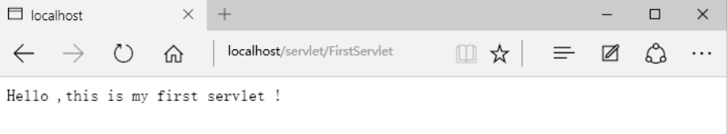
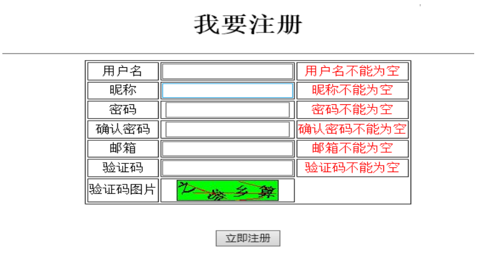
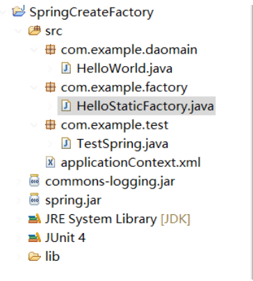

### **1.** **Web基础**

#### **1.1.** **概念**

* Java Servlet技术简称Servlet技术，是Java开发Web应用的底层技术

* Servlet在创建后（被第一次请求时）就一直保存在内存中

* Spring MVC 又叫 Spring Web MVC,是Spring 框架的一个模块，用于快速开发Web应用

*  MVC代表 Model-View-Controller

#### **1.2.** **Servlet/JSP应用架构**

* Servlet是一个Java程序，一个Servlet应用有一个或者多个Servlet程序

*  JSP页面会被转换编译成Servlet程序

*  Servlet应用无法独立运行，必须运行在Servlet容器中，如 Tomcat

* Web服务器和Web客户端之间通过HTTP协议通信

* Servlet/JSP容器是一个可以同时处理Servlet和静态内容的Web容器

#### **1.3.** **HTTP**

* 通过URL连接或者地址来访问资源，如http://google.com/index.html

* 不同的域名可以指向同一个IP

*  一个HTTP请求包含三个部分

1) 方法-URI-协议/版本

2) 请求头信息

3) 请求正文

4) 请求方法包括7种类型：GET、POST、HEAD、OPTIONS、PUT、DELETE、TRACE

* URI定义了一个互联网资源，通常解析为服务器根目录的相对路径，通常用/符号打头

* URL是URI的一个具体类型

* HTP响应包含三个部分

1) 协议-状态码-描述

2) 响应头信息

3) 响应正文

* HTTP响应报文的正文是HTML文档

### **2. SAX解析xml文档**

#### **2.1. 解析思想**

* SAX（Simple API for XML） 

读文档时候就能操作

*  解析原理

通过读取器读取XML文档，当读取到文档的某一部分时，（文档的开始，元素的开始，元素的结束，文档的结束）， 都会调用事件处理器的对应方法，读取的数据，以形参的方式传递给相应的方法。

#### **2.2. SAX解析优缺点**

1) 优点

Ø 不需要像DOM解析方式将整个文档加载进内存中，减小系统内存消耗。

Ø 当解析到某个标签内容时可以自动触发相应的方法进行处理，效率高

2) 缺点

Ø 只能执行查找动作，不能增删改

Ø 每次解析只能处理一次，要想再次处理需要再次解析

#### 2.3. 示例代码

例如解析如下XML文档：city.xml
（注意文档在工程中的位置，直接放在工程根目录下，否则在查找文档时候需要加载绝对路径）

```xml
1.<?xml version="1.0" encoding="utf-8"?>  
2.<county>   
3.  <province name="江苏">   
4.    <capital>南京</capital>    
5.    <city>苏州</city>   
6.  </province>    
7.  <province name="山东">   
8.    <capital>济南</capital>    
9.    <city>青岛</city>   
10.  </province>   
11.</county>  
```

##### 2.3.1 解析步骤

解析分为以下5个步骤：  

1) 获取解析工厂

2) 获取解析器

3) 获取读取器

4) 注册事件处理器

5) 开始解析

```java
1.public class SaxDemo1 {  
2.    public static void main(String[] args) throws Exception {   
3.        // 获取解析工厂  
4.        SAXParserFactory factory = SAXParserFactory.newInstance();   
5.        // 获取解析器  
6.        SAXParser parser = factory.newSAXParser();   
7.        // 获取读取器  
8.        XMLReader reader = parser.getXMLReader();  
9.        // 注册事件处理器  
10.        reader.setContentHandler(new MyHandler());   
11.        // 开始解析  
12.        reader.parse("city.xml");  
13.    }  
14.}  
15.  
16.class MyHandler implements org.xml.sax.ContentHandler {  
17.    @Override  
18.    public void startDocument() throws SAXException {  
19.        System.out.println("文档解析开始了");  
20.    }  
21.  
22.    @Override  
23.    public void startElement(String uri, String localName, String qName, Attributes atts) throws SAXException {  
24.        System.out.println("解析到标签" + qName);  
25.    }  
26.  
27.    @Override     
28.    public void characters(char[] ch, int start, int length) throws SAXException {  
29.        // 打印   
30.        System.out.println(new String(ch,start,length));   
31.    }  
32.      
33.    @Override  
34.    public void endElement(String uri, String localName, String qName) throws SAXException {  
35.        System.out.println("解析到结束标签" + qName);  
36.    }  
37.  
38.    @Override  
39.    public void endDocument() throws SAXException {  
40.        System.out.println("文档解析结束");  
41.    }  
42.  
43.    @Override  
44.    public void setDocumentLocator(Locator locator) {  
45.    }  
46.  
47.    @Override  
48.    public void startPrefixMapping(String prefix, String uri) throws SAXException {  
49.    }  
50.  
51.    @Override     
52.    public void endPrefixMapping(String prefix) throws SAXException {  
53.        // TODO Auto-generated method stub   
54.    }  
55.      
56.    @Override     
57.    public void ignorableWhitespace(char[] ch, int start, int length)   throws SAXException {   
58.        // TODO  
59.        // Auto-generated  
60.        // method  
61.        // stub  
62.        //   
63.    }  
64.  
65.    @Override     
66.    public void processingInstruction(String target, String data)   throws SAXException {   
67.        // TODO  
68.        // Auto-generated  
69.        // method  
70.        // stub  
71.        //   
72.    }  
73.  
74.    @Override  
75.    public void skippedEntity(String name) throws SAXException {  
76.        // TODO Auto-generated method stub  
77.    }  
78.}  
```

此处简单地打印出标签和内容，但是可以看到继承ContentHandler要复写很多方法，较为繁琐

那有木有好的方法呢？当然是有的，就是适配器设计模式。

##### 2.3.2 适配器模式

何为适配器设计模式？简单的说就是这个类已经实现了ContentHandler接口，我们使用这个类时不需要复写所有的方法，只将自己需要的方法复写即可。

```java
1.//适配器设计模式  
2.class MyHandler  extends DefaultHandler{      
3.    //定义一字符串，用于保存标签名称     
4.    private String eleName = null;   
5.      
6.    //如果只想打印第二个符合条件的标签主体内容，可以加上计数器   
7.    private int    iNum = 0;       
8.      
9.    @Override     
10.    public void startElement(String uri, String localName, String qName, Attributes attributes) throws SAXException {   
11.        //将开始标签名称保存           
12.        eleName = qName;      
13.    }     
14.      
15.    @Override     
16.    public void characters(char[] ch, int start, int length) throws SAXException {   
17.        //判断是哪一个标签，并采取相应的动作   
18.        //  if("capital".equals(eleName))   
19.        //  System.out.println(new String(ch,start,length));      
20.          
21.        //如果只想打印第二个符合条件的标签主体内容，可以加上计数器        
22.        if("capital".equals(eleName) && iNum++ == 1)              
23.            System.out.println(new String(ch,start,length));      
24.    }     
25.      
26.    @Override     
27.    public void endElement(String uri, String localName, String qName)  throws SAXException {     
28.        //结束标签后要将字符串初始化，否则会打印结束标签到下一开始标签前的空格内容        
29.        eleName = null;       
30.    }     
31.    
32.}  
```

### 3. **DOM解析xml文档**

#### 3.1. **基础概念**

**1) DOM模型 **(document object model)

DOM解析器在解析XML文档时，会把文档中的所有元素，按照其出现的层次关系，解析成一个个Node对象(节点)，并以树的结构组织起来，存储到内存中。

**2) JAXP中的文档对象**

Document：文档

Element：元素

Attr：属性

CharacterData：标签体

**3) Node节点**

Node是一个接口，代表文档树中的单个节点，其他文档类都是Node接口的实现

Node接口上提供了获取父节点、获取子节点的方法，由此可以遍历文档树。

Node接口定义了增删改查节点方法由此可以修改文档树。

#### 3.2. **DOM解析的优缺点**

1) 优点

> 十分便于增删改查的操作

> 只需一次解析拿到dom对象后可以重复使用，减少解析次数

2) 缺点

> 解析过程慢，需要将整个文档解析完成后才能进行操作

> 需要将整个文档载入内存中，消耗内存 ，尤其当文档较大时候

#### 3.3. **示例代码**

xml文档:

```xml
1.<?xml version="1.0" encoding="UTF-8"?>  
2.  
3.<jiyou>   
4.  <country name="America" 政治体制="资产阶级民主制" president="奥巴马">   
5.    <weapon>核弹</weapon>    
6.    <advantage>妹子多</advantage>    
7.    <land>就是大</land>  
8.  </country>    
9.  <country name="Russia">   
10.    <weapon>宙斯盾</weapon>    
11.    <advantage>哥有钱</advantage>   
12.  </country>   
</jiyou>  
```

Java代码：

```java
1.package com.example.xmlTest;  
2.  
3.import java.io.FileInputStream;  
4.import java.io.FileOutputStream;  
5.import java.io.FileWriter;  
6.import java.text.Format;  
7.import java.util.List;  
8.  
9.import javax.swing.ListModel;  
10.  
11.import org.dom4j.Attribute;  
12.import org.dom4j.Document;  
13.import org.dom4j.DocumentHelper;  
14.import org.dom4j.Element;  
15.import org.dom4j.io.OutputFormat;  
16.import org.dom4j.io.SAXReader;  
17.import org.dom4j.io.XMLWriter;  
18.import org.junit.Test;  
19.  
20./* 
21. * 利用dom方式解析xml文档 
22. */  
23.public class XmlDom {  
24.  
25.    @Test  
26.    public   void test() throws Exception{  
27.        //获取解析器  
28.        SAXReader reader = new SAXReader();  
29.        //读取xml文档获取其整个dom对象  
30.        Document document = reader.read("war.xml");  
31.        //获取根元素  
32.        Element root = document.getRootElement();  
33.        //获取标签体内容  
34.        String name = root.element("country").element("weapon").getText();  
35.        System.out.println(name);       
36.    }  
37.      
38.    /* 
39.     * 查找 
40.     */  
41.    @Test  
42.    public  void  find() throws Exception {  
43.        SAXReader reader = new SAXReader();  
44.        Document document = reader.read("war.xml");  
45.          
46.        Element root = document.getRootElement();  
47.        List<Element>  list =  root.elements();  
48.        String advString  = list.get(1).element("advantage").getText();  
49.        System.out.println(advString);  
50.    }  
51.      
52.    /* 
53.     * 增加标签元素 
54.     */  
55.    @Test  
56.    public void add() throws Exception{  
57.        SAXReader   reader = new SAXReader();  
58.        Document    document = reader.read("war.xml");  
59.        Element   root = document.getRootElement();  
60.          
61.        //利用DocumentHelper创建新的标签元素  
62.        Element  land = DocumentHelper.createElement("land");  
63.        land.setText("就是大");  
64.        //将新的元素添加到对应结节点中  
65.        Element  country = root.element("country");  
66.        country.add(land);  
67.          
68.        //上面的修改只是改变的加载在内存中的dom树，还需要通过文件写如将更改应用到实际文档  
69.//      FileWriter writer = new FileWriter("war.xml");  
70.//      document.write(writer);  
71.//      writer.flush();  
72.//      writer.close();  
73.          
74.        XMLWriter  writer =  new XMLWriter(new FileOutputStream("war.xml"),OutputFormat.createPrettyPrint());  
75.        writer.write(document);  
76.        writer.close();  
77.    }  
78.      
79.    /* 
80.     * 删除标签元素 
81.     */  
82.    @Test  
83.    public  void delete() throws Exception{  
84.        SAXReader   reader = new SAXReader();  
85.        Document    document = reader.read("war.xml");  
86.        Element   root = document.getRootElement();  
87.          
88.        @SuppressWarnings("unchecked")  
89.        List<Element>  list = root.elements();  
90.        Element  adv  = list.get(1).element("advantage");  
91.        adv.getParent().remove(adv);  
92.          
93.        XMLWriter  writer =  new XMLWriter(new FileOutputStream("war.xml"));  
94.        writer.write(document);  
95.        writer.close();  
96.    }  
97.      
98.      
99.    /* 
100.     * 修改标签元素 
101.     */  
102.    @Test  
103.    public void modify() throws Exception{  
104.        SAXReader   reader = new SAXReader();  
105.        Document    document = reader.read("war.xml");  
106.        Element   root = document.getRootElement();  
107.          
108.        List<Element>  list = root.elements();  
109.        Element  adv  = list.get(1).element("weapon");  
110.        adv.setText("宙斯盾");  
111.          
112.        XMLWriter writer = new XMLWriter(new FileOutputStream("war.xml"));  
113.        writer.write(document);  
114.        writer.close();           
115.    }  
116.      
117.    /* 
118.     * 为标签   增删改查    属性 
119.     */  
120.    @Test  
121.    public void attribute() throws Exception{  
122.        SAXReader   reader = new SAXReader();  
123.        Document    document = reader.read("war.xml");  
124.        Element   root = document.getRootElement();  
125.        Element countryElement = root.element("country");  
126.          
127.        //增  
128.        countryElement.addAttribute("政治体制", "资产阶级民主制");  
129.          
130.        //查  
131.        String  name = countryElement.attributeValue("name");  
132.        System.out.println(name);  
133.          
134.        //删  
135.        Attribute   president  = countryElement.attribute("president");  
136.        president.getParent().remove(president);  
137.          
138.        //改  
139.        //可由上得出      
140.        XMLWriter writer = new XMLWriter(new FileOutputStream("war.xml"));  
141.        writer.write(document);  
142.        writer.close();        
143.    }  
144.  
145.}  
```

### 4. Servlets

#### 4.1. Servlet API


*  Servlet接口是核心接口，是所有Serlvet都必须直接或间接实现的一个接口

* Servlet接口定义了Servlet与Servlet容器之间的约定，总的来说就是Servlet容器会把Servlet类加载到内存中，并在Servlet实例中调用特定方法，在一个应用程序中，每个Servlet类型只能有一个实例。当用户的请求引发service方法，并给这个方法传入一个ServletRequest实例和一个ServletResponse实例。

* ServletRequest封装当前的HTTP请求，让开发者不必去解析和操作原始的HTTP数据

* ServletResponse表示当前用户的HTTP响应，它的作用是使得将响应回传给用户更容易。

* Servlet容器还为每个应用程序创建一个ServletContext实例。这个对象封装context（应用程序）的环境细节，而每个context只有一个ServletContext。

* 每个Servlet实例还有一个封装Servlet配置信息的ServletConfig。

#### 4.2. **Servlet**

Servlet定义了5个方法：


* init 第一次请求我们编写的Serlvet时，Servlet容器调用此方法，后续不在调用，可以利用这个方法做一些初始化的工作。在调用这个方法时，Servlet容器会传递一个ServletConfig。一般会将这个ServletConfig赋给一个类级变量，以方便其他方法也可以使用这个对象。

* service 每次用户请求service时，servlet容器都会调用这个方法，我们对请求的处理就是在这里完成的。

* destroy 要销毁Servlet时，Servlet容器就会调用这个方法，它通常发生在卸载应用程序，或者关闭Servlet容器的时候，这里一般我们会写一些资源清理相关的代码

* getServletInfo 就是字面意思，返回Servlet的描述

* getServletConfig 这个方法返回由Servlet容器传给init方法的ServletConfig，上面说了，一般在init方法中将ServletConfig赋给一个类级变量，免得本方法返回null。

**TIP**:

注意Servlet线程安全性，Servlet不是线程安全的，而一个应用程序中所有的用户公用一个Servlet实例，因此不建议使用类级别的变量（只使用局部变量最好），除非是只读的或者java.utilconcurrent.atomic包中的成员。

#### 4.3.  编写Servlet应用

1) Servlet需要运行在Servlet容器中，所以需要一个Servlet容器，我们使用免费且强大的Tomcat

2) 示例程序

​	目录结构：


Ø 应用程序中一般会有JSP、HTML、图像等其他资源，这些都应该放在应用程序的目录下面，并且经常放在子目录下，如上图，html放在html文件下，jsp放在jsp目录下。

Ø 放在应用程序目录下的任何资源，用户可以通过资源的URL直接访问（放在应用程序目录下当然要可以访问了）

Ø 如果希望某个资源可以被Servlet访问，但不能被用户访问，那就应该放在WEB-INF目录下（是不是找到该目录的作用了）。

* 程序

```java
1.package com.example.servlet;  
2.  
3.import java.io.IOException;  
4.import java.io.PrintWriter;  
5.  
6.import javax.servlet.Servlet;  
7.import javax.servlet.ServletConfig;  
8.import javax.servlet.ServletException;  
9.import javax.servlet.ServletRequest;  
10.import javax.servlet.ServletResponse;  
11.import javax.servlet.annotation.WebServlet;  
12.  
13./** 
14. * 自定义Servlet，实现Servlet接口 
15. *  
16. * @author zhuyong 
17. */  
18.@WebServlet(name="MyServlet",urlPatterns="/myServlet")  
19.public class MyServlet implements Servlet{  
20.    //Servlet配置信息对象  
21.    private ServletConfig servletConfig = null;  
22.  
23.    /** 
24.     * 初始化方法，第一次请求时调用 
25.     */  
26.    @Override  
27.    public void init(ServletConfig config) throws ServletException {  
28.        this.servletConfig = config;  
29.          
30.        System.out.println("MyServlet 被初始化了...");  
31.    }  
32.  
33.    /** 
34.     * 核心逻辑方法，每次请求都调用 
35.     */  
36.    @Override  
37.    public void service(ServletRequest servletRequest, ServletResponse servletResponse) throws ServletException, IOException {  
38.        servletResponse.setCharacterEncoding("UTF-8");  
39.        servletResponse.setContentType("text/html");  
40.          
41.        PrintWriter printWriter = servletResponse.getWriter();  
42.        printWriter.write("<html><head></head><body>Hello ,This Is MyServlet!</body></html>");  
43.          
44.        printWriter.close();  
45.    }  
46.      
47.    /** 
48.     * 销毁方法 
49.     */  
50.    @Override  
51.    public void destroy() {  
52.        System.out.println("MyServlt被销毁了...");  
53.    }  
54.  
55.    /** 
56.     * 获取ServletConfig方法 
57.     */  
58.    @Override  
59.    public ServletConfig getServletConfig() {  
60.        return servletConfig;  
61.    }  
62.  
63.    /** 
64.     * 获取Servlet的基本描述 
65.     */  
66.    @Override  
67.    public String getServletInfo() {  
68.        return "This is MyServlet!";  
69.    }  
70.}  
```

Ø 这里我们定义了一个MyServlet，实现了Servlet接口，在初始化方法init()中简单的输出提示信息。

Ø 在核心的service()中，我们通过输出对象ServletResponse输出了一段HTML文本，这段文本被浏览器接收到的话，将被解析展示成对应的网页内容，其实我们定义了返回内容格式：servletResponse.setContentType("text/html")。

Ø 需要注意的是MyServlet上面的注解：@WebServlet(name="MyServlet",urlPatterns="/myServlet") 

@WebServlet 定义了MyServlet要被访问的URL名称，即我们在访问的时候可以通过 /myServlet 来请求到这个Servlet

* 部署访问

将应用部署到Tomcat中，启动Tomcat，然后输入地址：

*http://localhost:8080/Servlet_1/myServlet*

我们的浏览器输出如下内容：


* 我们注意到当第一次请求这个Servlet的时候，后台输出：


而第二次以及之后的请求都不再输出了，说明只有在第一次请求Servlet的时候才调用init()方法。

#### **4.4.  **ServletRequest

* 对于每一个HTTP请求，servlet容器会创建一个封装了HTTP请求的ServletRequest实例传递给servlet的service方法

* 以下为ServletRequest大部分方法：


* ServletRequest中最常用的方法就是：getParameter()，用于返回HTML表单域的值，或者HTTP请求URL查询字符串的值，例如：

  *http**://example/context/servlet?id=123*

​	那我们就可以用如下方法获取请求中id对应的值：

​	String id = request.getParameter(“id);

#### 4.5. ServletResponse

* ServletResponse则表示一个Servlet响应，其影藏了将响应发给浏览器的复杂性。通过ServletRequest的方法你可以获取一些请求相关的参数，而ServletResponse则可以将设置一些返回参数信息，并且设置返回内容。返回内容之前一般会调用setContentType方法设置响应的内容类型，如果没有设置，大多数浏览器会默认以html的形式响应，不过为了避免出问题，我们一般都设置该项。

* 值得注意的是ServletResponse中定义的getWriter方法，它返回可以将文本传给客户端的java.io.PrintWriter。在默认的情况下，PrintWriter对象使用ISO-8859-1编码，这有可能引起乱码。

* 以下为ServletResponse大部分方法：


#### 4.6. ServletConfig

* ServletConfig封装可以通过@WebServlet或者web.xml传给一个Servlet的配置信息，以这种方式传递的每一条信息都称做初始化信息，初始化信息就是一个个K-V键值对。

* 为了从一个Servlet内部获取某个初始参数的值，init方法中调用ServletConfig的getInitParameter方法或getInitParameterNames方法获取，除此之外，还可以通过getServletContext获取ServletContext对象。方法签名：


* 通过WebServlet传递配置信息示例：

```java
1./** 
2. * 测试ServletConfig 
3. *  
4. * @author zhuyong 
5. */  
6.@WebServlet(name="MyServlet2",  
7.        urlPatterns="/myServlet2",  
8.        initParams={  
9.                @WebInitParam(name = "name", value="小明"),  
10.                @WebInitParam(name = "address", value="江苏省")  
11.        }  
12.)  
13.public class MyServlet2 implements Servlet{  
14.    private ServletConfig servletConfig = null;  
15.  
16.     
17.    @Override  
18.    public void service(ServletRequest servletRequest, ServletResponse servletResponse) 
19.                 throws ServletException, IOException {  
20.        //获取初始化参数  
21.        ServletConfig servletConfig = getServletConfig();  
22.        String name = servletConfig.getInitParameter("name");  
23.        String address = servletConfig.getInitParameter("address");  
24.          
25.        //设置输出属性  
26.        servletResponse.setCharacterEncoding("UTF-8");  
27.        servletResponse.setContentType("text/html");  
28.          
29.        PrintWriter printWriter = servletResponse.getWriter();  
30.        printWriter.write("<html><head></head><body>姓名：" + name + "</br>地址：" + address + "</body></html>");  
31.          
32.        printWriter.close();  
33.    }  
34.     
35.   //*****其他方法和上面的一致，不再给出*********************** 
  } 
```


#### 4.7. ServletContext

* ServletContext是代表了Servlet应用程序。每个Web应用程序只有一个context。

* 在分布式环境中，一个应用程序同时部署到多个容器中，并且每台Java虚拟机都有一个ServletContext对象。

* 有了ServletContext对象后，就可以共享能通过应用程序的所有资源访问的信息，促进Web对象的动态注册，共享的信息通过一个内部Map中的对象保存在ServiceContext中来实现。

* ServletContext中的属性的生命周期从创建开始，到服务器关闭而结束

* 注意事项:因为存在ServletContext中的数据会长时间的保存在服务器，会占用内存，因此我们建议不要想serveltContext中添加过大的数据

* 保存在ServletContext中的对象称作属性。操作属性的方法：


* 因为ServletContext代表整个Servlet应用程序，所以在不同的servlet中设置的属性可以在其它servlet中获取。示例程序：

​	MyServletContext1:

```java
1.@Override  
2.    public void service(ServletRequest request, ServletResponse response)   
3.            throws ServletException, IOException {  
4.        //获取ServletContext  
5.        ServletContext context = this.servletConfig.getServletContext();  
6.          
7.        //设置属性值  
8.        context.setAttribute("name", "小红");  
9.        System.out.println("MyServletContext1成功设置属性！");  
10.    }  
```

MyServletContext2:

```java
1.@Override  
2.    public void service(ServletRequest request, ServletResponse response)   
3.            throws ServletException, IOException {  
4.        //获取ServletContext  
5.        ServletContext context = this.servletConfig.getServletContext();  
6.          
7.        //获取context1中设置的属性值  
8.        String name = (String) context.getAttribute("name");  
9.          
10.        System.out.println("获取设置的属性值name:" + name);  
11.    }  
```

当我们先访问MyServletContext1,设置了属性：


当我们再访问MyServletContext2，获取属性：


#### 4.8. GenericServlet

* 前面编写的Servlet应用中通过实现Servlet接口来编写Servlet，但是我们每次都必须为Servlet中的所有方法都提供实现，还需要将ServletConfig对象保存到一个类级别的变量中，GenericServlet抽象类就是为了为我们省略一些模板代码，实现了Servlet和ServletConfig，完成了一下几个工作：

* 将init方法中的ServletConfig赋给一个类级变量，使的可以通过getServletConfig来获取。

```java
public void init(ServletConfig config) throws ServletException {
     this.config = config;
     this.init();
}
```

* 同时为避免覆盖init方法后在子类中必须调用super.init(servletConfig)，GenericServlet还提供了一个不带参数的init方法，当ServletConfig赋值完成就会被第带参数的init方法调用。这样就可以通过覆盖不带参数的init方法编写初始化代码，而ServletConfig实例依然得以保存（这难道不是适配器模式吗？）

  Ø 为Servlet接口中的所有方法提供默认实现。

  Ø 提供方法来包装ServletConfig中的方法。

* 我们可以通过继承GenericServlet来自定义Servlet(这里不再给出示例程序。。。)

#### 4.9. **HTTPServlet**

* 在编写Servlet应用程序时，大多数都要用到HTTP，也就是说可以利用HTTP提供的特性，javax.servlet.http包含了编写Servlet应用程序的类和接口，其中很多覆盖了javax.servlet中的类型，我们自己在编写应用时大多时候也是继承的HttpServlet，以下为其中的重要成员:


* 从上图看，HttpServlet继承了GenericServlet，HttpServletRequest/Response继承了覆盖了ServletRequest/Response，成为了新的Servlet请求和响应的代表。在HttpServlet中覆盖了GenericServlet的service方法，并用新的Servlet请求和响应代表作为参数添加了一个service方法：

```java
1.//覆盖GenereicServlet中的service  
2.public void service(ServletRequest req, ServletResponse res) throws ServletException, IOException{
3.           HttpServletRequest  request;  
4.           HttpServletResponse response;         
5.           if (!(req instanceof HttpServletRequest &&  
6.                   res instanceof HttpServletResponse)) {  
7.               throw new ServletException("non-HTTP request or response");  
8.           }  
9.           request = (HttpServletRequest) req;  
10.           response = (HttpServletResponse) res;  
11.           service(request, response);  
12.       }  
13.}  
14.  
15.//新service方法签名  
16.protected void service(HttpServletRequest req, HttpServletResponse resp)  
```

* 原始的service方法将请求和响应进行向下转换，分别为HttpServletRequest和HttpServletResponse，并调用新的service方法。看了下2.5版本中的实现，发现没有加以上代码是中的instanceof判断，恩，看来2.5中直接向下转型确实暴力了点，考虑容器不一定总是把请求当做HTTP请求，这样做看起来稳妥了些。新的service方法会查寻HTTP请求的方法从而调用do{Method}来处理请求。

* 总之HttpServlet中有两项特性是GenericServlet中没有的：

> 不覆盖service方法，而是覆盖doGet、doPost等。

> 用HttpServletRequest\Response 替代ServletRequest\Response

* HttpServletRequest，HttpServletResponse由于带有了HTTP的特性，因此除了ServletRequest，ServletResponse中的方法之外还增加了几个可以获取HTTP特性信息的方法。

```java
//获取context的请求URI部分
java.lang.String getContextPath()
//获取Cookie对象数组
Cookie [] getCookies()

//返回指定HTTP标头的值
java.lang.String getHeader(java.lang.String name)
//返回发出这条请求的HTTP方法的名称
java.lang.String getMethod()
//返回请求URL中的查询字符串
java.lang.String getQueryString()
//获取session对象，没找到就新创建
HttpSession getSession()
//返回与这个请求相关的session对象，如果没有，并且create参数为true，创建新的session对象
```

```java
//响应对象添加cookie
void addCookie(Cookie cookie)
//添加标头
void addheader(String name,String value)
//重定向
void sendRedirect(String location)
```

* 示例程序

```java
1.package com.example.servlet;  
2.  
3.import java.io.IOException;  
4.import java.io.PrintWriter;  
5.  
6.import javax.servlet.ServletException;  
7.import javax.servlet.annotation.WebServlet;  
8.import javax.servlet.http.HttpServlet;  
9.import javax.servlet.http.HttpServletRequest;  
10.import javax.servlet.http.HttpServletResponse;  
11.  
12./** 
13. * 继承HttpServlet定义一个Servlet 
14. *  
15. * @author zhuyong 
16. */  
17.@WebServlet(urlPatterns="/myHttpServlet")  
18.public class MyHttpServlet extends HttpServlet{  
19.    private static final long serialVersionUID = 927677281600473562L;  
20.  
21.    @Override  
22.    public void init() throws ServletException {  
23.        System.out.println("MyHttpServlet被初始化了...");  
24.    }  
25.      
26.    @Override  
27.    protected void doGet(HttpServletRequest req, HttpServletResponse resp)   
28.            throws ServletException, IOException {  
29.        resp.setContentType("text/html");  
30.        resp.setCharacterEncoding("UTF-8");  
31.          
32.        PrintWriter writer = resp.getWriter();  
33.        writer.write("<html><head></head><body>Hello ,This Is MyHttpServlet!</br>"  
34.                + "Impossible Is Nothing!</body></html>");  
35.          
36.        writer.close();  
37.    }  
38.}  
```


#### 4.10.  部署描述符

前面我们设置servlet访问的URL地址或者初始化参数都是用的@WebServlet注解的方式，其实我们还可以用另外一种方式：部署描述符——即配置在应用中的web.xml文件。

部署描述符好处：

① 可以使用@WebServlet中没有的配置元素，例如  load-on-startup

② 需要修改配置值的话，如Servlet的路径，部署描述符不需要重新编译Servlet类

③ 可以将一个初始化参数传递给Servlet，，而不需要重新编译Servlet类

④ 部署描述符中的配置会覆盖Servlet标注中定义的值

示例程序：

1)  应用结构


2) Web.xml

```xml
1.<?xml version="1.0" encoding="UTF-8"?>  
2.<web-app xmlns:xsi="http://www.w3.org/2001/XMLSchema-instance" xmlns="http://xmlns.jcp.org/xml/ns/javaee" xsi:schemaLocation="http://xmlns.jcp.org/xml/ns/javaee http://xmlns.jcp.org/xml/ns/javaee/web-app_3_1.xsd" id="WebApp_ID" version="3.1">  
3.  <display-name>Servlet_3</display-name>  
4.    
5.  <!-- 默认首页 -->  
6.  <welcome-file-list>  
7.    <welcome-file>index.html</welcome-file>  
8.  </welcome-file-list>  
9.    
10.  <!-- 定义应用级别的初始化参数 -->  
11.  <context-param>  
12.    <param-name>appname</param-name>  
13.    <param-value>PersonInfo</param-value>  
14.  </context-param>  
15.    
16.  <!-- 定义servlet描述符信息 -->  
17.  <servlet>  
18.    <servlet-name>PersonInfo</servlet-name>  
19.    <servlet-class>com.example.servlet.PersonInfoServlet</servlet-class>  
20.      
21.    <!-- 定义servlet内的初始化参数，必须定义定义在 load-on-startup 前面 -->  
22.    <init-param>  
23.        <param-name>name</param-name>  
24.        <param-value>小明</param-value>  
25.    </init-param>  
26.      
27.    <init-param>  
28.        <param-name>address</param-name>  
29.        <param-value>淮安</param-value>  
30.    </init-param>  
31.      
32.    <!-- 定义servlet在应用启动的时候就加载 -->  
33.    <load-on-startup>5</load-on-startup>  
34.      
35.  </servlet>  
36.    
37.  <servlet-mapping>  
38.    <servlet-name>PersonInfo</servlet-name>  
39.    <url-pattern>/personInfo</url-pattern>  
40.  </servlet-mapping>  
41.</web-app>  
```

PersonInfoServlet:

```java
1.package com.example.servlet;  
2.  
3.import java.io.IOException;  
4.import java.util.Enumeration;  
5.  
6.import javax.servlet.ServletConfig;  
7.import javax.servlet.ServletException;  
8.import javax.servlet.http.HttpServlet;  
9.import javax.servlet.http.HttpServletRequest;  
10.import javax.servlet.http.HttpServletResponse;  
11.  
12./** 
13. * 示例程序，获取用户信息的Servlet 
14. *  
15. * @author zhuyong 
16. */  
17.public class PersonInfoServlet extends HttpServlet {  
18.    private static final long serialVersionUID = -7442227301433035924L;  
19.      
20.    @Override  
21.    public void init() throws ServletException {  
22.        System.out.println("PersonInfoServlet初始化了...");  
23.    }  
24.  
25.    @Override  
26.    protected void doGet(HttpServletRequest req, HttpServletResponse resp)   
27.            throws ServletException, IOException {  
28.        //获取URL请求地址中携带的参数  
29.        String urlPara = req.getParameter("id");  
30.        System.out.println("获取到URL请求参数id的值：" + urlPara + "\n");  
31.          
32.        //获取部署描述符中的应用级别初始参数  
33.        String appname = this.getServletContext().getInitParameter("appname");  
34.        System.out.println("获取到应用级别初始化参数 appname的值：" + appname + "\n");  
35.          
36.        //获取配置在servlet里的初始化参数  
37.        ServletConfig config = this.getServletConfig();  
38.        Enumeration<String> initParaNames =  config.getInitParameterNames();  
39.        while (initParaNames.hasMoreElements()) {  
40.            //获取参数名称  
41.            String initPara = (String) initParaNames.nextElement();  
42.            //根据名称获取值  
43.            String initParaValue = config.getInitParameter(initPara);  
44.              
45.            System.out.println("获取到初始化参数，名称：" + initPara + "，值：" + initParaValue);  
46.        }  
47.    }  
48.}  
```

3) 输出结果


后台打印信息：


我们可以看到在应用启动的时候打印了我们在init方法中的设置的信息，说明servlet确实被设置到应用启动的时候加载。然后我们请求这个servlet，获取打印了不同域的初始化参数信息。

**Servlet级别的信息保存在ServletConfig 中**

**整个应用级别的信息保存在ServletContext中**

### 5. Servlet应用

#### 5.1.  **基础概念**

Servlet: 由SUN公司提供的一种动态web资源开发技术.本质上就是一段java小程序.可以将Servlet加入到Servlet容器中运行.

#### 5.2. 步骤

主要分为两步：

1) 写一个java程序实现Servlet接口（此处直接继承了默认实现类GenericServlet，因为如果直接实现Servlet接口需要复写其中所有的方法）

2) 将编译好的带包的.class放到WEB-INF/classes下以外，还要配置web应用的 web.xml注册Servlet

#### 5.3. **示例步骤**

##### 5.3.1. 编写FirstServlet.java程序

为了对相关步骤结构由深入的认识，当然用记事本写啦  

```java
1.package  com.example.servlet;  
2.  
3.import javax.servlet.*;  
4.import java.io.*;  
5.  
6.public class FirstServlet  extends  GenericServlet{  
7.  
8.    public void service(ServletRequest  req,ServletResponse  res) 
9.                                               throws IOException,ServletException {  
10.      
11.        res.getWriter().write("Hello ,this is my first servlet !");  
12.    }  
13.}   
```

##### 5.3.2.  编译FirstServlet.java

打开 命令提示符窗口，切换到文件所在目录，输入javac  FirstServlet.java  ,但是显示错误


仔细一看是缺少javax.servlet这个程序包，想一想，我们编译用的是jdk默认的编译环境，并没有这个包，所以需要将相关的包导入编译路径查看现有的编译路径 set classpath


如何将所需要的包加进来呢？

找到Tomcat安装目录下的lib/ servlet-api.jar包，复制其路径

set classpath=%classpath%; (包的详细路径)


这个是临时配置，下次重新启动会失效。再次编译


会看到在目录下生成.class文件，但是我们要直接生成包路径结构，以便于后面配置web应用

***javac  -d  .  FirstServlet.java***

表示在当前目录下生成


可以在目录下看到生成的包名路径文件夹，结构为

***com/example/servlet/FirstServlet.class***

##### 5.3.3.  在Tomcat中配置web应用

在 Tomcat安装目录下的webapps下新建文件夹servlet

我们知道web应用目录为

**servlet  |**

  			**|------WEB-INF** 

  						**|----classes   此处将上面的com文件夹拷贝进来** 

 						 **|----lib      所需依赖库，默认使用Tomcat的，可为空**

 						 **|----web.xml   配置文件**

关键在于配置web.xml文件:

```java
1.<?xml version="1.0" encoding="ISO-8859-1"?>    
2.<web-app xmlns="http://java.sun.com/xml/ns/javaee"    
3.   xmlns:xsi="http://www.w3.org/2001/XMLSchema-instance"    
4.   xsi:schemaLocation="http://java.sun.com/xml/ns/javaee http://java.sun.com/xml/ns/javaee/web-app_2_5.xsd"    
5.   version="2.5">     
6.    
7.    <servlet>    
8.        <servlet-name>FirstServlet</servlet-name>    
9.        <servlet-class>com.example.servlet.FirstServlet</servlet-class>    
10.    </servlet>    
11.    <servlet-mapping>    
12.        <servlet-name>FirstServlet</servlet-name>    
13.        <url-pattern>/FirstServlet</url-pattern>    
14.    </servlet-mapping>    
15.    
16.</web-app>    
```

开头不会写没关系直接到其他web应用中找到复制一下

下面两个标签配置:

<servlet-name>起一个名称，上下两个要相同

<servlet-class>中是.class具体路径，也就相当于 包名.（文件.class名）

<url-pattern>里面是映射名称，即在浏览器中输入访问的名称，可以随便起

##### 5.3.4. 浏览器访问

输入http://localhost:8080/servlet/FirstServlet

( [http://本地](Http://本地)端口/(web应用名)/映射名称 )



### 6. ServletConfig

#### 6.1. 基础概念

代表当前Servlet在web.xml中的配置信息，可以在web.xml中<servlet>中配置

```xml
1.<servlet>  
2.        <servlet-name>Demo5Servlet</servlet-name>  
3.        <servlet-class>cn.itheima.Demo5Servlet</servlet-class>  
4.        <init-param>  
5.            <param-name>data1</param-name>  
6.            <param-value>value1</param-value>  
7.        </init-param>  
8.  </servlet>  
```

#### 6.3. **相关方法**

> String getServletName()：获取当前Servlet在web.xml中配置的名字

> String getInitParameter(String name)：获取当前Servlet指定名称的初始化参数的值

> Enumeration getInitParameterNames()：获取当前Servlet所有初始化参数的名字组成的枚举

> ServletContext getServletContext()：获取代表当前web应用的ServletContext对象

#### 6.3. 作用

不想在servlet中写死的内容可以配置到此处。

#### 6.4. 程序

作为Init的参数，可以先定义类变量，复写父类Init()方法，在  doGet() 方法中进行相关操作

```java
1.package com.example.servlet;  
2.  
3.import java.io.IOException;  
4.import java.util.Date;  
5.  
6.import javax.servlet.ServletConfig;  
7.import javax.servlet.ServletException;  
8.import javax.servlet.http.HttpServlet;  
9.import javax.servlet.http.HttpServletRequest;  
10.import javax.servlet.http.HttpServletResponse;  
11.  
12.public class ServletDemo extends HttpServlet {  
13.    private ServletConfig config = null;  
14.
15.    @Override  
16.    protected void doGet(HttpServletRequest req, HttpServletResponse resp)  
17.            throws ServletException, IOException {  
18.        //对config进行相关操作  
19.    }  
20.  
21.    @Override  
22.    protected void doPost(HttpServletRequest req, HttpServletResponse resp)  
23.            throws ServletException, IOException {  
24.        // TODO Auto-generated method stub  
25.        super.doPost(req, resp);  
26.    }  
27.  
28.    @Override  
29.    public void init(ServletConfig config) throws ServletException {  
30.        this.config = config;  
31.    }  
32.  
33.      
34.}  
```

但是每次需要重写方法等较为麻烦，好在HttpServlet的父类GenericServlet中封装了getServletConfig方法，可以直接调用

```java
1.package com.example.servlet;  
2.  
3.import java.io.IOException;  
4.import java.util.Enumeration;  
5.  
6.import javax.servlet.ServletConfig;  
7.import javax.servlet.ServletException;  
8.import javax.servlet.http.HttpServlet;  
9.import javax.servlet.http.HttpServletRequest;  
10.import javax.servlet.http.HttpServletResponse;  
11.  
12.public class ServletDemo extends HttpServlet {  
13.  
14.    @Override  
15.    protected void doGet(HttpServletRequest req, HttpServletResponse resp)  
16.            throws ServletException, IOException {  
17.        //对config进行相关操作  
18.        ServletConfig config = this.getServletConfig();  
19.          
20.        //获取Servlet在配置中的名称  
21.        String  name = config.getServletName();  
22.        System.out.println(name);  
23.          
24.        //获取当前Servlet指定名称的初始化参数的值  
25.        String  value = config.getInitParameter("demo1");  
26.        System.out.println(value);  
27.          
28.        //获取当前servlet所有初始化名称的枚举  
29.        Enumeration<String>  en = config.getInitParameterNames();  
30.        while(en.hasMoreElements()){  
31.            String nam = en.nextElement();  
32.            String valu = config.getInitParameter(nam);  
33.            System.out.println(nam+" : "+valu);  
34.        }  
35.    }  
36.  
37.    @Override  
38.    protected void doPost(HttpServletRequest req, HttpServletResponse resp)  
39.            throws ServletException, IOException {  
40.        super.doPost(req, resp);  
41.    }  
42.  
43.  
}  
```

### 7. ServletContext

#### 7.1. **基础概念**

代表当前web应用对象

#### 7.2. 作用

**1) 域对象**

作为域对象使用，在不同servlet之间传递数据,作用范围是整个web应用

**2) 生命周期**

当web应用被加载进容器时创建代表整个web应用的ServletContext对象。当服务器关闭或web应用被移除出容器时，ServletContext对象跟着销毁。

**3) 域**

一个域就理解为一个框，这里面可以放置数据，一个域既然称作域，他就有一个可以被看见的范围，这个范围内都可以对这个域中的数据进行操作，那这样的对象就叫做域对象。

**4) 初始化参数**

在web.xml可以配置整个web应用的初始化参数，利用ServletContext去获得

```xml
1.<context-param>  
2.    <param-name>param1</param-name>  
3.    <param-value>pvalue1</param-value>  
4.</context-param>  
```

​	this.getServletContext().getInitParameter("param1")

​	this.getServletContext().getInitParameterNames()

**5) 在不同servlet之间进行转发**

​	this.getServletContext().getRequestDispatcher("/servlet/Demo10Servlet").forward(request, response);

​	方法执行结束，service就会返回到服务器，再有服务器去调用目标servlet，其中request会重新创建，并将之前的request的数据拷贝进去。

**6) 读取资源文件**

* 由于相对路径默认相对的是java虚拟机启动的目录，所以我们直接写相对路径将会是相对于tomcat/bin目录，所以是拿不到资源的。如果写成绝对路径，当项目发布到其他环境时，绝对路径就错了。

* 为了解决这个问题ServletContext提供了this.getServletContext().getRealPath("/1.properties")，给进一个资源的虚拟路径，将会返回该资源在当前环境下的真实路径。this.getServletContext().getResourceAsStream("/1.properties")，给一个资源的虚拟路径返回到该资源真实路径的流。

* 当在非servlet下获取资源文件时，就没有ServletContext对象用了，此时只能用类加载器。

  classLoader.getResourceAsStream("../../1.properties")

  此方法利用类加载器直接将资源加载到内存中，有更新延迟的问题，以及如果文件太大，占用内存过大。

  ​	classLoader.getResource("../1.properties").getPath()

  直接返回资源的真实路径，没有更新延迟的问题。

#### 7.3.示例代码

**1)** 作用一：**作为域对象可以在整个web应用范围共享数据**

ServletContextDemo1.java:

```java
1.public class ServletContextDemo1 extends HttpServlet {  
2.  
3.    @Override  
4.    protected void doGet(HttpServletRequest req, HttpServletResponse resp)  
5.            throws ServletException, IOException {  
6.        this.getServletContext().setAttribute("xiaoming", "child");  
7.  
8.    }  
9.}  
```

ServletContextDemo2.java:

```java
1.public class ServletContextDemo2 extends HttpServlet {  
2.  
3.    @Override  
4.    protected void doGet(HttpServletRequest req, HttpServletResponse resp)  
5.            throws ServletException, IOException {  
6.        String value =  (String)this.getServletContext().getAttribute("xiaoming");  
7.        System.out.println(value);  
8.    }  
9.}  
```

在览器中先访问1（http://localhost:8080/day04/servlet1），

再访问2 ，访问的url设置如下

```xml
1. <servlet>  
2.        <servlet-name>ServletDemo1</servlet-name>  
3.        <servlet-class>com.example.servlet.ServletContextDemo1</servlet-class>  
4.</servlet>  
5.<servlet>  
6.        <servlet-name>ServletDemo2</servlet-name>  
7.        <servlet-class>com.example.servlet.ServletContextDemo2</servlet-class>  
8.</servlet>  
9.<servlet-mapping>  
10.        <servlet-name>ServletDemo1</servlet-name>  
11.        <url-pattern>/servlet1</url-pattern>  
12.</servlet-mapping>  
13.<servlet-mapping>  
14.        <servlet-name>ServletDemo2</servlet-name>  
15.        <url-pattern>/servlet2</url-pattern>  
16.</servlet-mapping>  
```

可以得到输出


**2)** **获取web应用初始化参数**

Xml:

```xml
1.<context-param>  
2.    <param-name>contextName</param-name>  
3.    <param-value>contextValue</param-value>  
4. </context-param>  
```

ServletContextDemo3.java  :

```java
1.public class ServletContextDemo3 extends HttpServlet {  
2.  
3.    @Override  
4.    protected void doGet(HttpServletRequest req, HttpServletResponse resp)  
5.            throws ServletException, IOException {  
6.        String value = this.getServletContext().getInitParameter("contextName");  
7.        System.out.println(value);  
8.    }  
9.}  
```

访问3，得出：


**3)** **实现Servlet的转发**

所请求的方法不进行处理，转而将请求转到另一个方法中进行处理

ServletContextDemo4.java  :

```java
1.public class ServletContextDemo4 extends HttpServlet {  
2.  
3.    @Override  
4.    protected void doGet(HttpServletRequest req, HttpServletResponse resp)  
5.            throws ServletException, IOException {  
6.        this.getServletContext().getRequestDispatcher("/servlet5").forward(req, resp); 
7.    }  
8.      
9.}  
```

Xml:

```xml
1.<servlet>  
2.    <servlet-name>ServletDemo4</servlet-name>  
3.    <servlet-class>com.example.servlet.ServletContextDemo4</servlet-class>  
4.</servlet>  
5.<servlet-mapping>  
6.    <servlet-name>ServletDemo4</servlet-name>  
7.    <url-pattern>/servlet4</url-pattern>  
8.</servlet-mapping>  
```

将请求转移到 /servlet5 对应的方法中

```java
1.public class ServletContextDemo5 extends HttpServlet {  
2.  
3.    @Override  
4.    protected void doGet(HttpServletRequest req, HttpServletResponse resp)  
5.            throws ServletException, IOException {  
6.        resp.getWriter().write("this is zhuanfa");  
7.    }  
8.  
9.}  
```

Xml:

```xml
1.</servlet>  
2.    <servlet>  
3.    <servlet-name>ServletDemo5</servlet-name>  
4.    <servlet-class>com.example.servlet.ServletContextDemo5</servlet-class>  
5.</servlet>  
6.<servlet-mapping>  
7.    <servlet-name>ServletDemo5</servlet-name>  
8.    <url-pattern>/servlet5</url-pattern>  
</servlet-mapping>     
```

浏览器访问：


**4) 加载资源文件**

* 例如读取工程目录中的context.properties文件

  其在工程中的具体位置如下：


内容：

*name=zhangsan*

*home=Earth*

ServletContextDemo6.java :

```
1.public class ServletContextDemo6 extends HttpServlet {  
2.  
3.    @Override  
4.    protected void doGet(HttpServletRequest req, HttpServletResponse resp)  
5.            throws ServletException, IOException {  
6.        Properties prop = new Properties();  
7.        prop.load(new  FileReader(this.getServletContext().getRealPath("context.properties")));  
8.        System.out.println("name = "+prop.getProperty("name"));  
9.        System.out.println("home = "+prop.getProperty("home"));  
10.    }  
11.  
12.}  
```

​	浏览器访问，程序输出：


* 当在非servlet下获取资源文件时，就没有ServletContext对象用了，此时只能用类加载器

  Context.properties 所在目录


ServletContextDemo7.java  :

```
1.public class ServletContextDemo7 extends HttpServlet {  
2.  
3.    @Override  
4.    protected void doGet(HttpServletRequest req, HttpServletResponse resp)  
5.            throws ServletException, IOException {  
6.        try {  
7.            new service().method1();  
8.        } catch (Exception e) {  
9.            e.printStackTrace();  
10.        }  
11.    }  
12.  
13.}  
```

method():

```
1.package com.example.servlet1;  
2.  
3.import java.io.FileReader;  
4.import java.util.Properties;  
5.  
6.public class service {  
7.    public void method1() throws Exception{  
8.        Properties prop = new Properties();  
9.        prop.load(new FileReader(service.class.getClassLoader().getResource("com/example/servlet/context.properties").getPath()));  
10.        System.out.println(prop.getProperty("name"));  
11.        System.out.println(prop.getProperty("home"));  
12.    }  
13.}  
```

输出：


### 8. ServletResponse

#### 8.1.  基础概念

1) Resonse的继承结构：ServletResponse--HttpServletResponse

2) Response代表**响应**，于是响应消息中的 状态码、响应头、实体内容都可以由它进行操作,由此引伸出

3) 利用Response输出数据到客户端

​	**response.getOutputStream().write("中文".getBytes())输出数据**，

​	这是一个字节流，是什么字节输出什么字节，而浏览器默认用平台字节码打开服务器发送的数据，如果服务器	端使用了非平台码去输出字符的字节数据就需要明确的指定浏览器编码时所用的码表，以防止乱码问题。

​	**response.addHeader("Content-type","text/html;charset=gb2312")**

​	response.getWriter().write(“中文”);输出数据，这是一个字符流，response会将此字符进行转码操作后输出到	浏览器，这个过程默认使用ISO8859-1码表，而ISO8859-1中没有中文，于是转码过程中用?代替了中文，导致	乱码问题。可以指定response在转码过程中使用的目标码表，防止乱码。	

​	**response.setCharcterEncoding("gb2312");**

​	其实response还提供了setContentType("text/html;charset=gb2312")方法，此方法会设置content-type响应	头，通知浏览器打开的码表，同时设置response的转码用码表，从而一行代码解决乱码。

4) 利用Response 设置 content-disposition头实现文件下载

* 设置响应头content-disposition为“attachment;filename=xxx.xxx”

* 利用流将文件读取进来，再利用Response获取响应流输出

* 如果文件名为中，一定要进行URL编码，编码所用的码表一定要是utf-8

5) refresh头控制定时刷新

* 设置响应头Refresh为一个数值，指定多少秒后刷新当前页面

* 设置响应头Refresh为 3;url=/Day05/index.jsp,指定多少秒后刷新到哪个页面

* 可以用来实现注册后“注册成功，3秒后跳转到主页”的功能

* 在HTML可以利用<meta http-equiv= "" content="">标签模拟响应头的功能。

6) 利用response设置expires、Cache-Control、Pragma实现浏览器是否缓存资源，这三个头都可以实现，但是由于历史原因，不同浏览器实现不同，所以一般配合这三个头使用

* 控制浏览器不要缓存（验证码图片不缓存）设置expires为0或-1设置 Cache-Control为no-cache、Pragma为no-cache

* 控制浏览器缓存资源。即使不明确指定浏览器也会缓存资源，这种缓存没有截至日期。当在地址栏重新输入地址时会用缓存，但是当刷新或重新开浏览器访问时会重新获得资源。

  如果明确指定缓存时间，浏览器缓存是，会有一个截至日期，在截至日期到期之前，当在地址栏重新输入地址或重新开浏览器访问时都会用缓存，而当刷新时会重新获得资源。

7) Response实现请求重定向

* 古老方法：

  response.setStatus(302);

  response.addHeader("Location","URL");

* 快捷方式：

  response.sendRedirect("URL");

8) 输出验证码图片

9) Response注意的内容：

* 对于一次请求，Response的getOutputStream方法和getWriter方法是互斥，只能  调用其一，特别注意forward后也不要违反这一规则。

* 利用Response输出数据的时候，并不是直接将数据写给浏览器，而是写到了Response的缓冲区中，等到整个service方法返回后，由服务器拿出response中的信息组成HTTP响应消息返回给浏览器。

  service方法返回后，服务器会自己检查Response获取的OutputStream或者Writer是否关闭，如果没有关闭，服务器自动帮你关闭，一般情况下不要自己关闭这两个流。	

#### 8.2. 示例程序

##### 8.2.1. 输出数据

```java
1.public class response extends HttpServlet {  
2.  
3.    @Override  
4.    protected void doGet(HttpServletRequest req, HttpServletResponse resp)  
5.            throws ServletException, IOException {  
6.        //resp.setHeader("Content-Type", "text/html;charset=utf-8");  
7.        //resp.getOutputStream().write("中国".getBytes("utf-8"));  
8.          
9.        //resp.setCharacterEncoding("utf-8");  
10.        //resp.setHeader("Content-Type", "text/html;charset=utf-8");  
11.        //resp.getWriter().write("江苏");  
12.          
13.         resp.setCharacterEncoding("utf-8");//可以不写这句，但是为了让看的人更清楚  
14.        resp.getWriter().write("世界");  
15.    }  
16.  
17.    @Override  
18.    protected void doPost(HttpServletRequest req, HttpServletResponse resp)  
19.            throws ServletException, IOException {  
20.        doGet(req, resp);  
21.    }  
22.}  
```

##### 8.2.2. 设置回应头

例如通知浏览器以下载方式保存图片

```java
1.public class ResponseDemo1 extends HttpServlet {  
2.  
3.    @Override  
4.    protected void doGet(HttpServletRequest req, HttpServletResponse resp)  
5.            throws ServletException, IOException {  
6.        //浏览器直接显示图片  
7.        FileInputStream  inputStream = new FileInputStream(this.getServletContext().getRealPath("1.jpg"));  
8.        OutputStream     outputStream = resp.getOutputStream();  
9.        byte[]  bs = new byte[1024];  
10.        int i =0;  
11.        while((i=inputStream.read(bs))!=-1){  
12.            outputStream.write(bs,0,i);  
13.        }  
14.        inputStream.close();  
15.    }  
16.  
17.}  
```

```xml
1.<servlet>  
2.    <servlet-name>response</servlet-name>  
3.    <servlet-class>com.example.response.ResponseDemo1</servlet-class>  
4.</servlet>  
5.  
6.<servlet-mapping>  
7.    <servlet-name>response</servlet-name>  
8.    <url-pattern>/response</url-pattern>  
9.</servlet-mapping>      
```


```java
1.@Override  
2.protected void doGet(HttpServletRequest req, HttpServletResponse resp)  
3.            throws ServletException, IOException {  
4.        //让浏览器以下载的方式保存图片  
5.        //resp.setHeader("Content-Disposition", "attachment;filename="+URLEncoder.encode("1.jpg"));  
6.      
7.        //当文件名包含 中文时候，要制定编码方式  
8.        resp.setHeader("Content-Disposition", "attachment;filename="+URLEncoder.encode("啊.jpg","utf-8"));  
9.        //浏览器直接显示图片  
10.        FileInputStream  inputStream = new FileInputStream(this.getServletContext().getRealPath("1.jpg"));  
11.        OutputStream     outputStream = resp.getOutputStream();  
12.        byte[]  bs = new byte[1024];  
13.        int i =0;  
14.        while((i=inputStream.read(bs))!=-1){  
15.            outputStream.write(bs,0,i);  
16.        }  
17.        inputStream.close();  
18.          
19.  }  
```


##### 8.2.3. 定时刷新页面

```java
1.public class RefreshServlet extends HttpServlet {  
2.  
3.    @Override  
4.    protected void doGet(HttpServletRequest req, HttpServletResponse resp)  
5.            throws ServletException, IOException {  
6.        //时钟显示  
7.        //resp.getWriter().write(new Date().toLocaleString());  
8.        //resp.setHeader("Refresh","1");  
9.          
10.        //刷新页面  
11.        resp.setContentType("text/html;charset=utf-8");  
12.        resp.getWriter().write("登录成功，三秒钟后回到主界面");  
13.        resp.setHeader("Refresh", "3;url=/ServletResponseTest/index.jsp");  
14.    }  
15.  
16.}  
```

##### 8.2.4 不缓存资源

```java
1.public class CacheServlet extends HttpServlet {  
2.  
3.    @Override  
4.    protected void doGet(HttpServletRequest req, HttpServletResponse resp)  
5.            throws ServletException, IOException {  
6.        //设置头，不缓存  
7.        resp.setIntHeader("Expires",-1);  
8.        resp.setHeader("Cache-Control", "no-cache");  
9.        resp.setHeader("Pragma","no-cache");  
10.        //可以准确显示当前时间  
11.        resp.setContentType("text/html;charset=utf-8");  
12.        resp.getWriter().write("当前时间是"+new Date().toString());  
13.    }  
14.  
15.}  
```

```java
1.public class CacheServlet extends HttpServlet {  
2.    @Override  
3.    protected void doGet(HttpServletRequest req, HttpServletResponse resp)  
4.            throws ServletException, IOException {        
5.        //设置浏览器一定时间期限内使用缓存的资源  
6.        resp.setDateHeader("Expires", System.currentTimeMillis()+10l*3600*24);//10天之内使用缓存的图片资源，注意数字后缀加l变成long型，防止int溢出  
7.        //浏览器直接显示图片  
8.        FileInputStream  inputStream = new FileInputStream(this.getServletContext().getRealPath("1.jpg"));  
9.        OutputStream     outputStream = resp.getOutputStream();  
10.        byte[]  bs = new byte[1024];  
11.        int i =0;  
12.        while((i=inputStream.read(bs))!=-1){  
13.            outputStream.write(bs,0,i);  
14.        }  
15.        inputStream.close();  
16.    }  
17.  
}  
```

##### 8.2.5. 实现请求重定向

```java
1.public class RedirectServlet extends HttpServlet {  
2.  
3.    @Override  
4.    protected void doGet(HttpServletRequest req, HttpServletResponse resp)  
5.            throws ServletException, IOException {  
6.        //resp.setStatus(302);  
7.        //resp.setHeader("Location", "/ServletResponseTest/index.jsp");  
8.          
9.        //可以直接设置  
10.        resp.sendRedirect("/ServletResponseTest/index.jsp");  
11.    }  
12.  
13.}  
```

当在浏览器输入http://localhost/ServletResponseTest/redirect时，浏览器自动跳转到

http://localhost/ServletResponseTest/index.jsp

### 9. ServletRequest

#### 9.1. 基础概念

HttpServletRequest对象代表客户端的请求，当客户端通过HTTP协议访问服务器时，HTTP请求中的所有信息都封装在这个对象中，开发人员通过这个对象的方法，可以获得客户这些信息。

#### 9.2. 通过Request对象进行的常用操作

* 获取客户机信息

*  获取请求头信息

*  获取请求参数

*  利用请求域传递对象

#### 9.3. **实际例子**

##### 9.3.1. 获取客户机信息

```java
1.package com.example.request;  
2./* 
3. * request获取客户机信息 
4. */  
5.import java.io.IOException;  
6.  
7.import javax.servlet.ServletException;  
8.import javax.servlet.http.HttpServlet;  
9.import javax.servlet.http.HttpServletRequest;  
10.import javax.servlet.http.HttpServletResponse;  
11.  
12.public class RequestDemo1 extends HttpServlet {  
13.  
14.    @Override  
15.    protected void doGet(HttpServletRequest req, HttpServletResponse resp)  
16.            throws ServletException, IOException {  
17.        //1、返回客户端发出请求完整URL  
18.        String  urlString = req.getRequestURL().toString();  
19.        System.out.println(urlString);  
20.          
21.        //2、返回请求行中资源名部分  
22.        String uriString = req.getRequestURI();  
23.        System.out.println(uriString);  
24.          
25.        //3、返回请求行中参数部分  
26.        String qString  = req.getQueryString();  
27.        System.out.println(qString);  
28.          
29.        //4、得到客户机请求方式  
30.        String  method = req.getMethod();  
31.        System.out.println(method);  
32.          
33.        //5、得到当前web应用虚拟目录名称(获取web应用名称用此方法)  
34.        String  path = req.getContextPath();  
35.        System.out.println(path);  
36.    }  
37.  
}  
```

浏览器输入 ：http://localhost/ServletRequestTest/request?name=haha

输出：


##### 9.3.2. 获取请求头信息

```java
1.public class RequestGetHeader extends HttpServlet {  
2.  
3.    @Override  
4.    protected void doGet(HttpServletRequest req, HttpServletResponse resp)  
5.            throws ServletException, IOException {  
6.        //获取请求头中 host 的内容  
7.        //String hostString = req.getHeader("Host");  
8.        //System.out.println(hostString);  
9.          
10.        //获取所有请求头  
11.        Enumeration<String>  headers = req.getHeaderNames();  
12.        while(headers.hasMoreElements()){  
13.            String nameString = (String) headers.nextElement();  
14.            String valueString = req.getHeader(nameString);  
15.            System.out.println(nameString+" : "+valueString);  
16.        }  
17.    }  
18.  
19.}  
```


##### 9.3.3. 实践—模拟网站防盗链

* 新建一个模拟正常网站

  新建开始页面 163.html

  

```xml
1.<!DOCTYPE html>  
2.<html>  
3.  <head>  
4.    <title>163.html</title>  
5.    <meta name="content-type" http-equiv="content-type" content="text/html; charset=UTF-8">  
6.  </head>  
7.  <body>  
8.        <h1>163重大新闻</h1>我是广告 我是广告 我是广告  我是广告  
9.        <a href="/ServletRequestTest/daolian">  时间的秘密</a>    我是广告  我是广告  
10.  </body>  
11.</html>  
```

浏览器输入 http://localhost/ServletRequestTest/163.html

显示：


点击“时间的秘密”进入具体内容页面：


具体实现程序

```java
1.public class Daolian extends HttpServlet {  
2.    @Override  
3.    protected void doGet(HttpServletRequest req, HttpServletResponse resp)  
4.            throws ServletException, IOException {  
5.        resp.setContentType("text/html;charset=utf-8");  
6.        resp.getWriter().write("在非洲每过一分钟就会消失60秒");  
7.    }  
8.}  
```

* 创建盗版网站 [www.165.com
  ](http://www.165.com)修改hosts文件（C:\Windows\System32\drivers\etc下）

  加入  127.0.0.1   [www.165.com](http://www.165.com)  使地址指向本地

​	  在Tomcat配置文件server.xml原有 <Host> 标签下加入

​	  <Host  name="www.165.com"    appBase="f:/165"/>

 	在对应的f盘下新建165文件夹，作为缺省应用，里面新建ROOT文件夹，ROOT下新建index.html，作为165网	 址的主页

```xml
1.<h1>165独家新闻</h1><hr>  
2.我是广告  我是广告    我是广告    我是广告    我是广告    
<a   href="http://localhost/ServletRequestTest/daolian">时间的秘密</a>我是广告    我是广告 
```

浏览器输入www.165.com显示


点击“时间的秘密”跳转到


作为正规的163网站要防止其它盗版网站盗用其内容，可以将程序修改为

```java
1.public class Daolian extends HttpServlet {  
2.    @Override  
3.    protected void doGet(HttpServletRequest req, HttpServletResponse resp)  
4.            throws ServletException, IOException {  
5.        resp.setContentType("text/html;charset=utf-8");  
6.          
7.        String refString = req.getHeader("Referer");  
8.        if(refString == null  || "".equals(refString)  || !refString.startsWith("http://localhost")){  
9.            resp.sendRedirect(req.getContextPath()+"/163.html");  
10.            return;  
11.        }  
12.        resp.getWriter().write("在非洲每过一分钟就会消失60秒");  
13.    }  
14.}  
```

即在显示相关具体内容前判断请求来源，如果不是自家网站，将其他非法请求转到自家网站主页

这样再次输入www.165.com，点击“时间的秘密”会显示163主页


1) 获取请求参数

请求页面 request.html

```xml
1.<!DOCTYPE html>  
2.<html>  
3.  <head>  
4.    <meta http-equiv="content-type" content="text/html; charset=UTF-8">  
5.  
6.  </head>  
7.    
8.  <body>  
9.    <h1>POST提交</h1><hr>  
10.    <form action="/ServletRequestTest/RequestDemo2"  method="POST">  
11.        姓名:<input type="text"  name="username"/>  
12.        地址:<input type="text"  name="addr"/>  
13.        <input type="submit"  value="提交"/>  
14.    </form>  
15.      
16.      <h1>GET提交</h1><hr>  
17.    <form action="/ServletRequestTest/RequestDemo2"  method="GET">  
18.        姓名:<input type="text"  name="username"/>  
19.        地址:<input type="text"  name="addr"/>  
20.        <input type="submit"  value="提交"/>  
21.    </form>  
22.  </body>  
23.</html>  
```


```java
1.public class RequestDemo2 extends HttpServlet {  
2.  
3.    @Override  
4.    protected void doGet(HttpServletRequest req, HttpServletResponse resp)  
5.            throws ServletException, IOException {  
6.        //获取提交的名称为“username”的参数  
7.        //对于post请求可以设置明确通知服务器以浏览器提交过来的编码方式解析，解决乱码  
8.//      req.setCharacterEncoding("utf-8");  
9.//      String name = req.getParameter("username");  
10.//      System.out.println(name);  
11.          
12.        //对于GET提交的乱码只能手动地进行编解码解决乱码问题  
13.        String name1 = req.getParameter("username");  
14.        String  name = new String(name1.getBytes("iso8859-1"),"utf-8");  
15.        System.out.println(name);  
16.      
17.//  Enumeration<String>  enumeration  = req.getParameterNames();  
18.//  while(enumeration.hasMoreElements()){  
19.//      String name = enumeration.nextElement();  
20.//      String value = req.getParameter(name);  
21.//      System.out.println(name+" = "+value);  
22.//      }  
23.    }  
24.  
25.    @Override  
26.    protected void doPost(HttpServletRequest req, HttpServletResponse resp)  
27.            throws ServletException, IOException {  
28.            doGet(req, resp);  
29.    }  
30.}  
```

### 10.JavaServer Pages(JSP)

#### 10.1. 基础概念

JSP全称是Java Server Pages，它和servle技术一样，都是SUN公司定义的一种用于开发动态web资源的技术

1) **JSP本质上是一个Servlet**

2) 当一个JSP页面第一次被请求时，Servlet/JSP容器主要做如下两件事情：

* 转换JSP页面到JSP页面实现类

* 如果转换成功，Servlet/JSP容器随后编译该Servlet类，并装载和实例化该类

3) 同一JSP页面后续请求，容器会检查JSP页面是否被修改过，如果是，则该JSP页面会被重新翻译、编译和执行，如果不是，则执行已经在内存中的JSP Servlet。

4) JSP页面可以包含模板元素和语法元素，模板元素指HTML标记和文字

5) 应用程序中的每一个JSP页面都可以直接在浏览器中输入路径页面访问

#### 10.2. 简单例程

1) 工程结构


2）date.jsp：

```html
1.<%@ page language="java" contentType="text/html; charset=UTF-8" pageEncoding="UTF-8"%>  
2.<%@ page import="java.util.Date" %>  
3.<%@ page import="java.text.DateFormat" %>  
4.<!DOCTYPE html PUBLIC "-//W3C//DTD HTML 4.01 Transitional//EN" "http://www.w3.org/TR/html4/loose.dtd">  
5.<html>  
6.<head>  
7.    <meta http-equiv="Content-Type" content="text/html; charset=UTF-8">  
8.    <title>显示日期JSP</title>  
9.</head>  
10.<body>  
11.    <%  
12.        DateFormat dateFormat = DateFormat.getDateInstance(DateFormat.LONG);  
13.        String s = dateFormat.format(new Date());  
14.        out.print("今天是" + s);  
15.    %>  
16.</body>  
17.</html>  
```

### 11. Cookie

#### 11.1. 基础概念

Cookie是客户端技术，程序把每个用户的数据以cookie的形式写给用户各自的浏览器。当用户使用浏览器再去访问服务器中的web资源时，就会带着各自的数据去。这样，web资源处理的就是用户各自的数据了

#### 11.2. 实际例程

1) 利用cookie判断用户是否访问过页面

```java
1.public class CookieDemo1 extends HttpServlet {  
2.  
3.    @Override  
4.    protected void doGet(HttpServletRequest req, HttpServletResponse resp)  
5.            throws ServletException, IOException {  
6.        resp.setContentType("text/html;charset=utf-8");  
7.          
8.        //判断之前是否访问过  
9.        Cookie[] ck = req.getCookies();  
10.        Cookie   ck2 = null;  
11.        if(ck != null){  
12.            for(Cookie  c : ck){  
13.                if("lasttime".equals(c.getName()))  
14.                    ck2 = c;  
15.            }  
16.        }  
17.        //根据访问第几次显示不同页面  
18.        if(ck2 !=null){  
19.            resp.getWriter().write("您上次访问的时间是"+new Date(Long.parseLong(ck2.getValue())));  
20.        }else {  
21.            resp.getWriter().write("您是第一次访问");  
22.        }  
23.          
24.        //生成cookie  
25.        Date date = new Date();  
26.        Cookie  cookie = new Cookie("lasttime",date.getTime()+"");  
27.        resp.addCookie(cookie);  
28.    }  
29.  
30.    @Override  
31.    protected void doPost(HttpServletRequest req, HttpServletResponse resp)  
32.            throws ServletException, IOException {  
33.        doGet(req, resp);  
34.          
35.    }  
36.  
37.}  
```


2) 利用cooie模拟图书阅读过程

定义基础类对象 ：书

```java
1.package com.example.booktest;  
2.  
3.import java.io.Serializable;  
4.  
5.public class Book implements Serializable {  
6.    private String  id;  
7.    private String  name;  
8.    private String author;  
9.    private String price;  
10.      
11.      
12.    public Book() {  
13.    }  
14.      
15.    public Book(String id,String name, String author, String price) {  
16.        super();  
17.        this.id = id;  
18.        this.name = name;  
19.        this.author = author;  
20.        this.price = price;  
21.    }  
22.    public String getId(){  
23.        return id;  
24.    }  
25.    public void setId(String id){  
26.        this.id = id;  
27.    }  
28.    public String getName() {  
29.        return name;  
30.    }  
31.    public void setName(String name) {  
32.        this.name = name;  
33.    }  
34.    public String getAuthor() {  
35.        return author;  
36.    }  
37.    public void setAuthor(String author) {  
38.        this.author = author;  
39.    }  
40.    public String getPrice() {  
41.        return price;  
42.    }  
43.    public void setPrice(String price) {  
44.        this.price = price;  
45.    }  
46.      
47.}  
```

初始化书管理集合，并且可以获取集合或单个对象

```java
1.package com.example.booktest;  
2.  
3.import java.util.LinkedHashMap;  
4.import java.util.Map;  
5.  
6.public class BookColleation {  
7.    private  static Map<String,Book>  bookMap = new LinkedHashMap<String, Book>();  
8.      
9.    public BookColleation(){  
10.          
11.    }  
12.      
13.    static{  
14.        bookMap.put("1", new Book("1","如何一秒钟赚一百万","巴菲特","9.9"));  
15.        bookMap.put("2", new Book("2","通往火星","奥巴马","19.9"));  
16.        bookMap.put("3",new Book("3","冰红茶喝出柠檬味","康帅富","1.0"));  
17.    }  
18.      
19.    public static Map<String, Book>  getBookColleation(){  
20.        return bookMap;  
21.    }  
22.      
23.    public static Book  getBook(String id){  
24.        return   bookMap.get(id);  
25.    }  
26.}  
```

首页，显示所有的书名和之前看过的所有书

```java
1.public class BookCookie extends HttpServlet {  
2.  
3.    @Override  
4.    protected void doGet(HttpServletRequest req, HttpServletResponse resp)  
5.            throws ServletException, IOException {  
6.        resp.setContentType("text/html;charset=utf-8");  
7.        //显示所有的书  
8.        Map<String, Book>  map = BookColleation.getBookColleation();  
9.        for(Map.Entry<String, Book>  m  :  map.entrySet() ){  
10.            Book  book = m.getValue();  
11.            resp.getWriter().write("<a href='"+req.getContextPath()+
12.                                "/bookInfo?id="+book.getId()+"'>"+book.getName()+"</a><br>");  
13.        }  
14.        resp.getWriter().write("<hr>");  
15.          
16.        //显示之前看过的书  
17.        Cookie[] ck = req.getCookies();  
18.        Cookie bkCookie = null;  
19.        if(ck != null){  
20.            for(Cookie  c : ck){  
21.                if("last".equals(c.getName()))  
22.                    bkCookie = c;  
23.            }  
24.        }  
25.        if(bkCookie!=null){  
26.            String id = bkCookie.getValue();  
27.            Book bk = BookColleation.getBook(id);  
28.            String name = bk.getName();  
29.            resp.getWriter().write("您最后看过的书:<br>"+name);  
30.        }else{  
31.            resp.getWriter().write("没有看过任何书");  
32.        }  
33.    }  
34.  
35.    @Override  
36.    protected void doPost(HttpServletRequest req, HttpServletResponse resp)  
37.            throws ServletException, IOException {  
38.        // TODO Auto-generated method stub  
39.        super.doPost(req, resp);  
40.    }  
41.  
42.}  
```

获取看过的书并将其存入到cookie待首页显示时调用查询

```java
1.public class BookInfo extends HttpServlet {  
2.  
3.    @Override  
4.    protected void doGet(HttpServletRequest req, HttpServletResponse resp)  
5.            throws ServletException, IOException {  
6.        resp.setContentType("text/html;charset=utf-8");  
7.        //获取要查看的书的具体内容，根据id  
8.        String id = req.getParameter("id");  
9.        Book book = BookColleation.getBook(id);  
10.        if(book == null){  
11.            resp.getWriter().write("没有这本书");  
12.            return;  
13.        }else {  
14.            resp.getWriter().write("<h1>书名："+book.getName()+"</h1>");  
15.            resp.getWriter().write("<h3>作者:"+book.getAuthor()+"</h3>");  
16.            resp.getWriter().write("<h3>价格："+book.getPrice()+"</h3>");  
17.              
18.        }  
19.          
20.        //将看过的书信息保存到cookie  
21.        Cookie cookie = new Cookie("last", book.getId());  
22.        cookie.setMaxAge(3600*10);  
23.        cookie.setPath(req.getContextPath());  
24.        resp.addCookie(cookie);  
25.    }  
26.  
27.    @Override  
28.    protected void doPost(HttpServletRequest req, HttpServletResponse resp)  
29.            throws ServletException, IOException {  
30.        // TODO Auto-generated method stub  
31.        super.doPost(req, resp);  
32.    }  
33.  
34.}  
```

### 12. Session

#### 12.1. **基础概念**

1) 在WEB开发中，服务器可以为每个用户浏览器创建一个会话对象（session对象），注意：**一个浏览器独占一个session对象**(默认情况下)。因此，在需要保存用户数据时，服务器程序可以把用户数据写到用户浏览器独占的session中，当用户使用浏览器访问其它程序时，其它程序可以从用户的session中取出该用户的数据，为用户服务。

2) session是一个域对象，作用范围为整个会话。

3) Session和Cookie的主要区别在于：

**Cookie是把用户的数据写给用户的浏览器**。

**Session技术把用户的数据写到用户独占的session中,服务器端**

#### 12.2. 实际例程

1) 利用session模拟网页支付

```html
1.<%@ page language="java" import="java.util.*" pageEncoding="UTF-8"%>  
2.<!DOCTYPE HTML PUBLIC "-//W3C//DTD HTML 4.01 Transitional//EN">  
3.<html>  
4.  <head>  
5.  </head>  
6.   
7.  <body>  
8.    <a href="<%=request.getContextPath() %>/scan?kind=书">书</a>  
9.    <a href="<%=request.getContextPath() %>/scan?kind=汽车">汽车</a>  
10.    <a href="<%=request.getContextPath() %>/pay">支付</a>  
11.  </body>  
12.</html>  
```


```java
1.public class Scan extends HttpServlet {  
2.  
3.    @Override  
4.    protected void doGet(HttpServletRequest req, HttpServletResponse resp)  
5.            throws ServletException, IOException {  
6.        //获取提交的类别，显示具体内容  
7.        String  kind =  req.getParameter("kind");  
8.        kind = new String(kind.getBytes("iso8859-1"),"utf-8");  
9.          
10.        //生成session  
11.        HttpSession  session = req.getSession();  
12.        //手动生成cookie，当用户关闭浏览器重启后依然能够利用cookie信息完成支付  
13.        Cookie  cookie = new Cookie("JSESSIONID",session.getId());  
14.        cookie.setMaxAge(3600*10);  
15.        cookie.setPath(req.getContextPath());  
16.        resp.addCookie(cookie);  
17.          
18.        session.setAttribute("kind",kind );  
19.    }  
20.  
21.    @Override  
22.    protected void doPost(HttpServletRequest req, HttpServletResponse resp)  
23.            throws ServletException, IOException {  
24.        doGet(req, resp);  
25.    }  
26.}  

1.public class Pay extends HttpServlet {  
2.    @Override  
3.    protected void doGet(HttpServletRequest req, HttpServletResponse resp)  
4.            throws ServletException, IOException {  
5.        resp.setContentType("text/html;charset=utf-8");  
6.        HttpSession  session = req.getSession();  
7.        String  kind = (String)session.getAttribute("kind");  
8.          
9.        resp.getWriter().write("您购买的"+kind+"价值999999999999999999元");  
10.          
11.    }  
12.    @Override  
13.    protected void doPost(HttpServletRequest req, HttpServletResponse resp)  
14.            throws ServletException, IOException {  
15.        // TODO Auto-generated method stub  
16.        super.doPost(req, resp);  
17.    }  
18.}  
```


URL重写

```html
1.<%@ page language="java" import="java.util.*" pageEncoding="UTF-8"%>  
2.<!DOCTYPE HTML PUBLIC "-//W3C//DTD HTML 4.01 Transitional//EN">  
3.<html>  
4.  <head>  
5.  </head>  
6.   
7.  <body>  
8.    <%  
9.        request.getSession();  
10.          
11.        String url1 =  request.getContextPath()+"/scan?kind=书";  
12.        url1 = response.encodeURL(url1);  
13.        String url2 =  request.getContextPath()+"/scan?kind=汽车";  
14.        url2 = response.encodeURL(url2);  
15.        String url3 = request.getContextPath()+"/pay";  
16.        url3 = response.encodeURL(url3);  
17.     %>  
18.       
19.    <a href="<%= url1 %>">书</a>  
20.    <a href="<%= url2 %>">汽车</a>  
21.    <a href="<%= url3 %>">支付</a>  
22.  </body>  
23.</html>  
```

2) 利用seesion模拟网站登录、注销过程

网站欢迎首页 welcome.jsp

```html
1.<%@ page language="java" import="java.util.*" pageEncoding="UTF-8"%>  
2.<!DOCTYPE HTML PUBLIC "-//W3C//DTD HTML 4.01 Transitional//EN">  
3.<html>  
4.  <head>  
5.  </head>  
6.    
7.  <body>  
8.        <h3>欢迎页面<h3><hr>  
9.        <%  
10.            String username = (String)session.getAttribute("username");  
11.        %>  
12.        <%   
13.            if(username == null ||  "".equals(username)){  
14.         %>  
15.            欢迎您访问本网站  
16.            <a  href="<%=request.getContextPath() %>/login.jsp">登录</a>  
17.            <a  href="#">注册</a>  
18.              
19.         <%  
20.         } else {  
21.         %>  
22.            欢迎您回来 <%=username %>  
23.            <a href="<%=request.getContextPath() %>/logout">注销</a>  
24.         <%  
25.            }  
26.          %>  
27.  </body>  
28.</html>  
```


用户登录：login.jsp

```html
1.<%@ page language="java" import="java.util.*" pageEncoding="UTF-8"%>  
2.<!DOCTYPE HTML PUBLIC "-//W3C//DTD HTML 4.01 Transitional//EN">  
3.<html>  
4.  <head>  
5.  </head>  
6.    
7.  <body>  
8.        <h3>登录界面</h3><hr>  
9.          
10.        <form  action="${pageContext.request.contextPath }/login"  method="POST">  
11.            用户名：<input type="text" name="username"/>  
12.            密码:<input type="text" name="password"/>  
13.            <input type="submit" value="立刻登录"/>  
14.        </form>  
15.  </body>  
16.</html>  
```

```java
1.public class Login extends HttpServlet {  
2.  
3.    @Override  
4.    protected void doGet(HttpServletRequest req, HttpServletResponse resp)  
5.            throws ServletException, IOException {  
6.        req.setCharacterEncoding("utf-8");  
7.        resp.setContentType("text/html;charset=utf-8");  
8.        //获取提交的用户名和密码  
9.        String username = req.getParameter("username");  
10.        String password = req.getParameter("password");  
11.        //查询数据库判断是否存在该用户  
12.        if(new UsersInfo().isExist(username, password)){  
13.        //如果正确重定向到主页  
14.            req.getSession().setAttribute("username",username);  
15.            resp.sendRedirect(req.getContextPath()+"/welcome.jsp");  
16.            return;  
17.        }else{  
18.            //如果不正确给出提示  
19.            resp.getWriter().write("登录错误，请重新登录");  
20.            //resp.sendRedirect(req.getContextPath()+"/login.jsp");  
21.        }  
22.    }  
23.  
24.    @Override  
25.    protected void doPost(HttpServletRequest req, HttpServletResponse resp)  
26.            throws ServletException, IOException {  
27.        doGet(req, resp);  
28.          
29.    }  
30.  
31.}  
```


登录成功：


登录失败：


注销页面：

```java
1.public class Logout extends HttpServlet {  
2.  
3.    @Override  
4.    protected void doGet(HttpServletRequest req, HttpServletResponse resp)  
5.            throws ServletException, IOException {  
6.        //用户注销  
7.        //杀死session  
8.        if(req.getSession(false)!=null && req.getSession().getAttribute("username")!=null){  
9.            req.getSession().invalidate();  
10.        }  
11.          
12.        //重定向到开始主页  
13.        resp.sendRedirect(req.getContextPath()+"/welcome.jsp");  
14.    }  
15.  
16.    @Override  
17.    protected void doPost(HttpServletRequest req, HttpServletResponse resp)  
18.            throws ServletException, IOException {  
19.        doGet(req, resp);  
20.    }  
21.  
22.}  
```

用户信息存储及xml配置：

```java
1.package com.example.session;  
2.  
3.import java.util.HashMap;  
4.import java.util.Map;  
5.  
6.public class UsersInfo {  
7.    private  static Map<String, String>  userMap = new HashMap<String,String>();  
8.      
9.    static{  
10.        userMap.put("奥巴马","123");  
11.        userMap.put("xiaoming","456");  
12.        userMap.put("我是谁","111");  
13.    }  
14.  
15.     public boolean isExist(String username,String password){  
16.         return userMap.containsKey(username)&&userMap.get(username).equals(password);  
17.     }  
18.}  
```

```xml
1.<?xml version="1.0" encoding="UTF-8"?>  
2.<web-app xmlns:xsi="http://www.w3.org/2001/XMLSchema-instance" xmlns="http://java.sun.com/xml/ns/javaee" xsi:schemaLocation="http://java.sun.com/xml/ns/javaee http://java.sun.com/xml/ns/javaee/web-app_3_0.xsd" id="WebApp_ID" version="3.0">  
3.  <display-name>SessionLogin</display-name>  
4.  <servlet>  
5.    <servlet-name>login</servlet-name>  
6.    <servlet-class>com.example.session.Login</servlet-class>  
7.  </servlet>  
8.    <servlet>  
9.    <servlet-name>logout</servlet-name>  
10.    <servlet-class>com.example.session.Logout</servlet-class>  
11.  </servlet>  
12.    
13.  <servlet-mapping>  
14.    <servlet-name>login</servlet-name>  
15.    <url-pattern>/login</url-pattern>  
16.  </servlet-mapping>  
17.    <servlet-mapping>  
18.    <servlet-name>logout</servlet-name>  
19.    <url-pattern>/logout</url-pattern>  
20.  </servlet-mapping>  
</web-app>  
```

### 13. 会话管理

#### 13.1.  概述

1) HTTP是**无状态性的**，一个Web服务器无法区分一个HTTP请求是否是第一次访问

2) 4种不同的状态保存技术：URL重写，隐藏域，cookies和HTTPSession对象，其实就是缓存技术

#### **13.2.**  URL重写

1) URL重写是一种会话跟踪技术，将一个或多个token添加到URL的查询字符串中，每个token为

2) K-V形式，例如：

a) url **? key-1=value-1&key-2=value-2**...

3) URL重写适合tokens无需在太多URL直接传递的情况下

4) URL在某些浏览器上最大长度为2000字符，这就限制了tokens数

5) 某些信息是敏感的，直接放在URL请求中是不合适的，例如用户密码

#### 13.3.  隐藏域

1) 将信息保存到HTML表单的隐藏域中

2) 当表单提交的时候，隐藏域的值也同时提交到服务器端

3) 例如我们在HTML页面中定义一个隐藏标签：

 <input  type=”hidden” name=”id” value=”1”/>

这个标签在页面展示时候并不会显示出来，但是当表单提交的时候，它会被提交到服务端，我们在Servlet里面可以通过  request.getParameter(“id”) 来获取它的值，这里即 1

#### 13.4. Cookies

1) Cookies 是一个很少的信息片段，可自动的在浏览器和Web服务器之间交互，因此cookies可以存储在多个页面之间传递的信息

2) Cookie作为HTTP Header的一部分，其传输由HTTP协议控制

3) 浏览器通常支持每个网站20个cookies

4) 创建cookies:

**Cookie  cookie = new Cookie(name, value);**

5) 可设置Cookie的domain、path和maxAge属性，其中maxAge属性决定cookie何时过期

6) Servlet添加cookie，通过HttpServletResponse的add方法：

**HttpServletResponse.addCookie(cookie)**

服务器会将设置的cookie发送到浏览器

7) Cookies也可以通过客户端的javascript脚本创建和删除

8) 服务器端读取提交的cookies，通过HttpServletRequest的getCookies方法，若查询某个cookie，需要遍历数组

9) 没有直接删除cookie的方法，只能创建一个同名的cookie，并将maxAge属性设置为0，并放到HttpServletResponse中，例如：

**Cookie cookie = new Cookie(“name”, “”);**

**Cookie.setMaxAge(0);**

**Response.addCookie(cookie);**

10)  示例程序

```java
1.package com.example.servlet;  
2.  
3.import java.io.IOException;  
4.import java.io.PrintWriter;  
5.  
6.import javax.servlet.ServletException;  
7.import javax.servlet.annotation.WebServlet;  
8.import javax.servlet.http.Cookie;  
9.import javax.servlet.http.HttpServlet;  
10.import javax.servlet.http.HttpServletRequest;  
11.import javax.servlet.http.HttpServletResponse;  
12.  
13./** 
14. * cookie使用示例servlet 
15. *  
16. * @author zhuyong 
17. */  
18.@WebServlet(urlPatterns="/cookieInfo")  
19.public class CookieInfoServlet extends HttpServlet{  
20.    private static final long serialVersionUID = 7025194241125675597L;  
21.  
22.    @Override  
23.    protected void doGet(HttpServletRequest req, HttpServletResponse resp) throws ServletException, IOException {  
24.        boolean hasPageCookie = false; //是否含有名称为page的cookie  
25.        Cookie[] cookies = req.getCookies();  
26.          
27.        if(null != cookies){  
28.            for(Cookie cookie : cookies){  
29.                String cookieName = cookie.getName();  
30.                if("page".equals(cookieName)){  
31.                    hasPageCookie = true;  
32.                }  
33.            }  
34.        }  
35.          
36.        if(hasPageCookie){  
37.            showMainPage(req,resp);  
38.        }else{  
39.            showWelcomePage(req, resp);  
40.        }  
41.    }  
42.      
43.  
44.    /** 
45.     * 如果客户端并没有指定的cookie缓存，就跳转到欢迎页面 
46.     * @param req 
47.     * @param resp 
48.     */  
49.    private void showWelcomePage(HttpServletRequest req, HttpServletResponse resp) {  
50.        Cookie cookie = new Cookie("page", "infoPage");  
51.        resp.addCookie(cookie);  
52.          
53.        resp.setContentType("text/html");  
54.        resp.setCharacterEncoding("UTF-8");  
55.          
56.        PrintWriter writer = null;  
57.          
58.        try{  
59.            writer = resp.getWriter();  
60.            writer.write("<html><head></head><body>你好，欢迎来到梦幻王国！</body></html>");  
61.        }catch (Exception e) {  
62.            e.printStackTrace();  
63.        }finally {  
64.            if(null != writer){  
65.                writer.close();  
66.            }  
67.        }  
68.    }  
69.      
70.    /** 
71.     * 如果存在指定的cookie，则显示信息页面 
72.     *  
73.     * @param req 
74.     * @param resp 
75.     */  
76.    private void showMainPage(HttpServletRequest req, HttpServletResponse resp) {  
77.        resp.setContentType("text/html");  
78.        resp.setCharacterEncoding("UTF-8");  
79.          
80.        PrintWriter writer = null;  
81.          
82.        try{  
83.            writer = resp.getWriter();  
84.            writer.write("<html><head></head><body>"  
85.                    + "<h1>梦幻王国</h1>"  
86.                    + "<hr>"  
87.                    + "<p>在梦幻王国的每一个地方...</p>"  
88.                    + "</body></html>");  
89.              
90.        }catch (Exception e) {  
91.            e.printStackTrace();  
92.        }finally {  
93.            if(null != writer){  
94.                writer.close();  
95.            }  
96.        }  
97.    }  
98.}  
```

示例程序Servlet 在接收到请求时候判断是否存在指定cookie,如果不存在就创建一个cookie，这个其实就是在第一次请求的时候，展示欢迎页面。后续再次请求，因为存在了cookie，便展示信息页面。

第一次请求：


第二次及后续请求：


我们F12调试跟踪下网络请求：

第一次：


可以看到第一次请求服务器端通过response 返回给客户端cookie

第二次：


第二次请求在请求中携带着之前客户端缓存的cookie信息，同时服务器端也返回这个cookie了。

#### 13.5. HttpSession对象

1) 一个用户**有且最多**有一个HttpSession，并且**不会被其他用户访问到**

2) 这里的用户指客户端，一个客户端例如浏览器访问会生成对应的HttpSession,当客户端关闭或者请求一次后将缓存清除了，再次请求的时候会创建新的HttpSession。

3) HttpSession对象在用户**第一次**访问网站的时候**自动被创建**

4) 可使用HttpServletResponse的**getSession**方法获取该对象

5) 可通过HttpSession的setAttribute方法将值放入到HttpSession中，同名的话新值会覆盖旧值

6) getAttribute()可获取之前存放进去的对象

7) 放入到HttpSession中的值，是存储在**内存**中的，因此不要往HttpSession中存放太多信息

8) 所有存放在HttpSession的数据**不会被发送到客户端**，session是**服务器**端缓存技术

9) Servlet会为每个HttpSession生成唯一的标识，并将该标识发送给给浏览器，或创建一个名为JSESSIONID的cookie，或者在URL后附加一个名为jsessionid的参数。在后续请求中，浏览器会将该标识提交给服务器。可使用HttpSession的getId()获取标识。

10) 设置HttpSession的超时时间：void **setMaxInactiveInterval**(int seconds)，若设置为0，永不过期


11) 示例程序

* **示例程序一**

```java
1.@Override  
2.    protected void doGet(HttpServletRequest req, HttpServletResponse resp)   
3.            throws ServletException, IOException {  
4.        System.out.println(req.getSession().getId());  
5.    }  
```

我们简单的输出创建的session 的ID，我们用不同的浏览器访问，会发现创建的HttpSession是不一样的。同一个客户端多次请求创建的session是一致的（即第一次创建了，后续同样的客户端就不会创建了）。当我们关闭浏览器或者清除浏览器缓存，再次请求，会发现生成了新的session，因为浏览器中的cookie失效了或者被清除了，服务器端识别不出所请求的客户端是之前已经请求过的，所以新建了HttpSession。

我们看下浏览器请求：

第一次：


服务器后台输出：


第一次请求服务器端生成了HttpSession，并且创建了对应名称为JSESSIONID，值为HttpSession的id 的cookie，通过response返回给客户端缓存。

第二次请求：


第二次客户端请求会带着session创建的cookie标识，这个就告诉了服务器端还是之前的那个客户端提交的，这样服务器就知道了不同的请求来自于同一个客户端，同时因为之前创建了这个客户端对应的HttpSession，也就不新建新的了。

*** 示例程序二：用户登录**  


**IndexServlet.java ：**

```java
1./** 
2. * 应用入口 
3. *  
4. * @author zhuyong 
5. */  
6.@WebServlet(urlPatterns="/*")  
7.public class IndexServlet extends HttpServlet{  
8.    private static final long serialVersionUID = 2195807259091461865L;  
9.  
10.    /**  
11.     * 用户请求应用处理，判断是否登录  
12.     */  
13.    @Override  
14.    protected void doGet(HttpServletRequest req, HttpServletResponse resp)   
15.            throws ServletException, IOException {  
16.        HttpSession session = req.getSession();  
17.        String userName = (String) session.getAttribute("username");  
18.        String password = (String) session.getAttribute("password");  
19.          
20.        if(null == userName || "".equals(userName) || null == password || "".equals(password)){  
21.            System.out.println("该客户端：" + req.getRemoteAddr() + " 尚未登录，跳转到登录页面！");  
22.            LoginPage.showLoginPage(req, resp, "请输入用户名或密码");  
23.        }else{  
24.            MainPage.showMainPage(req, resp);  
25.        }  
26.    }  
27.}  
```

**LoginServlet.java：**

```java
1./** 
2. * 登录Servlet 
3. *  
4. * @author zhuyong 
5. */  
6.@WebServlet(urlPatterns="/login")  
7.public class LoginServlet extends HttpServlet{  
8.    private static final long serialVersionUID = -4683621834171104969L;  
9.      
10.    /** 
11.     * 直接访问而非表单提交处理（已经约定表单都用POST提交） 
12.     */  
13.    @Override  
14.    protected void doGet(HttpServletRequest req, HttpServletResponse resp) throws ServletException, IOException {  
15.        HttpSession session = req.getSession();  
16.        String userName = (String) session.getAttribute("username");  
17.        String password = (String) session.getAttribute("password");  
18.          
19.        if(null == userName || "".equals(userName) || null == password || "".equals(password)){  
20.            System.out.println("该客户端：" + req.getRemoteAddr() + " 尚未登录，跳转到登录页面！");  
21.            LoginPage.showLoginPage(req, resp, "请输入用户名或密码");  
22.        }else{  
23.            MainPage.showMainPage(req, resp);  
24.        }  
25.    }  
26.  
27.    /** 
28.     * 登录表单提交处理逻辑 
29.     */  
30.    @Override  
31.    protected void doPost(HttpServletRequest req, HttpServletResponse resp)   
32.            throws ServletException, IOException {  
33.        String username = req.getParameter("username");  
34.        String password = req.getParameter("password");  
35.          
36.        if(null == username || "".equals(username) || null == password || "".equals(password)){  
37.            System.out.println("该客户端：" + req.getRemoteAddr() + " 提交用户名或密码为空，跳转到登录页面！");  
38.            LoginPage.showLoginPage(req, resp, "用户名或者密码为空");  
39.        }else{  
40.            System.out.println("用户：" + username + "登录成功！");  
41.            HttpSession session = req.getSession();  
42.            session.setAttribute("username", username);  
43.            session.setAttribute("password", password);  
44.            MainPage.showMainPage(req, resp);  
45.        }  
46.    }  
47.}  
```

 **LoginPage.java：**

```java
1. /** 
2. * 显示登录页面 
3. *  
4. * @author zhuyong 
5. */  
6.public class LoginPage {  
7.    /** 
8.     * 显示登录页面 
9.     *  
10.     * @param req    
11.     * @param resp 
12.     * @param info 提示信息 
13.     */  
14.    public static void showLoginPage(HttpServletRequest req, HttpServletResponse resp, String info) {  
15.        resp.setContentType("text/html");  
16.        resp.setCharacterEncoding("UTF-8");  
17.          
18.        PrintWriter writer = null;  
19.          
20.        try {  
21.            writer = resp.getWriter();  
22.            writer.write("<html>"  
23.                    + "<head><title>用户登录</title></head>"  
24.                    + "<body>"  
25.                    + "<form method='POST' action='login'>"  
26.                    + "<font color='red'>"  
27.                    + info  
28.                    + "</font>"  
29.                    + "</br>"  
30.                    + "用户名：<input name='username' style='width:400px'/>"  
31.                    + "</br></br>"  
32.                    + "密    码：<input name='password' style='width:400px'/>"  
33.                    + "</br>"  
34.                    + "<input type='submit' value='登录'>"  
35.                    + "</form>"  
36.                    + "</body>"  
37.                    + "</html>");  
38.        } catch (IOException e) {  
39.            e.printStackTrace();  
40.        }finally {  
41.            if(null != writer){  
42.                writer.close();  
43.            }  
44.        }  
45.    }  
46.}  
```

**MainPage.java：**

```java
1./** 
2. * 显示用户登录成功后主页面 
3. *  
4. * @author zhuyong 
5. */  
6.public class MainPage {  
7.    /** 
8.     * 显示主页面 
9.     *  
10.     * @param req 
11.     * @param resp 
12.     */  
13.    public static void showMainPage(HttpServletRequest req, HttpServletResponse resp) {  
14.        resp.setContentType("text/html");  
15.        resp.setCharacterEncoding("UTF-8");  
16.          
17.        PrintWriter writer = null;  
18.          
19.        try {  
20.            writer = resp.getWriter();  
21.            writer.write("<html>"  
22.                    + "<head><title>主页面</title></head>"  
23.                    + "<body>"  
24.                    + "欢迎您，"   
25.                    + req.getSession().getAttribute("username")  
26.                    + "</body>"  
27.                    + "</html>");  
28.        } catch (IOException e) {  
29.            e.printStackTrace();  
30.        }finally {  
31.            if(null != writer){  
32.                writer.close();  
33.            }  
34.        }  
35.    }  
36.}  
```

  ①  请求应用：


服务器后台输出：


因为用户还未登录，所以HttpSession中查询不到这个客户端的用户密码信息，所以显示登录界面。

② 假设输入用户名，但是不输入密码：


服务器后台输出：


后台判断出提交的内容为空，所以重新跳转到登录界面。

③ 输入用户名和密码：


点击登录按钮提交2，后台输出：


前端跳转到主页：


说明此时服务器端获取到了提交的用户名和密码。

④ 当我们再次请求/Session 或着 /Session/login 时候，还是一直显示上面的欢迎界面，因为服务器端在我们这个客户端对应的HttpSession中找到了之前提交的用户名和密码，知道登录过了，所以就不用登录了，因此显示这个界面。

⑤ 当我们清除浏览器缓存或者关闭浏览器重新请求这个应用时，又回到了登录界面，因为之前的浏览器端缓存已经失效或者丢失了，服务器端新生成了HttpSession，而新的HttpSession中并没有用户名和密码信息，所以认为客户端没有登录过，因此需要重新登录。

### 14.EL表达式

#### 14.1. 定义

EL 全名为Expression Language

#### 14.2. EL主要作用：

1) 获取数据：

EL表达式主要用于替换JSP页面中的脚本表达式，以从各种类型的web域 中检索java对象、获取数据。(某个web域 中的对象，访问javabean的属性、访问list集合、访问map集合、访问数组)

2) 执行运算：

利用EL表达式可以在JSP页面中执行一些基本的关系运算、逻辑运算和算术运算，以在JSP页面中完成一些简单的逻辑运算。${user==null}

3) 获取web开发常用对象

EL 表达式定义了一些隐式对象，利用这些隐式对象，web开发人员可以很轻松获得对web常用对象的引用，从而获得这些对象中的数据。

4) 调用Java方法

EL表达式允许用户开发自定义EL函数，以在JSP页面中通过EL表达式调用Java类的方法。

#### 14.3. 实例

1) EL获取数据

```html
1.<%@ page language="java" import="java.util.*" pageEncoding="UTF-8"%>  
2.<%@ page import="com.example.test.Person" %>  
3.<!DOCTYPE HTML PUBLIC "-//W3C//DTD HTML 4.01 Transitional//EN">  
4.<html>  
5.  <head>  
6.  
7.  </head>  
8.    
9.  <body>  
10.    <h3>获取常量数据</h3><hr>  
11.    ${"一弦一柱思华年" } ${999} ${true}  
12.      
13.    <h3>获取域中的变量数据</h3><hr>  
14.    <%  
15.        String name = "梅超风";  
16.        pageContext.setAttribute("name", name);  
17.     %>  
18.     ${name }  
19.       
20.     <h3>获取数组数据</h3><hr>  
21.     <%  
22.        String[]  dayDream = {"一手托起喜马拉雅山","飞上云霄","一秒到火星"};  
23.        pageContext.setAttribute("dream", dayDream);  
24.      %>  
25.     ${dream[1] }  
26.       
27.     <h3>获取集合中的数据</h3><hr>  
28.     <%  
29.        List<String>  list = new ArrayList<String>();  
30.        list.add("小红");  
31.        list.add("红花狼");  
32.        list.add("小太郎");  
33.        pageContext.setAttribute("list", list);  
34.          
35.      %>  
36.      ${list[1] }  
37.       
38.      
39.     <h3>获取Map中的数据</h3><hr>  
40.    <%  
41.        Map<String,String> map = new HashMap();  
42.        map.put("name","奥巴马");  
43.        map.put("age","17");  
44.        map.put("gender","男");  
45.        map.put("addr","白宫");  
46.        map.put("name.xiao","小黑黑");  
47.        pageContext.setAttribute("map",map);  
48.        pageContext.setAttribute("name","age");  
49.     %>  
50.     ${map["name"] }            ${map["addr"] }  
51.     ${map.gender }             ${map.age }  
52.     ${map["name.xiao"] }       ${name }  
53.       
54.     <h3>获取javabean的属性</h3><hr>  
55.     <%  
56.        Person p = new Person();  
57.        p.setName("西门吹雪");  
58.        p.setAge("99");  
59.        pageContext.setAttribute("p", p);  
60.      %>  
61.      ${p.age }  ${p.name }  
62.  </body>  
63.</html>  
```


2) EL执行运算

```html
1.<%@ page language="java" import="java.util.*" pageEncoding="UTF-8"%>  
2.<!DOCTYPE HTML PUBLIC "-//W3C//DTD HTML 4.01 Transitional//EN">  
3.<html>  
4.  <head>  
5.  </head>      
6.  <body>  
7.    <h3>算术运算：非数字参与运算会被转为数字参与运算</h3><hr>  
8.    ${1+1 }  
9.    ${1+"4" }  
10.    <%--${1+"a" } 错误 --%>  
11.      
12.    <h3>比较运算</h3><hr>  
13.    ${1>3 }  
14.    ${3 le 6 }  
15.      
16.    <h3>逻辑运算</h3><hr>  
17.      
18.    <h3>三元运算</h3><hr>  
19.    ${5>8?"是的":"不是" }  
20.      
21.    <h3>empty 运算符 : 判断一个对象是否为null或字符串是否为空字符串或集合内容是否为空或域中是否没有任何属性</h3><hr>  
22.    <%  
23.        String str = "aaaa";  
24.        pageContext.setAttribute("str",str);  
25.        List<String> list = new ArrayList<String>();  
26.        list.add("");  
27.        pageContext.setAttribute("list",list);  
28.     %>  
29.     ${empty str }  
30.     ${empty list}  
31.     ${empty pageScope }  
32.      
33.      
34.  </body>  
35.</html>  
```


```html
1.<%@ page language="java" import="java.util.*" pageEncoding="UTF-8"%>  
2.  
3.<%--导入标签库 --%>  
4.<%@ taglib  uri="http://java.sun.com/jsp/jstl/functions" prefix="fn" %>  
5.  
6.<!DOCTYPE HTML PUBLIC "-//W3C//DTD HTML 4.01 Transitional//EN">  
7.<html>  
8.  <head>  
9.  
10.  </head>  
11.    
12.  <body>  
13.        <%--利用标签库中提供的方法将字符以大写形式输出 --%>  
14.        ${fn:toUpperCase("asdasdDASasd") }  
15.  </body>  
</html>  
```


### 15. 自定义标签

#### 15.1. 传统标签:

例：显示ip地址

1) 写一个类实现Tag接口

```java
1. public class ShowIpTag implements javax.servlet.jsp.tagext.Tag{  
2.    private PageContext pc = null;  
3.      
4.    @Override  
5.    public int doEndTag() throws JspException {  
6.        return 0;  
7.    }  
8.  
9.    @Override  
10.    public int doStartTag() throws JspException {  
11.        try {  
12.            //获取ip  
13.            String ip = pc.getRequest().getRemoteAddr();  
14.            //输出  
15.            pc.getOut().write(ip);  
16.        } catch (IOException e) {  
17.            e.printStackTrace();  
18.        }  
19.        return 0;  
20.    }  
21.  
22.    @Override  
23.    public javax.servlet.jsp.tagext.Tag getParent() {  
24.        return null;  
25.    }  
26.  
27.    @Override  
28.    public void release() {  
29.    }  
30.  
31.    @Override  
32.    public void setPageContext(PageContext pc) {  
33.        this.pc = pc;  
34.    }  
35.  
36.    @Override  
37.    public void setParent(javax.servlet.jsp.tagext.Tag arg0) {  
38.    }  
39.  
40.}  
```

2) 写一个tld文件,描述写好的类

```xml
1.<?xml version="1.0" encoding="UTF-8"?>  
2.<taglib version="2.0" xmlns="http://java.sun.com/xml/ns/j2ee"  
3. xmlns:xsi="http://www.w3.org/2001/XMLSchema-instance" xsi:schemaLocation="http://java.sun.com/xml/ns/j2ee  http://java.sun.com/xml/ns/j2ee/web-jsptaglibrary_2_0.xsd">  
4. <tlib-version>1.0</tlib-version>  
5. <short-name>MyTag</short-name>  
6. <uri>http://www.example.com/MyTag</uri>  
7.   
8. <tag>  
9.      <name>showip</name>  
10.      <tag-class>com.example.tag.ShowIpTag</tag-class>  <%--所指向的类路径--%>  
11.      <body-content>empty</body-content>  
12. </tag>  
13.   
14.</taglib>  
```

注意新建tld文件时候版本要选择2.0

新建完成后将 xsi:schemaLocation= 后的属性复制到 *web-jsptaglibrary_2_0.xsd*  前面，这样

在文件中才有提示

3) 在jsp页面中引入tld文件,就可以在jsp页面中使用自定义标签了

```html
1.<%@ page language="java" import="java.util.*" pageEncoding="UTF-8"%>  
2.<%@ taglib uri="http://www.example.com/MyTag"  prefix="MyTag"%>  
3.<!DOCTYPE HTML PUBLIC "-//W3C//DTD HTML 4.01 Transitional//EN">  
4.<html>  
5.  <head>  
6.  
7.  </head>  
8.    
9.  <body>  
10.        <h3>java输出ip为：</h3>  
11.        <%=request.getRemoteAddr() %>  
12.          
13.        <h3>自定义标签输出ip为:</h3>  
14.        <MyTag:showip></MyTag:showip>  
15.          
16.        <h3>简单标签输出的ip：</h3>  
17.        <MyTag:showip2></MyTag:showip2>  
18.  </body>  
19.</html>  
```

输出结果：


分为doStartTag 和 doEndTag方法来分别处理发现开始标签和发现结束标签时的代码,在doStartTag可以通过返回值来控制标签体是否允许执行,在doEndTag方法里可以通过返回值控制标签之后的剩余页面是否允许执行；

传统标签的这种开发方式,需要我们分析发现开始标签和发现结束标签时都需要执行什么代码,还需要分析到底要返回什么样的标签体控制程序执行,相对来说相当的繁琐。

#### 15.2. 简单标签

(1) 写一个类实现SimpleTag接口(继承SimpleTag接口的默认实现类SimpleTagSupport)

```java
1.public class SimpleTagDemo  implements SimpleTag{  
2.    private JspContext jc = null;  
3.  
4.    @Override  
5.    public void doTag() throws JspException, IOException {  
6.        //转型获取PageContext对象  
7.        PageContext pContext = (PageContext)jc;  
8.        //获取ip  
9.        String pc = pContext.getRequest().getRemoteAddr();  
10.        //输出  
11.        pContext.getOut().write(pc);  
12.    }  
13.  
14.    @Override  
15.    public JspTag getParent() {  
16.        // TODO Auto-generated method stub  
17.        return null;  
18.    }  
19.  
20.    @Override  
21.    public void setJspBody(JspFragment arg0) {  
22.        // TODO Auto-generated method stub  
23.          
24.    }  
25.  
26.    @Override  
27.    public void setJspContext(JspContext jc) {  
28.        this.jc = jc ;  
29.    }  
30.  
31.    @Override  
32.    public void setParent(JspTag arg0) {  
33.        // TODO Auto-generated method stub  
34.          
35.    }  
36.  
37.}  
```

(2) 写一个tld文件,描述写好的类

```xml
1.<?xml version="1.0" encoding="UTF-8"?>  
2.<taglib version="2.0" xmlns="http://java.sun.com/xml/ns/j2ee"  
3. xmlns:xsi="http://www.w3.org/2001/XMLSchema-instance" xsi:schemaLocation="http://java.sun.com/xml/ns/j2ee  http://java.sun.com/xml/ns/j2ee/web-jsptaglibrary_2_0.xsd">  
4. <tlib-version>1.0</tlib-version>  
5. <short-name>MyTag</short-name>  
6. <uri>http://www.example.com/MyTag</uri>  
7.   
8. <tag>  
9.      <name>showip2</name>  
10.      <tag-class>com.example.simpletag.SimpleTagDemo</tag-class>  
11.      <body-content>empty</body-content>  
12. </tag>  
13.   
14.   
15.</taglib>  
```

(3) 在jsp页面中引入tld文件,就可以在jsp页面中使用自定义标签了

```html
1.<%@ page language="java" import="java.util.*" pageEncoding="UTF-8"%>  
2.<%@ taglib uri="http://www.example.com/MyTag"  prefix="MyTag"%>  
3.<!DOCTYPE HTML PUBLIC "-//W3C//DTD HTML 4.01 Transitional//EN">  
4.<html>  
5.  <head>  
6.  
7.  </head>  
8.    
9.  <body>  
10.        <h3>java输出ip为：</h3>  
11.        <%=request.getRemoteAddr() %>  
12.          
13.        <h3>自定义标签输出ip为:</h3>  
14.        <MyTag:showip></MyTag:showip>  
15.          
16.        <h3>简单标签输出的ip：</h3>  
17.        <MyTag:showip2></MyTag:showip2>  
18.  </body>  
19.</html>  
```

#### 15.3. 控制简单自定义标签的执行

##### 15.3.1. 控制标签体是否执行 

```java
1.public class SimpleTagControl extends SimpleTagSupport{  
2.    private int times ;  
3.     public void setTimes(int times) {  
4.        this.times = times;  
5.    }  
6.  
7.    @Override  
8.    public void doTag() throws JspException, IOException {  
9.        //控制标签体是否执行  
10.        //----标签体不执行：什么都不做标签体就不执行  
11.        //----标签体执行：只要调用封装标签体的JSPFragment的invoke 方法就可以  
12.        JspFragment  jFragment = getJspBody();  
13.        //jFragment.invoke(getJspContext().getOut());  
14.        //invoke()方法里面直接传入null默认也会将内容写入out  
15.        jFragment.invoke(null);  
16.          
17.    }  
18.  
19.}  
```

```xml
1.<?xml version="1.0" encoding="UTF-8"?>  
2.<taglib version="2.0" xmlns="http://java.sun.com/xml/ns/j2ee"  
3. xmlns:xsi="http://www.w3.org/2001/XMLSchema-instance" xsi:schemaLocation="http://java.sun.com/xml/ns/j2ee  http://java.sun.com/xml/ns/j2ee/web-jsptaglibrary_2_0.xsd">  
4. <tlib-version>1.0</tlib-version>  
5. <short-name>MyTag</short-name>  
6. <uri>http://www.example.com/MyTag</uri>  
7.   
8.   
9. <tag>  
10.      <name>ControlTag</name>  
11.      <tag-class>com.example.simpletag.SimpleTagControl</tag-class>  
12.      <body-content>scriptless</body-content>  
13. </tag>  
14.   
15.</taglib>  
```

```html
1.<%@ page language="java" import="java.util.*" pageEncoding="UTF-8"%>  
2.<%@ taglib uri="http://www.example.com/MyTag"  prefix="MyTag"%>  
3.<!DOCTYPE HTML PUBLIC "-//W3C//DTD HTML 4.01 Transitional//EN">  
4.<html>  
5.  <head>  
6.  
7.  </head>  
8.      
9.  <body>  
10.            标签之前  
11.            <MyTag:ControlTag >标签体</MyTag:ControlTag>  
12.            标签之后  
13.  </body>  
14.</html>  
```


##### 15.3.2. 控制标签之后的内容是否执行

```java
1.public class SimpleTagControl extends SimpleTagSupport{  
2.    private int times ;  
3.     public void setTimes(int times) {  
4.        this.times = times;  
5.    }  
6.  
7.    @Override  
8.    public void doTag() throws JspException, IOException {  
9.          
10.        //控制标签之后的内容是否执行  
11.        //----标签之后的内容执行：什么都不做就会执行  
12.        //----标签之后的内容不执行：抛出SkipPageException这个异常就不会执行  
13.        throw new SkipPageException();  
14.        }  
15.  
16.}  
```

```xml
1.<?xml version="1.0" encoding="UTF-8"?>  
2.<taglib version="2.0" xmlns="http://java.sun.com/xml/ns/j2ee"  
3. xmlns:xsi="http://www.w3.org/2001/XMLSchema-instance" xsi:schemaLocation="http://java.sun.com/xml/ns/j2ee  http://java.sun.com/xml/ns/j2ee/web-jsptaglibrary_2_0.xsd">  
4. <tlib-version>1.0</tlib-version>  
5. <short-name>MyTag</short-name>  
6. <uri>http://www.example.com/MyTag</uri>  
7.   
8.   
9. <tag>  
10.      <name>ControlTag</name>  
11.      <tag-class>com.example.simpletag.SimpleTagControl</tag-class>  
12.      <body-content>scriptless</body-content>  
13. </tag>  
14.   
15.</taglib>  
```

```html
1.<%@ page language="java" import="java.util.*" pageEncoding="UTF-8"%>  
2.<%@ taglib uri="http://www.example.com/MyTag"  prefix="MyTag"%>  
3.<!DOCTYPE HTML PUBLIC "-//W3C//DTD HTML 4.01 Transitional//EN">  
4.<html>  
5.  <head>  
6.  </head>  
7.      
8.  <body>  
9.            标签之前  
10.            <MyTag:ControlTag >标签体</MyTag:ControlTag>  
11.            标签之后  
12.  </body>  
13.</html>  
```


##### 15.3.3. 控制标签体重复执行

```java
1.public class SimpleTagControl extends SimpleTagSupport{  
2.    private int times ;  
3.     public void setTimes(int times) {  
4.        this.times = times;  
5.    }  
6.  
7.    @Override  
8.    public void doTag() throws JspException, IOException {  
9.          
10.        //控制标签体重复执行  
11.        for(int i=0;i<5;i++)  
12.            getJspBody().invoke(null);  
13.          
14.    }  
15.  
16.}  
```

```xml
1.<?xml version="1.0" encoding="UTF-8"?>  
2.<taglib version="2.0" xmlns="http://java.sun.com/xml/ns/j2ee"  
3. xmlns:xsi="http://www.w3.org/2001/XMLSchema-instance" xsi:schemaLocation="http://java.sun.com/xml/ns/j2ee  http://java.sun.com/xml/ns/j2ee/web-jsptaglibrary_2_0.xsd">  
4. <tlib-version>1.0</tlib-version>  
5. <short-name>MyTag</short-name>  
6. <uri>http://www.example.com/MyTag</uri>  
7.   
8.   
9. <tag>  
10.      <name>ControlTag</name>  
11.      <tag-class>com.example.simpletag.SimpleTagControl</tag-class>  
12.      <body-content>scriptless</body-content>  
13. </tag>  
14.   
</taglib>  
```

```html
1.<%@ page language="java" import="java.util.*" pageEncoding="UTF-8"%>  
2.<%@ taglib uri="http://www.example.com/MyTag"  prefix="MyTag"%>  
3.<!DOCTYPE HTML PUBLIC "-//W3C//DTD HTML 4.01 Transitional//EN">  
4.<html>  
5.  <head>  
6.  
7.  </head>  
8.      
9.  <body>  
10.            标签之前  
11.            <MyTag:ControlTag >标签体</MyTag:ControlTag>  
12.            标签之后  
13.  </body>  
14.</html>  
```


##### 15.3.4. 修改标签体后输出

```java
1.public class SimpleTagControl extends SimpleTagSupport{  
2.    private int times ;  
3.     public void setTimes(int times) {  
4.        this.times = times;  
5.    }  
6.  
7.    @Override  
8.    public void doTag() throws JspException, IOException {  
9.        //修改标签体后输出  
10.        StringWriter writer = new StringWriter();  
11.        JspFragment jspFragment = getJspBody();  
12.        jspFragment.invoke(writer);  
13.        String string = writer.toString();  
14.        string = string.toUpperCase();  
15.        getJspContext().getOut().write(string);  
16.          
17.    }  
18.}  
```

```html
1.<?xml version="1.0" encoding="UTF-8"?>  
2.<taglib version="2.0" xmlns="http://java.sun.com/xml/ns/j2ee"  
3. xmlns:xsi="http://www.w3.org/2001/XMLSchema-instance" xsi:schemaLocation="http://java.sun.com/xml/ns/j2ee  http://java.sun.com/xml/ns/j2ee/web-jsptaglibrary_2_0.xsd">  
4. <tlib-version>1.0</tlib-version>  
5. <short-name>MyTag</short-name>  
6. <uri>http://www.example.com/MyTag</uri>  
7.   
8.   
9. <tag>  
10.      <name>ControlTag</name>  
11.      <tag-class>com.example.simpletag.SimpleTagControl</tag-class>  
12.      <body-content>scriptless</body-content>  
13. </tag>  
14.   
15.</taglib>  

1.<%@ page language="java" import="java.util.*" pageEncoding="UTF-8"%>  
2.<%@ taglib uri="http://www.example.com/MyTag"  prefix="MyTag"%>  
3.<!DOCTYPE HTML PUBLIC "-//W3C//DTD HTML 4.01 Transitional//EN">  
4.<html>  
5.  <head>  
6.  
7.  </head>  
8.      
9.  <body>  
10.            标签之前  
11.            <MyTag:ControlTag ><br>标签体zcxzxc<br></MyTag:ControlTag>  
12.            标签之后  
13.  </body>  
14.</html>  
```


#### 15.4. 自定义标签来增加一个属性:

1) 在标签处理类中增加一个javabean属性,这个属性就是要增加的标签的属性,并对外提供setXXX方法

```java
1.public class SimpleTagControl extends SimpleTagSupport{  
2.    private int times ;  
3.     public void setTimes(int times) {  
4.        this.times = times;  
5.    }  
6.  
7.    @Override  
8.    public void doTag() throws JspException, IOException {  
9.        //控制标签体重复执行  
10.        for(int i=0;i<times;i++)  
11.            getJspBody().invoke(null);  
12.    }  
13.  
14.}  
```

2) 在tld文件中这个标签的描述中描述一下该属性 

```xml
1.<tag>  
2.      <name>ControlTag</name>  
3.      <tag-class>com.example.simpletag.SimpleTagControl</tag-class>  
4.      <body-content>scriptless</body-content>  
5.      <attribute>  
6.        <name>times</name>  
7.        <required>true</required>  
8.        <type>int</type>  
9.        <rtexprvalue>false</rtexprvalue>  
10.      </attribute>  
 </tag>  
```

则在jsp文件中引用该标签时自动加上属性 (此处功能相当于标签体执行5次)

```html
1.<body>  
2.            标签之前  
3.            <MyTag:ControlTag times="5"><br>标签体zcxzxc<br></MyTag:ControlTag>  
4.            标签之后  
5.  </body>  
```

### 16.JDBC

#### 16.1. JDBC快速入门

* 导入JDBC  jar包到当前工程lib目录，添加到编译路径

  操作数据库，新建数据库 day10 , 在其中新建表user ，


利用JDBC操作数据库

```java
1.package com.example.jdbc;  
2.  
3.import java.sql.Connection;  
4.import java.sql.DriverManager;  
5.import java.sql.ResultSet;  
6.import java.sql.SQLException;  
7.import java.sql.Statement;  
8.  
9.import com.mysql.jdbc.Driver;  
10.  
11.public class JDBCDemo1 {  
12.  
13.    public static void main(String[] args) throws SQLException{  
14.        //1、注册数据库驱动  
15.        DriverManager.registerDriver(new Driver());  
16.        //2、获取数据库连接  
17.        Connection connection = DriverManager.getConnection("jdbc:mysql://localhost:3306/day10","root","root");  
18.        //3、获取传输器对象  
19.        Statement statement = connection.createStatement();  
20.        //4、利用传输器传输sql语句到数据库中执行，获取结果集对象  
21.        ResultSet rs = statement.executeQuery("select * from user");  
22.        //5、遍历结果集查询结果  
23.        while (rs.next()) {  
24.            String name = rs.getString("name");  
25.            System.out.println(name);  
26.              
27.        }  
28.        //6、关闭资源  
29.        rs.close();  
30.        statement.close();  
31.        connection.close();  
32.          
33.    }  
34.}  
```

结果显示数据库中 name 对应的值

#### 16.2. 对数据库进行增删改查操作

* 先将操作中的共性方法封装成类

```java
1.package com.example.util;  
2.  
3.import java.io.FileReader;  
4.import java.sql.Connection;  
5.import java.sql.DriverManager;  
6.import java.sql.ResultSet;  
7.import java.sql.SQLException;  
8.import java.sql.Statement;  
9.import java.util.Properties;  
10.  
11.  
12.public class JDBCUtil {  
13.    private  static Properties properties;  
14.    static{  
15.        try {  
16.            properties = new Properties();  
17.            properties.load(new FileReader(JDBCUtil.class.getClassLoader().getResource("config.properties").getPath()));  
18.        } catch (Exception e) {  
19.            e.printStackTrace();  
20.            throw new RuntimeException();  
21.        }  
22.          
23.    }  
24.  
25.    /* 
26.     * 注册数据库驱动并且获取数据库连接 
27.     * @param null 
28.     * @return 数据库连接 
29.     */  
30.    public static Connection getConnection() throws ClassNotFoundException, SQLException{  
31.        //1、注册数据库驱动  
32.        //DriverManager.registerDriver(new Driver());  
33.        Class.forName(properties.getProperty("driver"));  
34.        //2、获取数据库连接  
35.        return  DriverManager.getConnection(properties.getProperty("uri"),properties.getProperty("user"),properties.getProperty("password"));  
36.          
37.    }  
38.      
39.      
40.    /* 
41.     * 关闭资源 
42.     * @param ResultSet 
43.     * @param Statement 
44.     * @param Connection 
45.     */  
46.    public static void close(ResultSet rs,Statement st,Connection ct){  
47.        if(rs != null){  
48.            try {  
49.                rs.close();  
50.            } catch (SQLException e) {  
51.                e.printStackTrace();  
52.            }finally{  
53.                rs = null;  
54.            }  
55.        }  
56.          
57.        if(st != null){  
58.            try {  
59.                st.close();  
60.            } catch (SQLException e) {  
61.                e.printStackTrace();  
62.            }finally{  
63.                st = null;  
64.            }  
65.        }  
66.          
67.        if(ct != null){  
68.            try {  
69.                ct.close();  
70.            } catch (SQLException e) {  
71.                e.printStackTrace();  
72.            }finally{  
73.                ct = null;  
74.            }  
75.        }  
76.    }  
77.}  
```

相关properties 文件

```
driver=com.mysql.jdbc.Driver
uri=jdbc:mysql://localhost:3306/day10
user=root
password=root
```

测试文件

```java
1.package com.example.jdbc;  
2.  
3.import java.sql.Connection;  
4.import java.sql.ResultSet;  
5.import java.sql.Statement;  
6.  
7.import org.junit.Test;  
8.  
9.import com.example.util.JDBCUtil;  
10.  
11./* 
12. * 利用JDBC对数据库进行增删改查 
13. */  
14.public class JDBCDemo2 {  
15.      
16.    /* 
17.     * 对数据库进行更新数据 
18.     */  
19.    @Test  
20.    public void update() {  
21.        Connection ct = null;  
22.        Statement st = null;  
23.        ResultSet rs = null;  
24.          
25.        try {  
26.            ct = JDBCUtil.getConnection();  
27.            st = ct.createStatement();  
28.            st.executeUpdate("update user set password=2345 where name='lisi'");  
29.              
30.        } catch (Exception e) {  
31.            e.printStackTrace();  
32.        }finally{  
33.            JDBCUtil.close(rs, st, ct);  
34.        }  
35.    }  
36.      
37.    /* 
38.     * 删除数据 
39.     */  
40.    @Test  
41.    public void delete(){  
42.        Connection ct = null;  
43.        Statement st = null;  
44.        ResultSet rs = null;  
45.          
46.        try {  
47.            ct = JDBCUtil.getConnection();  
48.            st = ct.createStatement();  
49.            st.executeUpdate("delete from user where name='lisi'");  
50.        } catch (Exception e) {  
51.            e.printStackTrace();  
52.        }finally{  
53.            JDBCUtil.close(rs, st, ct);  
54.        }  
55.    }  
56.      
57.    /* 
58.     * 查询数据 
59.     */  
60.    @Test  
61.    public void find(){  
62.        Connection ct = null;  
63.        Statement st = null;  
64.        ResultSet rs = null;  
65.          
66.        try {  
67.            ct = JDBCUtil.getConnection();  
68.            st = ct.createStatement();  
69.            rs =st.executeQuery("select * from user where name='zs'");  
70.            while(rs.next()){  
71.                String name = rs.getString("name");  
72.                String password = rs.getString("password");  
73.                System.out.println(name+" : "+password);  
74.            }  
75.        } catch (Exception e) {  
76.            e.printStackTrace();  
77.        }finally{  
78.            JDBCUtil.close(rs, st, ct);  
79.        }  
80.    }  
81.      
82.    /* 
83.     *增加数据 
84.     */  
85.    @Test  
86.    public void add(){  
87.        Connection ct = null;  
88.        Statement st = null;  
89.        ResultSet rs = null;  
90.        try {  
91.            ct = JDBCUtil.getConnection();  
92.            st = ct.createStatement();  
93.            int count = st.executeUpdate("insert into user values (null,'zhaoliu','123456','zhaoliu@qq.com','1999-09-09')");  
94.            if(count > 0){  
95.                System.out.println("执行成功，并且影响的行数为"+count);  
96.            }else{  
97.                System.out.println("执行失败");  
98.            }  
99.                  
100.        } catch (Exception e) {  
101.            e.printStackTrace();  
102.        }finally{  
103.            JDBCUtil.close(rs, st, ct);  
104.        }  
105.    }  
106.}  
```

### 17. 利用PreparedStatement防止SQL注入

```java
1.package com.example.jdbc;  
2.  
3.import java.sql.Connection;  
4.import java.sql.DriverManager;  
5.import java.sql.ResultSet;  
6.import java.sql.SQLException;  
7.  
8.import org.junit.Test;  
9.  
10.import com.mysql.jdbc.Driver;  
11.import com.mysql.jdbc.PreparedStatement;  
12.  
13.public class JDBCDemo3 {  
14.    @Test  
15.    public void test() throws SQLException{  
16.        //1、注册数据库驱动  
17.        DriverManager.registerDriver(new Driver());  
18.        //2、获取数据库连接  
19.        Connection connection = DriverManager.getConnection("jdbc:mysql://localhost:3306/day10","root","root");  
20.        //3、利用 PreparedStatement 将操作语句传入，参数用 ? 代替  
21.        PreparedStatement ps = (PreparedStatement) connection.prepareStatement("select * from  user where name=?");  
22.        //4、传入参数  
23.        ps.setString(1, "wangwu");  
24.        //5、获取结果集对象  
25.        ResultSet rs = ps.executeQuery();  
26.        //6、遍历结果集查询结果  
27.        while (rs.next()) {  
28.            String name = rs.getString("name");  
29.            String password = rs.getString("password");  
30.            System.out.println(name+" : "+password);  
31.              
32.        }  
33.        //6、关闭资源  
34.        rs.close();  
35.        connection.close();  
36.          
37.    }  
38.}  
```

### 18.JDBC批处理

#### 18.1. Statement批处理

优点：可以执行多条不同结构的sql语句

缺点：没有使用预编译机制，效率低下，如果执行多条结构相同只是参数不同的sql语句，仍然需要些多条sql语句的主干，相对麻烦

```java
1.package com.example.batch;  
2.  
3.import java.sql.Connection;  
4.import java.sql.DriverManager;  
5.import java.sql.SQLException;  
6.import java.sql.Statement;  
7.import org.junit.Test;  
8.public class StatementBatch {  
9.    /* 
10.     * 实现statement方式批处理 
11.     */  
12.    @Test  
13.    public void BatchDemo(){  
14.        Connection connection = null;  
15.        Statement statement = null;  
16.        try {  
17.            Class.forName("com.mysql.jdbc.Driver");  
18.             connection = DriverManager.getConnection("jdbc:mysql://localhost:3306/day10","root","root");  
19.             statement = connection.createStatement();  
20.            statement.addBatch("create database day10banch");  
21.            statement.addBatch("use day10banch");  
22.            statement.addBatch("create table banch("  
23.                            + "id int primary key auto_increment,"  
24.                            +"name varchar(60)"  
25.                            +");");  
26.            statement.addBatch("insert into banch value (null,'xiao')");  
27.            statement.addBatch("insert into banch value (null,'hong')");  
28.            statement.addBatch("insert into banch value (null,'fang')");  
29.            statement.addBatch("insert into banch value (null,'yan')");  
30.            statement.addBatch("insert into banch value (null,'fei')");  
31.      
32.            statement.executeBatch();  
33.        } catch (Exception e) {  
34.            e.printStackTrace();  
35.        }finally{  
36.            if(statement != null){  
37.                try {  
38.                    statement.close();  
39.                } catch (SQLException e) {  
40.                    e.printStackTrace();  
41.                }finally{  
42.                    statement = null;  
43.                }  
44.            }  
45.              
46.            if(connection != null){  
47.                try {  
48.                    connection.close();  
49.                } catch (SQLException e) {  
50.                    e.printStackTrace();  
51.                }finally{  
52.                    connection = null;  
53.                }  
54.            }  
55.        }  
56.          
57.    }  
58.}  
```

#### 18.2. preparedStatement 批处理机制

优点：有预编译机制，效率较高，执行多条结构相同，参数不同的sql语句时，不需要重复写sql的主干语句

缺点：只能执行结构相同参数不同的人sql语句，不能执行多条结构不同的语句

```java
1.package com.example.batch;  
2.  
3.import java.sql.Connection;  
4.import java.sql.DriverManager;  
5.import java.sql.Statement;  
6.  
7.import org.junit.Test;  
8.  
9.import com.mysql.jdbc.PreparedStatement;  
10.  
11.public class PSBanch {  
12.  
13.    @Test  
14.    public void PSDemo(){  
15.        Connection connection = null;  
16.        PreparedStatement ps = null;  
17.        try {  
18.            Class.forName("com.mysql.jdbc.Driver");  
19.            connection = DriverManager.getConnection("jdbc:mysql://localhost:3306/day10banch","root","root");  
20.            ps = (PreparedStatement) connection.prepareStatement("insert into demo values (null,?)");  
21.              
22.            for(int i=1;i<10000;i++){  
23.                ps.setString(1, "ha"+i);  
24.                ps.addBatch();  
25.                  
26.                if(i%1000 == 0){  
27.                    ps.executeBatch();  
28.                    ps.clearBatch();  
29.                }  
30.            }  
31.            ps.executeBatch();  
32.              
33.              
34.        } catch (Exception e) {  
35.            e.printStackTrace();  
36.        }  
37.    }  
38.          
39.}  
```

### 19. 事务

#### **19.1.** **基础概念**

#### **19.2.** **事务使用**

```java
1.package com.example.tran;  
2.  
3.import java.sql.Connection;  
4.import java.sql.DriverManager;  
5.import java.sql.SQLException;  
6.  
7.import javax.persistence.PreUpdate;  
8.  
9.import org.junit.Test;  
10.  
11.import com.mysql.jdbc.PreparedStatement;  
12.  
13.public class JDBCTranDemo1 {  
14.    @Test  
15.    public void Demo(){  
16.        Connection connection = null;  
17.        PreparedStatement ps  = null;  
18.        try{  
19.            Class.forName("com.mysql.jdbc.Driver");  
20.            connection = DriverManager.getConnection("jdbc:mysql://localhost:3306/day11","root","root");  
21.            //回滚事务  
22.            connection.setAutoCommit(false);  
23.              
24.            ps = (PreparedStatement) connection.prepareStatement("update account set money=money-100 where name=?");  
25.            ps.setString(1, "xiao");  
26.            ps.executeUpdate();  
27.              
28.            int i = 1/0;//此处发生错误，导致下面账户更改不能执行  
29.              
30.            ps =(PreparedStatement)connection.prepareStatement("update account set money=money+100 where name=?");  
31.            ps.setString(1, "hong");  
32.            ps.executeUpdate();  
33.              
34.            //提交事务  
35.            connection.commit();  
36.        }catch(Exception e){  
37.            try {  
38.                //事务回滚  
39.                connection.rollback();  
40.            } catch (SQLException e1) {  
41.                e1.printStackTrace();  
42.            }  
43.            e.printStackTrace();  
44.        }finally{  
45.            if(ps != null){  
46.                try {  
47.                    ps.close();  
48.                } catch (SQLException e) {  
49.                    e.printStackTrace();  
50.                }finally{  
51.                    ps = null;  
52.                }  
53.            }  
54.            if(connection != null){  
55.                try {  
56.                    connection.close();  
57.                } catch (SQLException e) {  
58.                    e.printStackTrace();  
59.                }finally{  
60.                    connection = null;  
61.                }  
62.            }  
63.        }  
64.    }  
65.      
}  
```

#### 19.3. 设置事务回滚点

```java
1.package com.example.tran;  
2./* 
3. * 事务中设置回滚点 
4. */  
5.import java.sql.Connection;  
6.import java.sql.DriverManager;  
7.import java.sql.SQLException;  
8.import java.sql.Savepoint;  
9.  
10.import org.junit.Test;  
11.  
12.import com.mysql.jdbc.PreparedStatement;  
13.  
14.public class JDBCTranDemo2 {  
15.    @Test  
16.    public void Demo2(){  
17.        Connection connection = null;  
18.        PreparedStatement ps  = null;  
19.        Savepoint  sp = null;  
20.        try{  
21.            Class.forName("com.mysql.jdbc.Driver");  
22.            connection = DriverManager.getConnection("jdbc:mysql://localhost:3306/day11","root","root");  
23.            //回滚事务  
24.            connection.setAutoCommit(false);  
25.              
26.            ps = (PreparedStatement) connection.prepareStatement("update account set money=money-100 where name=?");  
27.            ps.setString(1, "xiao");  
28.            ps.executeUpdate();  
29.              
30.            ps =(PreparedStatement)connection.prepareStatement("update account set money=money+100 where name=?");  
31.            ps.setString(1, "hong");  
32.            ps.executeUpdate();  
33.              
34.            //设置回滚点  
35.            sp = connection.setSavepoint();  
36.              
37.            int i = 1/0;//错误发生处  
38.              
39.            ps = (PreparedStatement) connection.prepareStatement("update account set money=money-100 where name=?");  
40.            ps.setString(1, "xiao");  
41.            ps.executeUpdate();  
42.              
43.            ps =(PreparedStatement)connection.prepareStatement("update account set money=money+100 where name=?");  
44.            ps.setString(1, "hong");  
45.            ps.executeUpdate();  
46.              
47.              
48.            //提交事务  
49.            connection.commit();  
50.        }catch(Exception e){  
51.            try {  
52.                if(sp == null){//如果sp为空，说明语句还没有执行回滚点处就已经发生异常，要对所有语句进行回滚  
53.                    connection.rollback();  
54.                }else{//sp不为空，可以回到回滚点，继续执行其它操作，但如果希望之前的代码有效，依然需要提交  
55.                    connection.rollback(sp);  
56.                    connection.commit();  
57.                }  
58.                  
59.            } catch (SQLException e1) {  
60.                e1.printStackTrace();  
61.            }  
62.            e.printStackTrace();  
63.        }finally{  
64.            if(ps != null){  
65.                try {  
66.                    ps.close();  
67.                } catch (SQLException e) {  
68.                    e.printStackTrace();  
69.                }finally{  
70.                    ps = null;  
71.                }  
72.            }  
73.            if(connection != null){  
74.                try {  
75.                    connection.close();  
76.                } catch (SQLException e) {  
77.                    e.printStackTrace();  
78.                }finally{  
79.                    connection = null;  
80.                }  
81.            }  
82.        }  
83.    }  
84.}  
```

### 20.手动编写连接池

#### **20.1.** 实际示例

1) 编写JDBC公共方法

```java
1.package com.example.jdbcutil;  
2.  
3.import java.io.FileReader;  
4.import java.sql.Connection;  
5.import java.sql.DriverManager;  
6.import java.sql.ResultSet;  
7.import java.sql.SQLException;  
8.import java.sql.Statement;  
9.import java.util.Properties;  
10.  
11.public class JDBCUtils {  
12.      
13.    private static  Properties prop = null;  
14.    private static Connection connection;  
15.      
16.    static{  
17.        prop = new Properties();  
18.        try {  
19.            prop.load(new FileReader(JDBCUtils.class.getClassLoader().getResource("config.properties").getPath()));  
20.        } catch (Exception e) {  
21.            e.printStackTrace();  
22.            throw new RuntimeException();  
23.        }  
24.    }  
25.    public JDBCUtils(){  
26.          
27.    }  
28.      
29.    /* 
30.     * 获取数据库连接 
31.     */  
32.    public static Connection getConnection() throws ClassNotFoundException, SQLException{  
33.        //获取连接  
34.            Class.forName(prop.getProperty("driver"));  
35.            connection = DriverManager.getConnection(prop.getProperty("uri"),prop.getProperty("user"),prop.getProperty("password"));  
36.            return connection;  
37.          
38.    }  
39.      
40.    /* 
41.     * 关闭数据库连接 
42.     */  
43.    public static void close(ResultSet rs,Statement st,Connection ct){  
44.        if(rs != null){  
45.            try {  
46.                rs.close();  
47.            } catch (SQLException e) {  
48.                e.printStackTrace();  
49.            }finally{  
50.                rs = null;  
51.            }  
52.        }  
53.          
54.        if(st != null){  
55.            try {  
56.                st.close();  
57.            } catch (SQLException e) {  
58.                e.printStackTrace();  
59.            }finally{  
60.                st = null;  
61.            }  
62.        }  
63.          
64.        if(ct != null){  
65.            try {  
66.                ct.close();  
67.            } catch (SQLException e) {  
68.                e.printStackTrace();  
69.            }finally{  
70.                ct = null;  
71.            }  
72.        }  
73.    }  
74.      
75.}  
```

相关 properties 文件：

```
driver=com.mysql.jdbc.Driver
user=root
password=root
uri=jdbc\:mysql\://localhost\:3306/day11
```

2) 手动编写连接池

```java
1.package com.example.jdbcpool;  
2.  
3.import java.io.PrintWriter;  
4.import java.lang.reflect.InvocationHandler;  
5.import java.lang.reflect.Method;  
6.import java.lang.reflect.Proxy;  
7.import java.sql.Connection;  
8.import java.sql.SQLException;  
9.import java.sql.SQLFeatureNotSupportedException;  
10.import java.util.LinkedList;  
11.import java.util.List;  
12.import java.util.logging.Logger;  
13.  
14.import javax.sql.DataSource;  
15.  
16.import com.example.jdbcutil.JDBCUtils;  
17.  
18.public class PoolDemo implements DataSource {  
19.    //对数据库操作涉及大量增删改操作，采用LinkedList 实现，便于增删改  
20.    private static List<Connection> list = new LinkedList<Connection>();  
21.      
22.    static{  
23.        try{  
24.            for(int i=0;i<5;i++){  
25.                Connection cn = JDBCUtils.getConnection();  
26.                list.add(cn);  
27.            }  
28.        }catch(Exception e){  
29.            e.printStackTrace();  
30.        }  
31.    }  
32.      
33.    @Override  
34.    public Connection getConnection() throws SQLException {  
35.        try{  
36.        if(list.size() == 0){  
37.            for(int i=0;i<3;i++){  
38.                Connection cn = JDBCUtils.getConnection();  
39.                list.add(cn);  
40.            }  
41.        }  
42.        }catch(Exception e){  
43.            e.printStackTrace();  
44.        }  
45.          
46.        final Connection cn = list.remove(0);  
47.          
48.        //利用动态代理改造close()方法  
49.        Connection proxy = (Connection) Proxy.newProxyInstance(cn.getClass().getClassLoader(),cn.getClass().getInterfaces(), new InvocationHandler() {  
50.              
51.            @Override  
52.            public Object invoke(Object proxy, Method method, Object[] args)  
53.                    throws Throwable {  
54.                if("close".equals(method.getName())){  
55.                    //对于close方法，自行修改  
56.                    returnCon(cn);  
57.                    return null;  
58.                }else{  
59.                    //对于不想调用的方法调用代理者身上相同的方法  
60.                    return method.invoke(cn, args);  
61.                }  
62.            }  
63.        });  
64.          
65.        System.out.println("获取了一个连接，连接池里还有"+list.size()+"个连接");  
66.        return proxy;  
67.          
68.    }  
69.      
70.    private void returnCon(Connection ct){  
71.        try{  
72.            if(ct !=null && !ct.isClosed()){  
73.                list.add(ct);  
74.                System.out.println("还回了一个连接，连接池里还有"+list.size()+"个连接");  
75.            }  
76.        }catch(Exception e){  
77.            e.printStackTrace();  
78.        }  
79.    }  
80.      
81.      
82.    @Override  
83.    public PrintWriter getLogWriter() throws SQLException {  
84.        // TODO Auto-generated method stub  
85.        return null;  
86.    }  
87.  
88.    @Override  
89.    public void setLogWriter(PrintWriter out) throws SQLException {  
90.        // TODO Auto-generated method stub  
91.  
92.    }  
93.  
94.    @Override  
95.    public void setLoginTimeout(int seconds) throws SQLException {  
96.        // TODO Auto-generated method stub  
97.  
98.    }  
99.  
100.    @Override  
101.    public int getLoginTimeout() throws SQLException {  
102.        // TODO Auto-generated method stub  
103.        return 0;  
104.    }  
105.  
106.    @Override  
107.    public Logger getParentLogger() throws SQLFeatureNotSupportedException {  
108.        // TODO Auto-generated method stub  
109.        return null;  
110.    }  
111.  
112.    @Override  
113.    public <T> T unwrap(Class<T> iface) throws SQLException {  
114.        // TODO Auto-generated method stub  
115.        return null;  
116.    }  
117.  
118.    @Override  
119.    public boolean isWrapperFor(Class<?> iface) throws SQLException {  
120.        // TODO Auto-generated method stub  
121.        return false;  
122.    }  
123.  
124.      
125.  
126.    @Override  
127.    public Connection getConnection(String username, String password)  
128.            throws SQLException {  
129.        // TODO Auto-generated method stub  
130.        return null;  
131.    }  
132.  
133.}  
```

3) 主程序：操作数据库

```java
1.package com.example.jdbc;  
2.  
3.import java.sql.Connection;  
4.import java.sql.PreparedStatement;  
5.import java.sql.ResultSet;  
6.  
7.import org.junit.Test;  
8.  
9.import com.example.jdbcpool.PoolDemo;  
10.import com.example.jdbcutil.JDBCUtils;  
11.  
12.public class JDBCDemo1 {  
13.      
14.    @Test  
15.    public void Demo(){  
16.        Connection cn = null;  
17.        PreparedStatement pt = null;  
18.        ResultSet rs = null;  
19.        PoolDemo pDemo  = new PoolDemo();  
20.        try{  
21.            cn = pDemo.getConnection();  
22.            pt = cn.prepareStatement("select * from account");  
23.            rs = pt.executeQuery();  
24.            while(rs.next()){  
25.                System.out.println(rs.getString("name"));  
26.            }  
27.        }catch(Exception e){  
28.            e.printStackTrace();  
29.        }finally{  
30.            JDBCUtils.close(rs, null, cn);  
31.        }  
32.          
33.          
34.    }  
35.}  
```

### 21. **开源数据库连接池**

#### **21.1.** **JDBC**

1) 在系统中增加如下两个 jar 文件：

Commons-dbcp.jar：连接池的实现

Commons-pool.jar：连接池实现的依赖库

2) jdbc.properties

```
driverClassName=com.mysql.jdbc.Driver
url=jdbc:mysql:///day11
username=root
password=root
```

3)

```java
1.package com.example.dbcp;  
2.  
3.import java.io.FileReader;  
4.import java.sql.Connection;  
5.import java.sql.PreparedStatement;  
6.import java.sql.ResultSet;  
7.import java.util.Properties;  
8.  
9.  
10.  
11.import javax.sql.DataSource;  
12.  
13.import org.apache.commons.dbcp.BasicDataSource;  
14.import org.apache.commons.dbcp.BasicDataSourceFactory;  
15.import org.junit.Test;  
16.  
17.import com.example.jdbcpool.PoolDemo;  
18.import com.example.jdbcutil.JDBCUtils;  
19.  
20.public class DBCPDemo {  
21.    @Test  
22.    public void Demo(){  
23.        Connection cn = null;  
24.        PreparedStatement pt = null;  
25.        ResultSet rs = null;  
26.        try{      
27.        //利用DBCP方式实现数据源  
28.        //方式1  
29.//      BasicDataSource source = new BasicDataSource();  
30.//      source.setDriverClassName("com.mysql.jdbc.Driver");  
31.//      source.setUrl("jdbc:mysql://localhost:3306/day11");  
32.//      source.setUsername("root");  
33.//      source.setPassword("root");  
34.          
35.        //方式2  
36.        Properties prop = new Properties();  
37.        prop.load(new FileReader("jdbc.properties"));  
38.        BasicDataSourceFactory factory = new BasicDataSourceFactory();  
39.        DataSource source = factory.createDataSource(prop);  
40.          
41.        cn = source.getConnection();  
42.        pt = cn.prepareStatement("select * from account");  
43.        rs = pt.executeQuery();  
44.        while(rs.next()){  
45.            System.out.println(rs.getString("name"));  
46.        }  
47.        }catch(Exception e){  
48.            e.printStackTrace();  
49.        }finally{  
50.            JDBCUtils.close(rs, null, cn);  
51.        }  
52.          
53.          
54.    }  
55.}  
```

#### 21.2. C3P0

1) 导入jar包

2) 如果采用方式2配置  c3p0-config.xml  文件

```xml
1.<?xml version="1.0" encoding="UTF-8"?>  
2.<c3p0-config>  
3.    <default-config>  
4.        <property name="driverClass">com.mysql.jdbc.Driver</property>  
5.        <property name="jdbcUrl">jdbc:mysql://localhost:3306/day11</property>  
6.        <property name="user">root</property>  
7.        <property name="password">root</property>  
8.    </default-config>  
9.      
10.        <named-config name="aaa">  
11.        <property name="driverClass">com.mysql.jdbc.Driver</property>  
12.        <property name="jdbcUrl">jdbc:mysql://localhost:3306/day11</property>  
13.        <property name="user">root</property>  
14.        <property name="password">root</property>  
15.    </named-config>  
16.</c3p0-config>  
```

3)

```java
1.package com.example.c3p0;  
2.  
3.import java.io.FileReader;  
4.import java.sql.Connection;  
5.import java.sql.PreparedStatement;  
6.import java.sql.ResultSet;  
7.import java.util.Properties;  
8.  
9.import javax.sql.DataSource;  
10.  
11.import org.apache.commons.dbcp.BasicDataSourceFactory;  
12.import org.junit.Test;  
13.  
14.import com.example.jdbcutil.JDBCUtils;  
15.import com.mchange.v2.c3p0.ComboPooledDataSource;  
16.  
17.public class C3P0Demo {  
18.    @Test  
19.    public void Demo(){  
20.        Connection cn = null;  
21.        PreparedStatement pt = null;  
22.        ResultSet rs = null;  
23.        try{      
24.            //利用c3p0数据源  
25.            //方式1 手动配置  
26.//          ComboPooledDataSource source = new ComboPooledDataSource();  
27.//          source.setDriverClass("com.mysql.jdbc.Driver");  
28.//          source.setJdbcUrl("jdbc:mysql://localhost:3306/day11");  
29.//          source.setUser("root");  
30.//          source.setPassword("root");  
31.              
32.            //方式2，利用配置文件 c3p0-config.xml 连接数据库  
33.            //ComboPooledDataSource source = new ComboPooledDataSource();//不指定名称则寻找  默认标签  
34.            ComboPooledDataSource source = new ComboPooledDataSource("aaa");//寻找名称为 aaa 的标签  
35.              
36.            cn = source.getConnection();  
37.            pt = cn.prepareStatement("select * from account");  
38.            rs = pt.executeQuery();  
39.            while(rs.next()){  
40.                System.out.println(rs.getString("name"));  
41.        }  
42.        }catch(Exception e){  
43.            e.printStackTrace();  
44.        }finally{  
45.            JDBCUtils.close(rs, null, cn);  
46.        }  
47.          
48.          
49.    }  
50.}  
```

#### 21.1.tomcat内置的数据源(DBCP)

1) 为tomcat配置数据源

在 WebRoot-META-INF 下：context.xml

```xml
1.<?xml version="1.0" encoding="UTF-8"?>  
2.<Context>  
3.    <Resource name="mySource"  
4.             auth="Container"  
5.             type="javax.sql.DataSource"  
6.             username="root"  
7.             password="root"  
8.             driverClassName="com.mysql.jdbc.Driver"  
9.             url="jdbc:mysql:///day11"  
10.             maxActive="8"  
11.             maxIdle="4"/>  
12.</Context>  
```

2) 如果在程序中获取这个数据源

​	想要访问jndi就必须在Servlet中才能执行下列代码:

```java
1.package com.example.TOM;  
2.  
3.import java.io.IOException;  
4.import java.sql.Connection;  
5.import java.sql.PreparedStatement;  
6.import java.sql.ResultSet;  
7.  
8.import javax.naming.Context;  
9.import javax.naming.InitialContext;  
10.import javax.naming.NamingException;  
11.import javax.servlet.ServletException;  
12.import javax.servlet.http.HttpServlet;  
13.import javax.servlet.http.HttpServletRequest;  
14.import javax.servlet.http.HttpServletResponse;  
15.import javax.sql.DataSource;  
16.  
17.public class TomDbcp extends HttpServlet{  
18.  
19.    @Override  
20.    protected void doGet(HttpServletRequest req, HttpServletResponse resp)  
21.            throws ServletException, IOException {  
22.        super.doGet(req, resp);  
23.    }  
24.  
25.    @Override  
26.    protected void doPost(HttpServletRequest req, HttpServletResponse resp)  
27.            throws ServletException, IOException {  
28.        super.doPost(req, resp);  
29.    }  
30.  
31.    @Override  
32.    public void init() throws ServletException {  
33.          
34.        try {  
35.            Context ct = new InitialContext();  
36.            Context jndi= (Context) ct.lookup("java:com/env");  
37.            DataSource source = (DataSource) jndi.lookup("mySource");  
38.              
39.            Connection cn = source.getConnection();  
40.            PreparedStatement pt = cn.prepareStatement("select * from account");  
41.            ResultSet rs = pt.executeQuery();  
42.            while(rs.next()){  
43.                System.out.println(rs.getString("name"));  
44.            }  
45.              
46.            rs.close();  
47.            pt.close();  
48.            cn.close();  
49.        } catch (Exception e) {  
50.            e.printStackTrace();  
51.            throw new RuntimeException(e);  
52.        }  
53.          
54.    }  
55.      
56.}  
```

### 22. JDBC元数据API

#### 22.1. **基础概念**

1) 元数据：数据库、表、列的定义信息

2) 元数据类型：

DataMetaData

ParameterMetaData

ResultSetMetaData

#### 22.2. 测试实例

1) 导入c3p0相关类库，配置c3p0-config.xml

```xml
1.<?xml version="1.0" encoding="UTF-8"?>  
2.<c3p0-config>  
3.    <default-config>  
4.        <property name="driverClass">com.mysql.jdbc.Driver</property>  
5.        <property name="jdbcUrl">jdbc:mysql://localhost:3306/day12</property>  
6.        <property name="user">root</property>  
7.        <property name="password">root</property>  
8.    </default-config>  
</c3p0-config>  
```

2) 测试DataMetaData

```java
1.package com.example.metadata;  
2.  
3.import java.sql.Connection;  
4.import java.sql.DatabaseMetaData;  
5.import java.sql.PreparedStatement;  
6.import java.sql.ResultSet;  
7.import java.sql.SQLException;  
8.  
9.import com.mchange.v2.c3p0.ComboPooledDataSource;  
10.  
11.public class DataBaseMetaDataDemo {  
12.    public static void main(String[] args) {  
13.        Connection cn = null;  
14.        ResultSet rs = null;  
15.        ComboPooledDataSource source = new ComboPooledDataSource();  
16.          
17.        try{  
18.            cn  = source.getConnection();  
19.              
20.            //获取当前数据库的元数据  
21.            DatabaseMetaData metaData  = cn.getMetaData();  
22.              
23.            //获取数据库的 URL  
24.            String url = metaData.getURL();  
25.            System.out.println(url);  
26.              
27.            //获取数据库的用户名  
28.            String userName = metaData.getUserName();  
29.            System.out.println(userName);  
30.              
31.            //获取驱动名称  
32.            String driverName = metaData.getDriverName();  
33.            System.out.println(driverName);  
34.              
35.            //获取数据库中指定表的主键信息  
36.            rs = metaData.getPrimaryKeys(null,null,"account");  
37.            while(rs.next()){  
38.                short  keySeq = rs.getShort("KEY_SEQ");  
39.                String name = rs.getString("COLUMN_NAME");  
40.                System.out.println(keySeq +" : "+name);  
41.            }  
42.              
43.            //获取表  
44.            rs = metaData.getTables(null, null,"%",null);  
45.            while(rs.next()){  
46.                String name = rs.getString("TABLE_NAME");  
47.                System.out.println(name);  
48.            }  
49.        }catch(Exception e){  
50.            e.printStackTrace();  
51.        }finally{  
52.            if(rs!=null){  
53.                try {  
54.                    rs.close();  
55.                } catch (SQLException e) {  
56.                    e.printStackTrace();  
57.                }  
58.            }  
59.              
60.            if(cn!=null){  
61.                try {  
62.                    cn.close();  
63.                } catch (SQLException e) {  
64.                    e.printStackTrace();  
65.                }  
66.            }  
67.        }  
68.          
69.          
70.          
71.    }  
72.}  
```

测试： ParameterMetaData

```java
1.package com.example.metadata;  
2.  
3.import java.sql.Connection;  
4.import java.sql.PreparedStatement;  
5.import java.sql.ResultSet;  
6.import java.sql.SQLException;  
7.  
8.import com.mchange.v2.c3p0.ComboPooledDataSource;  
9.  
10.public class ParameterMetaData {  
11.    public static void main(String[] args) {  
12.        Connection cn = null;  
13.        PreparedStatement ps = null;  
14.        ResultSet rs = null;  
15.        ComboPooledDataSource source = new ComboPooledDataSource();  
16.      
17.        try{  
18.            cn = source.getConnection();  
19.            ps = cn.prepareStatement("select * from account where name=? and money=?");  
20.              
21.            //获取参数元数据  
22.            java.sql.ParameterMetaData  pData = ps.getParameterMetaData();  
23.              
24.            //参数个数  
25.            int count = pData.getParameterCount();  
26.            System.out.println(count);  
27.              
28.            //获取参数的类型（mysql不支持，如果需要url后面拼接参数  
29.            //?generateSimpleParameterMetadata=true）  
30.//          String type = pData.getParameterTypeName(1);  
31.//          System.out.println(type);  
32.//          String type2 = pData.getParameterTypeName(2);  
33.//          System.out.println(type2);  
34.              
35.        }catch(Exception e){  
36.            e.printStackTrace();  
37.        }finally{  
38.            if(rs!=null){  
39.                try {  
40.                    rs.close();  
41.                } catch (SQLException e) {  
42.                    e.printStackTrace();  
43.                }  
44.            }  
45.              
46.            if(ps!=null){  
47.                try {  
48.                    ps.close();  
49.                } catch (SQLException e) {  
50.                    e.printStackTrace();  
51.                }  
52.            }  
53.              
54.            if(cn!=null){  
55.                try {  
56.                    cn.close();  
57.                } catch (SQLException e) {  
58.                    e.printStackTrace();  
59.                }  
60.            }  
61.        }  
62.    }  
63.}  
```

测试：ResultSetMetaData

```java
1.package com.example.metadata;  
2.  
3.import java.sql.Connection;  
4.import java.sql.PreparedStatement;  
5.import java.sql.ResultSet;  
6.import java.sql.ResultSetMetaData;  
7.import java.sql.SQLException;  
8.  
9.import com.mchange.v2.c3p0.ComboPooledDataSource;  
10.  
11.public class RSMetaData {  
12.    public static void main(String[] args) {  
13.        Connection cn = null;  
14.        PreparedStatement ps = null;  
15.        ResultSet rs = null;  
16.        ComboPooledDataSource source = new ComboPooledDataSource();  
17.      
18.        try{  
19.            cn = source.getConnection();  
20.            ps = cn.prepareStatement("select * from account");  
21.            rs = ps.executeQuery();  
22.              
23.            //获取结果集元数据  
24.            ResultSetMetaData rSetMetaData = rs.getMetaData();  
25.              
26.            //获取结果集中的列数  
27.            int count  = rSetMetaData.getColumnCount();  
28.            System.out.println(count);  
29.              
30.            //获取结果集中的指定列的名称  
31.            String name = rSetMetaData.getColumnName(2);  
32.            System.out.println(name);  
33.              
34.            //获取结果集中指定列的类型名称  
35.            String type = rSetMetaData.getColumnTypeName(2);  
36.            System.out.println(type);  
37.              
38.        }catch(Exception e){  
39.            e.printStackTrace();  
40.        }finally{  
41.            if(rs!=null){  
42.                try {  
43.                    rs.close();  
44.                } catch (SQLException e) {  
45.                    e.printStackTrace();  
46.                }  
47.            }  
48.              
49.            if(ps!=null){  
50.                try {  
51.                    ps.close();  
52.                } catch (SQLException e) {  
53.                    e.printStackTrace();  
54.                }  
55.            }  
56.              
57.            if(cn!=null){  
58.                try {  
59.                    cn.close();  
60.                } catch (SQLException e) {  
61.                    e.printStackTrace();  
62.                }  
63.            }  
64.        }  
65.          
66.    }  
67.}  
```

### 23. Apache—DBUtils框架

#### **23.1.** **基础概念**

1) commons-dbutils 是 Apache 组织提供的一个开源 JDBC工具类库，它是对JDBC的简单封装

2) API介绍：

org.apache.commons.dbutils.QueryRunner --- 核心

org.apache.commons.dbutils.ResultSetHandler

org.apache.commons.dbutils.DbUtils  工具类

3) DbUtils 

提供如关闭连接、装载JDBC驱动程序等常规工作的工具类，里面的所有方法都是静态的

4) QueryRunner:可以简化对数据库的操作

#### 23.2. 代码示例

⑴ 导入相关DBUtils和c3p0类库，配置c3p0-config.xml

⑵ 实现增删改：update方法

```java
1.public class DBUtilsDemo1 {  
2.      
3.    /* 
4.     * 利用 DBUtils 实现数据库增删改 
5.     */  
6.    @Test  
7.    public void update() throws SQLException{  
8.        QueryRunner runner = new QueryRunner(new ComboPooledDataSource());  
9.        runner.update("update account set money=? where name=?",8888,"hong");  
10.    }  
11.      
12.    @Test  
13.    public void add() throws SQLException{  
14.        QueryRunner runner = new QueryRunner(new ComboPooledDataSource());  
15.        runner.update("insert into account values (null,?,?)","wang",7777);  
16.    }  
17.      
18.    @Test  
19.    public void delete() throws SQLException{  
20.        QueryRunner  runner = new QueryRunner(new ComboPooledDataSource());  
21.        runner.update("delete from account where id=?",3);  
22.    }  
23.      
24.    /* 
25.     * 自定义实现DBUtils功能 
26.     */  
27.    @Test  
28.    public void updateMyDBU() throws SQLException{  
29.        MyDBUtils mDb = new MyDBUtils(new ComboPooledDataSource());  
30.        mDb.update("insert into account values (null,?,?)","xue",9999);  
31.    }  
32.}  
```

其中为了理解其相关实现过程，自定义方法实现相同功能 updateMyDBU() 方法

```java
1.package com.example.dbutils;  
2.  
3.import java.sql.Connection;  
4.import java.sql.ParameterMetaData;  
5.import java.sql.PreparedStatement;  
6.import java.sql.SQLException;  
7.  
8.import javax.sql.DataSource;  
9.  
10.import org.apache.commons.dbutils.DbUtils;  
11.  
12.  
13.public class MyDBUtils {  
14.  
15.    private DataSource source;  
16.    public MyDBUtils(){  
17.          
18.    }  
19.      
20.    public MyDBUtils(DataSource source){  
21.        this.source = source;  
22.    }  
23.      
24.    /* 
25.     * 自定义实现数据库增删改操作 
26.     */  
27.    public int update(String sql,Object... params) throws SQLException{  
28.        Connection cnn = source.getConnection();  
29.        PreparedStatement ps = cnn.prepareStatement(sql);  
30.        //获取参数元数据，获取参数个数  
31.        ParameterMetaData pMetaData = ps.getParameterMetaData();  
32.        int count  = pMetaData.getParameterCount();  
33.        //循环设置参数  
34.        for(int i=1;i<=count;i++){  
35.            ps.setObject(i,params[i-1]);  
36.        }  
37.        //执行操作  
38.        int rs = ps.executeUpdate();  
39.        DbUtils.closeQuietly(cnn,ps,null);  
40.        return rs;  
41.    }  
42.  
43.}  
```

实现查询： QuneryRunner.query 方法

```java
1.package com.example.dbutils;  
2.  
3.import java.sql.ResultSet;  
4.import java.sql.SQLException;  
5.import java.util.ArrayList;  
6.import java.util.List;  
7.  
8.import org.apache.commons.dbutils.QueryRunner;  
9.import org.apache.commons.dbutils.ResultSetHandler;  
10.import org.junit.Test;  
11.  
12.import com.mchange.v2.c3p0.ComboPooledDataSource;  
13.  
14.public class DBUtilsQuery {  
15.  
16.    /* 
17.     * 利用 DBUtils 方式实现数据库的查询 
18.     */  
19.    @Test  
20.    public void Query() throws SQLException{  
21.        QueryRunner runner = new QueryRunner(new ComboPooledDataSource());  
22.        List<Account> list = runner.query("select * from account where  money>?",  
23.        new ResultSetHandler<List<Account>>() {  
24.  
25.            @Override  
26.            public List<Account> handle(ResultSet rs) throws SQLException {  
27.                List<Account> list = new ArrayList<Account>();  
28.                while(rs.next()){  
29.                    Account account = new Account();  
30.                    account.setId(rs.getInt("id"));  
31.                    account.setName(rs.getString("name"));  
32.                    account.setMoney(rs.getDouble("money"));  
33.                    list.add(account);  
34.                }  
35.                  
36.                return list;  
37.            }  
38.        },5000);  
39.          
40.        System.out.println(list);  
41.    }  
42.      
43.    /* 
44.     * 自定义方式实现 数据库查询 
45.     */  
46.    @Test  
47.    public void MyQuery() throws SQLException{  
48.        MyDBUtilsQuery mQuery = new MyDBUtilsQuery(new ComboPooledDataSource());  
49.        List<Account> list = mQuery.Query("select * from account where  money>?",  
50.                new MyResultSetHandler<List<Account>>() {  
51.  
52.                    @Override  
53.                    public List<Account> handle(ResultSet rs) throws SQLException {  
54.                        List<Account> list = new ArrayList<Account>();  
55.                        while(rs.next()){  
56.                            Account account = new Account();  
57.                            account.setId(rs.getInt("id"));  
58.                            account.setName(rs.getString("name"));  
59.                            account.setMoney(rs.getDouble("money"));  
60.                            list.add(account);  
61.                        }  
62.                          
63.                        return list;  
64.                    }  
65.                },5000);  
66.                  
67.                System.out.println(list);  
68.    }  
69.}  
```

其中account 对象：

```java
1.package com.example.dbutils;  
2.  
3.public class Account {  
4.    private int id ;  
5.    private String name ;  
6.    private double money;  
7.    public int getId() {  
8.        return id;  
9.    }  
10.    public void setId(int id) {  
11.        this.id = id;  
12.    }  
13.    public String getName() {  
14.        return name;  
15.    }  
16.    public void setName(String name) {  
17.        this.name = name;  
18.    }  
19.    public double getMoney() {  
20.        return money;  
21.    }  
22.    public void setMoney(double money) {  
23.        this.money = money;  
24.    }  
25.    public Account(int id, String name, double money) {  
26.        super();  
27.        this.id = id;  
28.        this.name = name;  
29.        this.money = money;  
30.    }  
31.    public Account() {  
32.    }  
33.      
34.}  
```

自定义方法MyQuery() 实现查询

```java
1.package com.example.dbutils;  
2.  
3.import java.sql.Connection;  
4.import java.sql.ParameterMetaData;  
5.import java.sql.PreparedStatement;  
6.import java.sql.ResultSet;  
7.import java.sql.SQLException;  
8.  
9.import javax.sql.DataSource;  
10.  
11.import org.apache.commons.dbutils.DbUtils;  
12.  
13.  
14.public class MyDBUtilsQuery {  
15.  
16.    DataSource source;  
17.    public MyDBUtilsQuery(){  
18.          
19.    }  
20.      
21.    public MyDBUtilsQuery(DataSource source){  
22.        this.source = source;  
23.    }  
24.      
25.    /* 
26.     * 自定义实现数据库查询 
27.     */  
28.    public <T> T Query(String sql,MyResultSetHandler<T>  mrs,Object... params) throws SQLException{  
29.         Connection  cnn = source.getConnection();  
30.         PreparedStatement ps = cnn.prepareStatement(sql);  
31.         //获取参数元数据，获取参数个数  
32.         ParameterMetaData pMetaData = ps.getParameterMetaData();  
33.         int count = pMetaData.getParameterCount();  
34.         //循环设置参数  
35.         for(int i=1;i<=count;i++){  
36.             ps.setObject(i, params[i-1]);  
37.         }  
38.           
39.         //执行查询获取查询结果集  
40.         ResultSet rs = ps.executeQuery();  
41.         //回调处理结果集的逻辑  
42.         T t = mrs.handle(rs);  
43.         DbUtils.closeQuietly(cnn, ps, rs);  
44.         return t;  
45.    }  
46.}  
```

MyResultSetHandler 接口：

```java
1.package com.example.dbutils;  
2.  
3.import java.sql.ResultSet;  
4.import java.sql.SQLException;  
5.  
6.public interface MyResultSetHandler<T> {  
7.        T handle(ResultSet rs) throws SQLException;  
8.}  
```

### 24.监听器（活化和钝化）

#### 24.1. 监听器

监听器就是一个java程序，功能是监听另一个java对象变化（方法调用、属性变更）

#### 24.2. 监听器分类

**1) 8个监听器**

```java
ServletContextListener
HttpSessionListener
ServletRequestListener
ServletContextAttributeListener
HttpSessionAttributeListener 
ServletRequestAttributeListener
HttpSessionBindingListener 
HttpSessionActivationListener 
```

2) 8个监听器主要分为3钟

a) 用来监听三大作用域的创建和销毁的监听器

* ServletContextListener 用来监听ServletContext对象创建和销毁的监听器

​		创建:服务器启动,web应用加载后立即创建代表当前web应用的ServletContext对象

​		销毁:服务器关闭或web应用被移除出容器时,随着web应用的销毁而销毁

* HttpSessionListener 用来监听HttpSession对象创建和销毁的监听器

​		创建:第一次调用request.getSession方法时创建代表当前会话的session对象

​		销毁:超过30分钟没人用销毁/调用invalidate方法自杀/服务器非正常关闭时随着web应用的销毁而销毁,如果服		务器是正常关闭会被钝化起来.

* 钝化

  当服务器正常关闭时,还存活着的session会随着服务器的关闭被以文件的形式存储在tomcat的work目录下,这个过程叫做session的钝化

* 活化

  当服务器再次正常开启时,服务器会找到之前的SESSIONS.ser文件从中恢复之前保存起来的session对象这个过程叫做session的活化

  **想要随着Session被钝化活化的对象它的类必须实现Serializable接口**

* ServletRequestListener  用来监听ServletRequest对象创建和销毁的监听

​          创建:请求开始创建代表请求的request对象

​          销毁:请求结束时代表请求的request对象销毁

b) 用来监听三大作用域中属性变化的监听器

```
ServletContextAttributeListener
HttpSessionAttributeListener 
ServletRequestAttributeListener
```

c) 使javabean自己感知自己在Session中状态变化的监听器,

这两个监听器很特殊,**不需要自己去写类实现也不需要在web.xml中注册,只要使javabean实现	这个接口就能起作用**

* **HttpSessionBindingListener** 

​		javabean被绑定到session中：sessionDidActive(HttpSessionBindingEvent event)

​		javabean被移除绑定从session中：valueUnbound(HttpSessionBindingEvent event)方法

* **HttpSessionActivationListener**

​	    javabean随着session被钝化：sessionWillPassivate(HttpSessionBindingEvent event) 

​		javabean随着session被活化：sessionDidActive(HttpSessionBindingEvent event)

#### 24.3. **实例代码**

##### 24.3.1  ServletContextListener

​	步骤：

* 新建类实现ServletContextListener接口

```java
1.package com.example.servletcontext;  
2.  
3.import javax.servlet.ServletContextEvent;  
4.import javax.servlet.ServletContextListener;  
5.  
6.public class ServletContextListenerDemo1 implements ServletContextListener {  
7.  
8.    @Override  
9.    public void contextDestroyed(ServletContextEvent arg0) {  
10.        System.out.println("ServletContextListener被销毁了！");  
11.    }  
12.  
13.    @Override  
14.    public void contextInitialized(ServletContextEvent arg0) {  
15.        System.out.println("ServletContextListener被触发了！");  
16.    }  
17.  
18.}  
```

* 在web.xml 中注册监听器

```xml
1.<listener>  
2.    <listener-class>  
3.        com.example.servletcontext.ServletContextListenerDemo1  
4.    </listener-class>  
5.</listener>  
```

* 验证功能

当启动tomcat 服务器后，在输出的信息中可以发现


即当前web应用被加载后 ServletContext 对象创建 ，从而触动 ServletContextListener 

当关闭服务器后


web 应用销毁则销毁ServletContext, 触发监听器中的监听销毁时的方法

##### 24.3.2  HttpSessionListener

​	步骤：

* 新建类实现**HttpSessionListener**接口

```java
1.public class MyHttpSessionListener implements HttpSessionListener {  
2.  
3.    @Override  
4.    public void sessionCreated(HttpSessionEvent arg0) {  
5.        System.out.println("HttpSession 创建了");  
6.    }  
7.  
8.    @Override  
9.    public void sessionDestroyed(HttpSessionEvent arg0) {  
10.        System.out.println("HttpSession 销毁了");  
11.    }  
12.  
13.} 
```

* 注册监听器

```xml
1.<listener>  
2.    <listener-class>  
3.       com.example.listener.MyHttpSessionListener  
4.    </listener-class>  
5. </listener>  
```

* 写代码测试

新建类获取HttpSession 对象，并设置值

```java
1.public class HSListenerDemo1 extends HttpServlet {  
2.  
3.    @Override  
4.    protected void doGet(HttpServletRequest req, HttpServletResponse resp)  
5.            throws ServletException, IOException {  
6.          
7.        //获取 HttpSession 对象，并设置值  
8.        HttpSession session = req.getSession();  
9.        session.setAttribute("name","hong");  
10.          
11.    }  
12.  
13.    @Override  
14.    protected void doPost(HttpServletRequest req, HttpServletResponse resp)  
15.            throws ServletException, IOException {  
16.        doGet(req, resp);  
17.          
18.    }  
19.  
20.}  
```

类 销毁HttpSession 对象

```java
1.public class HttpSessionInvalidate extends HttpServlet {  
2.  
3.    @Override  
4.    protected void doGet(HttpServletRequest req, HttpServletResponse resp)  
5.            throws ServletException, IOException {  
6.        //销毁HttpSession 对象  
7.        req.getSession().invalidate();  
8.    }  
9.  
10.    @Override  
11.    protected void doPost(HttpServletRequest req, HttpServletResponse resp)  
12.            throws ServletException, IOException {  
13.        doGet(req, resp);  
14.          
15.    }  
16.  
} 
```

获取 HttpSession 域中设置的值

```java
1.public class HSGetValue extends HttpServlet {  
2.  
3.    @Override  
4.    protected void doGet(HttpServletRequest req, HttpServletResponse resp)  
5.            throws ServletException, IOException {  
6.        //获取 HttpSession 域中设置的值  
7.        HttpSession  session = req.getSession();  
8.        String name = (String) session.getAttribute("name");  
9.        System.out.println(name);  
10.    }  
11.    @Override  
12.    protected void doPost(HttpServletRequest req, HttpServletResponse resp)  
13.            throws ServletException, IOException {  
14.        doGet(req, resp);     
15.    }  
16.  
17.}  
```

在 xml 中配置   HSListenerDemo1 、HttpSessionInvalidate  和   HSGetValue 

使浏览器能够访问

*  当第一次访问 HSListenerDemo1 时 

  （当服务器正常关闭后再打开在访问不会出现，因为服务器将session中信息	保存起来了，下次会使用这些信息，当非正常关闭不会保存这些信息，就是**钝化**和**活化**）


* 访问 HSGetValue  

  

* 访问  HttpSessionInvalidate


**注意，如果在HttpSession中想要是设置的Javabean 相关值能够钝化和活化,需要使Javabean实现   Serializable 接口**

##### 24.3.3 ServletRequestListener

* 新建类实现ServletRequestListener接口

```java
1.package com.example.srlistener;  
2.  
3.import javax.servlet.ServletRequestEvent;  
4.import javax.servlet.ServletRequestListener;  
5.  
6.public class MyServletRequestListener implements ServletRequestListener {  
7.  
8.    @Override  
9.    public void requestDestroyed(ServletRequestEvent arg0) {  
10.        System.out.println("request对象被销毁了"+arg0.getServletRequest());  
11.    }  
12.  
13.    @Override  
14.    public void requestInitialized(ServletRequestEvent arg0) {  
15.        System.out.println("request对象被创建出来了"+arg0.getServletRequest());  
16.    }  
17.  
18.}  
```

* 在web.xml 中注册监听器

* 验证功能

  当访问上例中的 HSGetValue   时


4) 其它监听器省略示例

### 25. **过滤器**

#### 25.1. **Filter**

也称之为过滤器，它是Servlet技术中最实用的技术，WEB开发人员通过Filter技术，对web服务器管理的所有web资源：例如Jsp, Servlet, 静态图片文件或静态 html 文件等进行拦截，从而实现一些特殊的功能。例如实现URL级别的权限访问控制、过滤敏感词汇、压缩响应信息等一些高级功能。

#### 25.2. **Filter的生命周期**

* init(FilterConfig filterConfig)throws ServletException：

  和我们编写的Servlet程序一样，Filter的创建和销毁由WEB服务器负责。 web 应用程序启动时，web 服务器将创建Filter 的实例对象，并调用其init方法进行初始化

  开发人员通过init方法的参数，可获得代表当前filter配置信息的FilterConfig对象。

* doFilter(ServletRequest,ServletResponse,FilterChain)

  每次filter进行拦截都会执行;

  在实际开发中方法中参数request和response通常转换为HttpServletRequest和HttpServletResponse类型进行操作;

* destroy()：

​      在Web容器卸载 Filter 对象之前被调用。

#### 25.3. **开发实例**

1) Filter开发分为二个步骤：

> 编写java类**实现Filter接口**，并实现(三个方法)其doFilter方法。

> 在 **web.xml** 文件中使用**<filter>和<filter-mapping>元素对编写的filter类进行注册**，并设置它所能拦截的资源。

2) 利用过滤器实现全站请求乱码处理

​	实现思想：

​     浏览器请求服务器资源，中间经过过滤器，如果浏览器的数据是中文，那么由于浏览器和服务器的数据编码可能不一样，会导致服务器收到的是乱码，那么可以在过滤器中对数据进行处理，将数据进行转码成 “UTF-8”的编码给服务器，从而服务器收到正确的中文数据。其中对于 POST 方式提交的数据直接设置字符编码便可以解决，但是对于  GET 方式提交的数据则需要手动将其转码，可以通过request 域获取参数集合，遍历集合将数据转码。

​     对于浏览器返回的数据只需要指定编码即可。

​	 具体实现：

```java
1.package com.example.filter;  
2.  
3.import java.io.IOException;  
4.import java.util.Map;  
5.  
6.import javax.servlet.Filter;  
7.import javax.servlet.FilterChain;  
8.import javax.servlet.FilterConfig;  
9.import javax.servlet.ServletException;  
10.import javax.servlet.ServletRequest;  
11.import javax.servlet.ServletResponse;  
12.import javax.servlet.http.HttpServletRequest;  
13.import javax.servlet.http.HttpServletRequestWrapper;  
14.  
15.public class EncodeFilter implements Filter {  
16.  
17.    private String encodingString = null;  
18.  
19.    @Override  
20.    public void destroy() {  
21.  
22.    }  
23.  
24.    @Override  
25.    public void doFilter(ServletRequest request, ServletResponse response,  
26.            FilterChain chain) throws IOException, ServletException {  
27.        //请求恢复编码设置  
28.        response.setContentType("text/html;charset=" + encodingString);  
29.        //request.setCharacterEncoding("utf-8");//可以解决POST提交的数据乱码，但是不能解决GET方式的乱码  
30.          
31.        //调用自定义的类对request进行处理  
32.        chain.doFilter(new MyServletRequest((HttpServletRequest)request),response);  
33.          
34.    }  
35.  
36.    @Override  
37.    public void init(FilterConfig filterConfig) throws ServletException {  
38.        // 获取初始化编码方式  
39.        encodingString = filterConfig.getInitParameter("encoding") == null ?"utf-8"  
40.                : filterConfig.getInitParameter("encoding");  
41.    }  
42.  
43.    // 采用装饰模式编写编码过滤器，一定要注意此处继承的类，不是ServletRequestWrapper  
44.    class MyServletRequest extends HttpServletRequestWrapper {  
45.        private HttpServletRequest request = null;  
46.        private boolean isFilter = true;// 设置标志位，当相同的请求再次发生时从缓存中取出字符不会再次转码  
47.  
48.        public MyServletRequest(HttpServletRequest request) {  
49.            super(request);  
50.            this.request =  request;  
51.        }  
52.  
53.        @Override  
54.        public Map<String, String[]> getParameterMap() {  
55.            try {  
56.                // 如果提交方式是 POST 提交  
57.                if (request.getMethod().equalsIgnoreCase("POST")) {  
58.                    request.setCharacterEncoding(encodingString);  
59.                    return request.getParameterMap();  
60.                } else if (request.getMethod().equalsIgnoreCase("GET")) {  
61.  
62.                    // 如果是 GET 方式提交，则需要手动将每个字符转码  
63.                    Map<String, String[]> map = request.getParameterMap();  
64.                    if (isFilter) {  
65.                        for (Map.Entry<String, String[]> a : map.entrySet()) {  
66.                            String[] valueStrings = a.getValue();  
67.                            for (int i = 0; i < valueStrings.length; i++) {  
68.                                valueStrings[i] = new String(  
69.                                        valueStrings[i].getBytes("iso8859-1"),  
70.                                        encodingString);  
71.                            }  
72.                        }  
73.                        isFilter = false;  
74.                    }  
75.                    return map;  
76.                } else {  
77.                    return request.getParameterMap();  
78.                }  
79.                  
80.            } catch (Exception e) {  
81.                e.printStackTrace();  
82.                throw new RuntimeException(e);  
83.            }  
84.        }  
85.  
86.        @Override  
87.        public String[] getParameterValues(String name) {  
88.            return this.getParameterMap().get(name);  
89.        }  
90.  
91.        @Override  
92.        public String getParameter(String name) {  
93.            return getParameterValues(name) == null ? null  
94.                    : getParameterValues(name)[0];  
95.        }  
96.    }  
}  
```

在web.xml 注册过滤器

```xml
1.<filter>  
2.        <filter-name>encodeFilter</filter-name>  
3.        <filter-class>com.example.filter.EncodeFilter</filter-class>  
4.  
5.        <!-- 配置一下请求编码 -->  
6.        <init-param>  
7.            <param-name>encoding</param-name>  
8.            <param-value>utf-8</param-value>  
9.        </init-param>  
10.    </filter>  
11.  
12.    <filter-mapping>  
13.        <filter-name>encodeFilter</filter-name>  
14.        <url-pattern>/*</url-pattern>  
    </filter-mapping>  
```

### 26. **文件的上传**

#### 26.1. 文件的上传步骤

1) 在web页面中添加上传输入项

​	<input type="file">标签用于在web页面中添加文件上传输入项，设置文件上传输入项时须注意：

* 必须要设置**input输入项的name属性**，否则浏览器将不会发送上传文件的数据。

* 必须把form的**enctype属值设为multipart/form-data.**设置该值后，浏览器在上传文件时，将把文件数据附带在http请求消息体中，并使用**ＭＩＭＥ**协议对上传的文件进行描述，以方便接收方对上传数据进行解析和处理。

* 表单的提交方式要是**post**

2) 在servlet中读取上传文件的数据，并保存到服务器硬盘中

Request对象提供了一个**getInputStream**方法，通过这个方法可以读取到客户端提交过来的数据。但由于用户可能会同时上传多个文件，在servlet端编程直接读取上传数据，并分别解析出相应的文件数据是一项非常麻烦的工作

为方便用户处理文件上传数据，Apache 开源组织提供了一个用来处理表单文件上传的一个开源组件（ **Commons-fileupload** ），该组件性能优异，并且其API使用极其简单，可以让开发人员轻松实现web文件上传功能，因此在web开发中实现文件上传功能，通常使用Commons-fileupload组件实现。

使用Commons-fileupload组件实现文件上传，需要导入该组件相应的支撑jar包：**Commons-fileupload**和**commons-io**。commons-io 不属于文件上传组件的开发jar文件，但Commons-fileupload 组件从1.1 版本开始，它工作时需要commons-io包的支持

#### 26.2. **实例**

* 导入所需要的jar包

* 在jsp页面中写出文件上传输入项

```html
1.<%@ page language="java" import="java.util.*" pageEncoding="UTF-8"%>  
2.<!DOCTYPE HTML PUBLIC "-//W3C//DTD HTML 4.01 Transitional//EN">  
3.<html>  
4.  <head>  
5.  </head>  
6.    
7.  <body style="text-align: center;">  
8.    <h1>文件上传</h1><hr>  
9.      
10.    <form action="${pageContext.request.contextPath }/getFile" method="POST" enctype="multipart/form-data">  
11.        字段1:<input type="text" name="des1"/>  
12.        字段2:<input type="text" name="des2">  
13.        <input type="file" name="fileUp" /><br><br>  
14.        <input type="submit" value="上传文件"/>  
15.    </form>  
16.      
17.  </body>  
18.</html>  
```

* 在servlet中对上传请求进行处理

```java
1.package com.example.web;  
2.  
3.import java.io.File;  
4.import java.io.FileOutputStream;  
5.import java.io.IOException;  
6.import java.io.InputStream;  
7.import java.io.OutputStream;  
8.import java.math.BigDecimal;  
9.import java.util.List;  
10.import java.util.UUID;  
11.  
12.import javax.servlet.ServletException;  
13.import javax.servlet.http.HttpServlet;  
14.import javax.servlet.http.HttpServletRequest;  
15.import javax.servlet.http.HttpServletResponse;  
16.  
17.import org.apache.commons.fileupload.FileItem;  
18.import org.apache.commons.fileupload.ProgressListener;  
19.import org.apache.commons.fileupload.FileUploadBase.FileSizeLimitExceededException;  
20.import org.apache.commons.fileupload.FileUploadException;  
21.import org.apache.commons.fileupload.disk.DiskFileItemFactory;  
22.import org.apache.commons.fileupload.servlet.ServletFileUpload;  
23.  
24.import com.example.utils.IOUtil;  
25.  
26.public class GetFile  extends HttpServlet{  
27.  
28.    /** 
29.     * 实现对上传文件的处理，对于提交的内容分析，如果是字段则打印出名称和值，如果是文件则将其保存至磁盘中 
30.     */  
31.    @Override  
32.    protected void doGet(HttpServletRequest req, HttpServletResponse resp)  
33.            throws ServletException, IOException {  
34.        resp.setContentType("text/html;charset=utf-8");  
35.        try{  
36.            //1、创建工厂  
37.            DiskFileItemFactory factory = new DiskFileItemFactory();  
38.                //--设置内存缓冲区大小，当上传的文件大小超出设定大小，将使用临时文件  
39.                factory.setSizeThreshold(10*1024);  
40.                //--设置临时文件（不设置将使用默认）  
41.                factory.setRepository(new File(this.getServletContext().getRealPath("WEB-INF//temp")));  
42.                  
43.            //2、生产文件上传核心类  
44.            ServletFileUpload fileUpload = new ServletFileUpload(factory);  
45.                //--判断上传表单是否为multipart/form-data类型  
46.                if(!fileUpload.isMultipartContent(req)){  
47.                    throw new RuntimeException("请使用正确的表单方式上传");  
48.                }  
49.                //--设置单个文件上传的最大值  
50.                fileUpload.setFileSizeMax(1024*1024);  
51.                //--设置整个表单上传文件总量的最大值  
52.                fileUpload.setSizeMax(10*1024*1024);  
53.                //--设置编码方式，解决上传文件名乱码问题  
54.                fileUpload.setHeaderEncoding("utf-8");  
55.                  
56.                //--对文件上传进行监听  
57.                fileUpload.setProgressListener(new ProgressListener() {  
58.                      
59.                    Long startTime = System.currentTimeMillis();  
60.                      
61.                    //三个参数分别表示已经上传量，总上传量，上传的提交的第几项  
62.                    @Override  
63.                    public void update(long bytesRead, long contentLength, int items) {  
64.                          
65.                        try {  
66.                            Thread.sleep(100);  
67.                        } catch (InterruptedException e) {  
68.                            e.printStackTrace();  
69.                        }  
70.                          
71.                        //显示上传第几项，总上传量，已经上传量  
72.                        BigDecimal br = new BigDecimal(bytesRead).divide(new BigDecimal(1024),2,BigDecimal.ROUND_HALF_UP);  
73.                        BigDecimal cl = new BigDecimal(contentLength).divide(new BigDecimal(1024),2,BigDecimal.ROUND_HALF_UP);  
74.                        System.out.print("上传第"+items+"项   ; 总上传量"+cl.toString()+"kb ; 已经上传量"+br.toString()+"kb");  
75.                          
76.                        //剩余字节数  
77.                        BigDecimal leftLength = cl.subtract(br);  
78.                        System.out.print(" ; 剩余字节"+leftLength+"kb");  
79.                                  
80.                        //上传百分比  
81.                        if(contentLength!=0){  
82.                            BigDecimal percent = new BigDecimal(bytesRead).multiply(new BigDecimal(100)).divide(new BigDecimal(contentLength),2,BigDecimal.ROUND_HALF_UP);  
83.                            System.out.print(" ; 已上传"+percent+"%");  
84.                        }  
85.                        //上传用时  
86.                        Long currentTime = System.currentTimeMillis();  
87.                        Long spendTime = (currentTime-startTime)/1000;  
88.                        System.out.print(" ; 已用时"+spendTime+"s");  
89.                        //上传速度  
90.                        BigDecimal speed = new BigDecimal(0)  ;  
91.                        if(spendTime != 0){  
92.                            speed = br.divide(new BigDecimal(spendTime),2,BigDecimal.ROUND_HALF_UP);  
93.                        }  
94.                        System.out.print(" ; 上传速度"+speed.toString()+"kb/s");  
95.                        //大致剩余时间  
96.                        BigDecimal leftTime =new BigDecimal(0);  
97.                        if(!speed.equals(new BigDecimal(0))){  
98.                             leftTime = leftLength.divide(speed,2,BigDecimal.ROUND_HALF_UP);  
99.                        }  
100.                        System.out.print(" ; 估计剩余时间"+leftTime.toString()+"s");  
101.                          
102.                        System.out.println("");  
103.                    }  
104.                });  
105.              
106.            //3、解析上传的内容  
107.            List<FileItem> list = fileUpload.parseRequest(req);  
108.            //4、遍历文档获取对象  
109.            for(FileItem item : list){  
110.                if(item.isFormField()){  
111.                    //上传的是普通表单文件  
112.                    String name = item.getFieldName();//获取表单名称  
113.                    String value = item.getString();//获取表单值  
114.                    //System.out.println(name+"　: "+value);  
115.                }else{  
116.                    //上传的是文件  
117.                    InputStream in = item.getInputStream();  
118.                    String fileName = item.getName();  
119.                      
120.                    //--有些浏览器上传上来的文件是文件的整个路径，需要处理，只保留文件名  
121.                    fileName = fileName.substring(fileName.lastIndexOf("\\")+1);  
122.                    //--为了使相同名称的文件保存到服务器中不会覆盖，需要对每个文件名处理得到一个独一无二的名称  
123.                    fileName = UUID.randomUUID().toString()+"_"+fileName;  
124.                      
125.                    String path = this.getServletContext().getRealPath("WEB-INF//upFile");  
126.                    //--为了保证不将所有的问件保存到一个目录中，可以按照哈希算法创建多个文件目录，保存文件  
127.                    int hash = fileName.hashCode();  
128.                    String hashStr = Integer.toHexString(hash);  
129.                    char[]  hashStrings = hashStr.toCharArray();  
130.                    for(char c : hashStrings){  
131.                        path = path+"//"+c;  
132.                    }  
133.                      
134.                    //判断保存文件的目录是否存在，如果不存在则创建  
135.                    File pathFile = new File(path);  
136.                    if(!pathFile.exists() && !pathFile.isDirectory()){  
137.                        pathFile.mkdirs();  
138.                    }  
139.                      
140.                    //创建文件  
141.                    File saveFile= new File(path+"\\"+fileName);  
142.                    saveFile.createNewFile();  
143.                      
144.                    //将上传的文件保存至指定目录  
145.                    OutputStream out = new FileOutputStream(saveFile);  
146.                    IOUtil.inToOut(in, out);  
147.                    IOUtil.close(in, out);  
148.                      
149.                    //删除临时文件  
150.                    item.delete();  
151.                      
152.                }  
153.            }  
154.        }catch(FileSizeLimitExceededException e){  
155.            resp.getWriter().write("单个文件上传大小不超过1M，文件上传总量不超过10M!");  
156.            return;  
157.        }catch (FileUploadException e) {  
158.            e.printStackTrace();  
159.        }  
160.    }  
161.  
162.    @Override  
163.    protected void doPost(HttpServletRequest req, HttpServletResponse resp)  
164.            throws ServletException, IOException {  
165.        doGet(req, resp);  
166.          
167.    }  
168.      
169.}  
```

* 注册servlet

* 结果

  浏览器访问应用


选择上传文件，如果选择的文件过大，将抛出异常（程序中可以给出友好提示）

选择合适大小的文件上传，将会显示上传过程


上传完成，可以在Tomcat的应用目录下找到该文件

.........\webapps\FileUpLoad\WEB-INF\upFile\d\1\3\f\5\4\e\文件名

（上面在在字段中输入数据的话将会将数据传送出去，打印出来）

### 27.**文件的下载**

#### 27.1.**实现方式**

Web应用中实现文件下载的两种方式：

1) 超链接直接指向下载资源

2) 程序实现下载需设置两个响应头

   设置**Content-Type** 的值为：下载文件对应**MIME** 类型、

Web 服务器希望浏览器不直接处理相应的实体内容，而是由用户选择将相应的实体内容

保存到一个文件中，这需要设置 **Content-Disposition** 报头。

在设置 Content-Dispostion 之前一定要指定 Content-Type.

#### 27.2.**实例**

* 例如在如下目录保存两个图片


* 设置jsp页面

```html
1.<%@ page language="java" contentType="text/html; charset=UTF-8"  
2.    pageEncoding="UTF-8"%>  
3.<!DOCTYPE html PUBLIC "-//W3C//DTD HTML 4.01 Transitional//EN" "http://www.w3.org/TR/html4/loose.dtd">  
4.<html>  
5.<head>  
6.</head>  
7.  
8.<body style="text-align: center;">  
9.    <h1>下载页面</h1><hr>  
10.        <a href="${pageContext.request.contextPath }/down?name=1.jpg">图片1</a><pre></pre>  
11.        <a href="${pageContext.request.contextPath }/down?name=2.jpg">图片2</a>  
12.  
13.</body>  
</html> 
```

* 实现servlet

```java
1.package com.example.web;  
2.  
3.import java.io.FileInputStream;  
4.import java.io.IOException;  
5.import java.io.OutputStream;  
6.import java.net.URLEncoder;  
7.  
8.import javax.servlet.ServletException;  
9.import javax.servlet.http.HttpServlet;  
10.import javax.servlet.http.HttpServletRequest;  
11.import javax.servlet.http.HttpServletResponse;  
12.  
13.import com.example.utils.IOUtil;  
14.  
15.public class DownloadFile extends HttpServlet {  
16.  
17.    @Override  
18.    protected void doGet(HttpServletRequest req, HttpServletResponse resp)  
19.            throws ServletException, IOException {  
20.        //获取待下载文件的名称  
21.        String fileName = req.getParameter("name");  
22.          
23.        //通知浏览器以下载方式保存文件，同时设定编码防止乱码  
24.        resp.setHeader("Content-Disposition", "attachment;filename="+URLEncoder.encode(fileName,"UTF-8"));  
25.        //通知浏览器将要下载文件的类型  
26.        resp.setContentType(this.getServletContext().getMimeType(fileName));  
27.          
28.        FileInputStream inputStream = new FileInputStream(this.getServletContext().getRealPath(fileName));  
29.        OutputStream outputStream = resp.getOutputStream();  
30.          
31.        IOUtil.inToOut(inputStream, outputStream);  
32.        IOUtil.close(inputStream, outputStream);  
33.          
34.    }  
35.  
36.    @Override  
37.    protected void doPost(HttpServletRequest req, HttpServletResponse resp)  
38.            throws ServletException, IOException {  
39.        doGet(req, resp);  
40.          
41.    }  
42.  
43.}  
```

* 注册servlet

* 结果

  浏览器访问，点击图片1


选择保存或打开，得到图片1

### 28. **邮件**

#### 28.1. **实际示例**

1) 手动创建本地邮件服务器：易邮


其中域名就是所要生成的邮件服务器地址，邮件名后缀

新建账号


这样就新建了了一个账号为wei@yz.com的网络邮箱，当然它是本地的

另外在申请一个邮箱，一个发，一个收

2) 利用java写一个邮件发送出去

* 导入所需要的jar包，不过在jre1.6版本后不需要再额外导入jar包，之前版本因为自带包有问题，需要删除自带的邮件相关类，在导入jar包

```
1.package com.example.web;  
2.  
3.import java.util.Properties;  
4.  
5.import javax.mail.Message;  
6.import javax.mail.MessagingException;  
7.import javax.mail.Session;  
8.import javax.mail.Transport;  
9.import javax.mail.internet.InternetAddress;  
10.import javax.mail.internet.MimeMessage;  
11.import javax.mail.internet.MimeMessage.RecipientType;  
12.  
13.public class MailDemo {  
14.  
15.    /** 
16.     * 利用java工具发送邮件 
17.     * @param args 
18.     * @throws MessagingException  
19.     */  
20.    public static void main(String[] args) throws MessagingException {  
21.          
22.        Properties prop = new Properties();  
23.        prop.setProperty("mail.transport.protocol", "smtp");//协议  
24.        prop.setProperty("mail.smtp.host", "localhost");//主机名  
25.        prop.setProperty("mail.smtp.auth", "true");//是否开启权限控制  
26.        prop.setProperty("mail.debug", "true");//如果设置为true则在发送邮件时会打印发送时的信息  
27.        //创建程序到邮件服务器之间的一次会话  
28.        Session session = Session.getInstance(prop);  
29.        //获取邮件对象  
30.        Message msg = new MimeMessage(session);  
31.        //邮件发送地址  
32.        msg.setFrom(new InternetAddress("yong@yz.com"));  
33.        //邮件接收地址  
34.        msg.setRecipients(RecipientType.TO, new InternetAddress[]{new InternetAddress("hong@yz.com")});  
35.        //邮件主题  
36.        msg.setSubject("这是来自java程序的一封邮件");  
37.        //邮件正文  
38.        msg.setText("这是邮件的正文...内容....");  
39.        //找到邮递员  
40.        Transport trans = session.getTransport();  
41.        //发送人账户名和密码  
42.        trans.connect("yong","1");  
43.        trans.sendMessage(msg, msg.getAllRecipients());  
44.          
45.          
46.    }  
47.  
48.}  
```

这里我们用yong@yz.com给hong@yz.com发送了一封邮件

那我们如何收取到邮件了，因为服务器是建立在本地的，不好通过浏览器访问，这里我们使用Foxmail邮件收发客户端

3) 安装好客户端以后，新建邮箱账户


下面设置邮件服务器的属性，因为邮件服务器在本地，所要要设置成localhost


4) 这样运行java程序


我们可以大致 看一下运行过程的信息，收发邮件的端口号，字节码等信息

5) 在Foxmail客户端选择收件人账户，点击收取，输入在Foxmail设置的口令密码，这样就能收取邮件了

可以看到收件箱中有一封邮件，打开


可以看到发件人，正文内容等信息；

至此本地邮件收发就完成了。

### 29. **Jsp页面中嵌入Javascript程序**

#### 29.1. **代码示例**

1) 注册界面处理，Javascript完成对输入内容是否为空及合法性的判断

```html
1.<%@ page language="java" import="java.util.*" pageEncoding="UTF-8"%>  
2.<!DOCTYPE HTML PUBLIC "-//W3C//DTD HTML 4.01 Transitional//EN">  
3.<html>  
4.  <head>  
5.        <script type="text/javascript">  
6.        function changeImg(img){  
7.            imgimg.src = img.src+"?time="+new Date().getTime();  
8.        }  
9.        function checkForm(){  
10.            var canSubmit = true;  
11.            //非空校验  
12.            canSubmit1 =checkNull("username","用户名不能为空");  
13.            canSubmit2 =checkNull("nickname","昵称不能为空") ;  
14.            canSubmit3 =checkNull("password","密码不能为空");  
15.            canSubmit4 =checkNull("password2","确认密码不能为空") ;  
16.            canSubmit5 =checkNull("email","邮箱不能为空") ;  
17.            canSubmit6 =checkNull("valistr","验证码不能为空");  
18.              
19.            if(canSubmit1 == false || canSubmit2 == false || canSubmit3 == false || canSubmit4 == false || canSubmit5 == false ||canSubmit6 == false){  
20.                canSubmit = false;  
21.            }  
22.              
23.            //判断两次密码是否一致  
24.            var pwd1 = document.getElementsByName("password")[0].value;  
25.            var pwd2 = document.getElementsByName("password2")[0].value;  
26.            if(pwd1 != pwd2){  
27.                document.getElementById("password2_message").innerHTML="<font color='red'>"+"两次密码不一致"+"</font>";  
28.                canSubmit =false;  
29.            }  
30.              
31.            //判断邮箱格式  
32.            //--邮箱格式  xx@xx.xx.xx  
33.            var email = document.getElementsByName("email")[0].value;  
34.            if(email!=null && email!="" && !/^\w+@\w+(\.\w+)+$/.test(email)){  
35.                document.getElementById("email_message").innerHTML="<font color='red'>"+"邮箱格式不正确"+"</font>";  
36.                canSubmit=false;  
37.                      
38.            }  
39.              
40.            //判断验证码是否正确  
41.            //后台校验  
42.              
43.            return canSubmit;  
44.        }  
45.        function checkNull(name,message){  
46.            document.getElementById(name+"_message").innerHTML="";  
47.            var value = document.getElementsByName(name)[0].value;  
48.              
49.            if(value == null || value == ""){  
50.                document.getElementById(name+"_message").innerHTML="<font color='red'>"+message+"</font>";  
51.                return false;  
52.            }  
53.            return true;  
54.      
55.              
56.        }  
57.          
58.        </script>  
59.  </head>  
60.    
61.  <body style="text-align: center;">  
62.    <div align="center">  
63.    <h1>我要注册</h1><hr>  
64.    <form action="${pageContext.request.contextPath }/regist" method="POST" onsubmit="return checkForm();">  
65.        <table  style="text-align: center;" border="1" >  
66.            <tr>  
67.                <td>用户名</td>  
68.                <td><input type="text" name="username" value="${param.username }"></td>  
69.                <td id="username_message"></td>  
70.            </tr>  
71.            <tr>  
72.                <td>昵称</td>  
73.                <td><input type="text" name="nickname" value="${param.nickname }"></td>  
74.                <td id="nickname_message"></td>  
75.            </tr>  
76.            <tr>  
77.                <td>密码</td>  
78.                <td><input type="password" name="password"></td>  
79.                <td id="password_message"></td>  
80.            </tr>  
81.            <tr>  
82.                <td>确认密码</td>  
83.                <td><input type="password" name="password2"></td>  
84.                <td id="password2_message"></td>  
85.            </tr>  
86.            <tr>  
87.                <td>邮箱</td>  
88.                <td><input type="text" name="email" value="${param.email }"></td>  
89.                <td id="email_message"></td>  
90.            </tr>  
91.            <tr>  
92.                <td>验证码</td>  
93.                <td><input type="text" name="valistr"></td>  
94.                <td id="valistr_message">${msg }</td>  
95.            </tr>  
96.            <tr>  
97.                <td>验证码图片</td>  
98.                <td></td>  
99.            </tr>  
100.        </table>  
101.        <br><br><input type="submit" value="立即注册">  
102.    </form>  
103.    </div>  
104.  </body>  
105.</html>  
```

#### 29.2. **注意事项**

1) Javascript和java程序是不一样的,有些在java中的语法在javascript中是没有用的

例如不能使用equals()方法，判断相等直接使用 ==

2) 在jsp中使用<c:if >等c标签，一定要声明，否则会出错

3) 要注意警告标志，一般很有可能是标签没有闭合，这样有些虽然表面上没有大问题，但是还是有着不妥的，例如在写一个 超链接的标签时如果没有闭合，那么在界面中在不该有超链接的地方点击依然会触发超链接

4) 上面jsp页面的效果，这属于前台校验



验证码的正确性使用后台校验：

```java
1.//校验验证码是否正确  
2. String valistr = (String) req.getSession().getAttribute("valistr");  
3. String valistrString = req.getParameter("valistr");  
4. if(valistr ==null || valistrString==null || !valistr.equals(valistrString)){  
5.       req.setAttribute("msg","<font color='red'>"+"验证码不正确"+"</font>");  
6.       req.getRequestDispatcher("/regist.jsp").forward(req, resp);  
7.        return;  
8.  }  
```

### 30.**注解+本地线程+动态代理实现事务管理**

#### 30.1. **概述**

在项目开发中由于某些问题使得程序出错，通常出错了我们要么抛出异常，要么对其进行处理。但是在某些场合程序的前后逻辑存在一定的耦合关系，要么一起完成，要么一起不完成，比如A 和B两件事，但是有可能A完成了，但是在执行B或之前除了问题，导致B没有执行，这就可能出现打错。常用的一个例子就是银行转账问题，A给B转账，A已经将钱汇出，银行将A账户钱减少，但是在往B账户添加钱款时发生了断电或网络故障导致B的账户并没有收到钱款，这就造成了A用户的损失。所以我们使用事务对其进行控制。

#### 30.2.**示例**

对数据库进行操作的时候，用service向数据库中的订单表和订单项表中存入数据，由于两张表存在外键联系，所以要进行事务控制，


同时我们需要向dao层中的方法传入connection参数，这样做的结果是我们每次都要开启提交事务，很是麻烦，尤其service向dao层传入参数增加了层与层直接的耦合性，那么有什么好方法可以不用这样做呢？

那是当然，我们使用动态代理技术，何为动态代理啊？说的简单一点就是它将你的方法拿过去改造一番，改造出来的方法变得更加强大，可以在执行本来的方法前或后执行一些操作。


那这样我们就可以对service进行改造啦，我们可以将service进行代理，在它之前开启事务，之后关闭事务。

在工厂类中：

```java
1.public  <T> T getInstance(Class<T> clazz){  
2.        try {  
3.            String name = clazz.getSimpleName();  
4.            String clasName = prop.getProperty(name);  
5.            final T service = (T) Class.forName(clasName).newInstance();  
6.              
7.            return (T) Proxy.newProxyInstance(service.getClass().getClassLoader(),service.getClass().getInterfaces(),   
8.                new InvocationHandler() {  
9.                      
10.                    @Override  
11.                    public Object invoke(Object proxy, Method method, Object[] args)  
12.                            throws Throwable {  
13.                            try{  
14.                                //开启事务  
15.                                TransationManager.startTran();  
16.                                Object object = method.invoke(service, args);  
17.                                //提交事务  
18.                                TransationManager.commit();  
19.                                return object;  
20.                            }catch(InvocationTargetException e){  
21.                                //事务回滚  
22.                                TransationManager.rollBack();  
23.                                //如果是底层的异常需要获取底层异常将异常抛出去传递到上层  
24.                                e.printStackTrace();  
25.                                throw new RuntimeException(e.getTargetException());  
26.                            }catch(Exception e){  
27.                                //事务回滚  
28.                                TransationManager.rollBack();  
29.                                e.printStackTrace();  
30.                                throw new RuntimeException(e);  
31.                            }finally{  
32.                                TransationManager.release();  
33.                            }  
34.                        }  
35.                    }  
36.                });  
37.              
38.        } catch (Exception e) {  
39.            e.printStackTrace();  
40.            throw new RuntimeException(e);  
41.        }   
42.    }  
```

其中TransationManager类可以获取对数据库的连接，开启事务，提交事务等，稍后提到，这样我们原来不住地写开关事务就不用了，因为调用service类会自动开关事务

但这样依然有问题，我们的service和dao都是通过工厂类来获取的，但是我们的dao需要实现事务吗？service层调用了dao层，dao层当然就不需要了，可是工厂类中获取实例就只有这一个方法，怎么办呢？哎，我来一个getServiceInstance()和getDaoInstance()两个方法，只要在service实例方法中实现代理就可以了。但是如果我们在程序中应该调用getDaoInstance()方法的地方结果调用getServiceInstance()方法了，程序会识别出来吗？不会！那又怎么办啊？！

##### 30.2.1. 泛型

这里我们就要使用另一杀手锏了-----泛型！我们使service的类接口实现一个新定义的Service接口，dao类的接口实现新建的Dao接口，在工厂方法中限定获取方法的类型，不就可以了吗

```java
1.package com.example.dao;  
2.  
3.public interface Dao {  
4.  
5.}  
```

```java
public interface  OrderDao  extends Dao{......}  
```

```java
1.package com.example.service;  
2.  
3.public interface Service {  
4.  
}  
```

```java
public interface OrderService extends Service{.....} 
```

在工厂类中

```java
public  <T extends Service> T getServiceInstance(Class<T> clazz){....}  
```

```java
1.public  <T extends Dao> T getDaoInstance(Class<T> clazz){...}  
```

这样便完成对service和dao的获取不同实例对象的控制

但这样就好了吗？我们的service默认是使用事务的，但是如果我们的service不需要事务呢？那又怎么办啊？！

##### 30.2.2. 注解

我们要使用另一秘密武器--------注解！注意，注解和注释是不同的，注释是给我们人看的，而注解是给程序看的，我们平时使用的 @Override 就是注解，它可表明该方法覆盖父类方法。注解可以实现程序的标识，那么好了，我们可以使用一个注解表明那些需要事务的方法啊，如果不需要事务的我们不给它通行证（注解）就行了呗！

好，那我们来新建一个注解 @interface 

```java
1.package com.example.annotation;  
2.  
3.import java.lang.annotation.ElementType;  
4.import java.lang.annotation.Retention;  
5.import java.lang.annotation.RetentionPolicy;  
6.import java.lang.annotation.Target;  
7.  
8.  
9./** 
10. * 自定义注解，该注解含义，只有被改注解注解的方法才能开启事务，从而达到只对需要的方法开启事务的控制 
11. * @author YONGZHU 
12. * 
13. */  
14.@Retention(RetentionPolicy.RUNTIME)  
15.@Target(ElementType.METHOD)  
16.public @interface Tran {  
17.  
18.}  
```

我们该需要开启事务的添加注解，

```java
  @Tran  
  public void addOrderToSQL(Order order);  
```

添加注解是添加了，那我们的代理如何识别啊？我们可以通过

```
method.isAnnotationPresent(Tran.class）
```

来判定一个方法是否有注解（此处程序中的注解名是Tran）

那么工厂类我们就可以写成这样

```java
1.package com.example.factory;  
2.  
3.import java.io.FileReader;  
4.import java.lang.reflect.InvocationHandler;  
5.import java.lang.reflect.InvocationTargetException;  
6.import java.lang.reflect.Method;  
7.import java.lang.reflect.Proxy;  
8.import java.util.Properties;  
9.  
10.import com.example.annotation.Tran;  
11.import com.example.dao.Dao;  
12.import com.example.service.Service;  
13.import com.example.utils.TransationManager;  
14.  
15.public class BasicFactory {  
16.      
17.    private static BasicFactory factory = new BasicFactory();  
18.    private static Properties prop = null;  
19.      
20.    static{  
21.        try {  
22.            prop = new Properties();  
23.            prop.load(new FileReader(BasicFactory.class.getClassLoader().getResource("config.properties").getPath()));  
24.        } catch (Exception e) {  
25.            e.printStackTrace();  
26.            throw new RuntimeException(e);  
27.        }  
28.    }  
29.      
30.      
31.    public BasicFactory(){  
32.          
33.    }  
34.      
35.    public static BasicFactory getFactory(){  
36.        return factory;   
37.    }  
38.      
39.    //获取Dao的实例对象  
40.    @SuppressWarnings("unchecked")  
41.    public  <T extends Dao> T getDaoInstance(Class<T> clazz){  
42.        try {  
43.            String name = clazz.getSimpleName();  
44.            String clasName = prop.getProperty(name);  
45.            return (T) Class.forName(clasName).newInstance();  
46.        } catch (Exception e) {  
47.            e.printStackTrace();  
48.            throw new RuntimeException(e);  
49.        }   
50.    }  
51.      
52.    //获取Service的实例对象  
53.    @SuppressWarnings("unchecked")  
54.    public  <T extends Service> T getServiceInstance(Class<T> clazz){  
55.        try {  
56.            String name = clazz.getSimpleName();  
57.            String clasName = prop.getProperty(name);  
58.            final T service = (T) Class.forName(clasName).newInstance();  
59.              
60.            return (T) Proxy.newProxyInstance(service.getClass().getClassLoader(),service.getClass().getInterfaces(),   
61.                new InvocationHandler() {  
62.                      
63.                    @Override  
64.                    public Object invoke(Object proxy, Method method, Object[] args)  
65.                            throws Throwable {  
66.                        if(method.isAnnotationPresent(Tran.class)){  
67.                            //实现了Tran注解的方法才开启事务  
68.                            try{  
69.                                //开启事务  
70.                                TransationManager.startTran();  
71.                                Object object = method.invoke(service, args);  
72.                                //提交事务  
73.                                TransationManager.commit();  
74.                                return object;  
75.                            }catch(InvocationTargetException e){  
76.                                //事务回滚  
77.                                TransationManager.rollBack();  
78.                                //如果是底层的异常需要获取底层异常将异常抛出去传递到上层  
79.                                e.printStackTrace();  
80.                                throw new RuntimeException(e.getTargetException());  
81.                            }catch(Exception e){  
82.                                //事务回滚  
83.                                TransationManager.rollBack();  
84.                                e.printStackTrace();  
85.                                throw new RuntimeException(e);  
86.                            }finally{  
87.                                TransationManager.release();  
88.                            }  
89.                        }else{  
90.                            return method.invoke(service, args);  
91.                        }  
92.                    }  
93.                });  
94.              
95.        } catch (Exception e) {  
96.            e.printStackTrace();  
97.            throw new RuntimeException(e);  
98.        }   
99.    }  
100.      
101.}  
```

这样就可以了吗？

我们思考一下，在web的使用中，我们的服务器端可能同时收到很多请求，这样就可能引发多线程安全问题，如果对数据库的连接只有一个connection，可能一个线程开启了事务，但是出现问题了需要回滚事务，但是此时另一个线程开挂抢了cpu资源提交了事务，那这就大事不好了。哎呀，那又应该怎么办呀？

##### 30.2.3. ThreadLocal

好吧，你知道的，我又要使出一个杀手锏了，那就是ThreadLocal，这是个什么东西啊，乍看好像和线程有关，哎，我们要研究的不就是多线程么，看来靠谱，不过谁知道这怎么用啊，我们不妨先来看一下API文档。

类 ThreadLocal<T>


直接已知子类： 


该类提供了线程局部 (thread-local) 变量。这些变量不同于它们的普通对应物，因为访问某个变量（通过其 get 或 set 方法）的每个线程都有自己的局部变量，它独立于变量的初始化副本。ThreadLocal 实例通常是类中的 private static 字段，它们希望将状态与某一个线程（例如，用户 ID 或事务 ID）相关联。 

读了一遍，呵呵，这文字真是令人费解，算了，我们不妨先来看一下它的方法，一看，还真简单，就四个方法：


一个设置初始化值，不过它操作的是当前线程的局部变量，这个我们往其中设置一些值，其它三个也好理解获取值，移除。

其实这个对象能干什么呢，它能够保存线程对象，那么我们可以针对不同的线程创建不同的ThreadLocal实例，让它带着值去操作，这样就不会受到其他线程的影响

我们原来的TransationManager只是简单的获取连接，用连接去开启事务，回滚事务，回滚事务，将这些功能通过方法提供出来，现在我们需要对其进行改进

```java
1.package com.example.utils;  
2.  
3.import java.lang.reflect.InvocationHandler;  
4.import java.lang.reflect.Method;  
5.import java.lang.reflect.Proxy;  
6.import java.sql.Connection;  
7.import java.sql.SQLException;  
8.  
9.import javax.sql.DataSource;  
10.  
11.import org.apache.commons.dbutils.DbUtils;  
12.  
13.import com.mchange.v2.c3p0.ComboPooledDataSource;  
14.  
15./** 
16. * 事务管理 
17. * @author YONGZHU 
18. * 
19. */  
20.public class TransationManager {  
21.  
22.    public TransationManager(){  
23.          
24.    }  
25.    //数据源  
26.    private static DataSource source = new ComboPooledDataSource();  
27.    //保存当前线程  
28.    private static ThreadLocal<Connection> proxyCon = new ThreadLocal<Connection>(){};  
29.      
30.      
31.    //开启事务  
32.    public static void startTran() throws SQLException{  
33.            final Connection connection = source.getConnection();//获取连接  
34.            connection.setAutoCommit(false);//开启事务  
35.            proxyCon.set(proxyConnection);  
36.              
37.    }  
38.      
39.    //提交事务并关闭资源  
40.    public static void commit(){  
41.        DbUtils.commitAndCloseQuietly(proxyCon.get());  
42.    }  
43.      
44.    //回滚事务  
45.    public static void rollBack(){  
46.        DbUtils.rollbackAndCloseQuietly(proxyCon.get());  
47.    }  
48.      
49.    //  
50.    public static Connection getConnection(){  
51.        return proxyCon.get();  
52.    }  
53.      
54.    /** 
55.     * @return 
56.     */  
57.    public static DataSource getSource(){  
58.return source;  
59.          
60.    }  
61.  
62.    //释放资源  
63.    public static void release() {  
64.        DbUtils.closeQuietly(proxyCon.get());  
65.        proxyCon.remove();  
66.    }  
}  
```

那么....你已经知道我要说什么了，什么还有问题？哪里有？不着急，我们来看一下DaoImpl中的程序

```java
1.@Override  
2.    public void addOrderToSQL(Order order) throws Exception {  
3.            QueryRunner runner = new QueryRunner();  
4.            runner.update(TransationManager.getConnection(),"insert into orders values (?,?,?,?,?,?,?,?,?)",  
5.            ......  );  
6.    }  
7.  
8.@Override  
9.    public Product getPnumByUUID(String productUUID) throws UnsupportedEncodingException, SQLException {  
10.          
11.        QueryRunner runner = new QueryRunner(TransationManager.getSource());  
12.        return runner.query("select * from products where uuid=?",......);  
13.    }  
```

发现什么？对于是否需要事务的方法我们采用了不同的处理方法，一个getSource()，一个getConnection()，这是不是有点显得麻烦啊，有没有一种好的方法，我们不需要去判定到底需要那种方法呢，可以一劳永逸呢？不就是getSource()和getConnection()两个方法嘛，那我们就对这进行处理，这里我们还是使用上述的代理方法

```java
1.package com.example.utils;  
2.  
3.import java.lang.reflect.InvocationHandler;  
4.import java.lang.reflect.Method;  
5.import java.lang.reflect.Proxy;  
6.import java.sql.Connection;  
7.import java.sql.SQLException;  
8.  
9.import javax.sql.DataSource;  
10.  
11.import org.apache.commons.dbutils.DbUtils;  
12.  
13.import com.mchange.v2.c3p0.ComboPooledDataSource;  
14.  
15./** 
16. * 事务管理 
17. * @author YONGZHU 
18. * 
19. */  
20.public class TransationManager {  
21.  
22.    public TransationManager(){  
23.          
24.    }  
25.    //数据源  
26.    private static DataSource source = new ComboPooledDataSource();  
27.    //保存当前线程  
28.    private static ThreadLocal<Connection> proxyCon = new ThreadLocal<Connection>(){};  
29.      
30.    //判断当前线程是否开启事务标记  
31.    private  static ThreadLocal<Boolean> isOpenTran = new ThreadLocal<Boolean>(){  
32.        @Override  
33.        protected Boolean initialValue() {  
34.            return false;//默认不开启事务  
35.        }  
36.          
37.    };  
38.      
39.    //开启事务  
40.    public static void startTran() throws SQLException{  
41.            isOpenTran.set(true);//设置事务标记为true  
42.            final Connection connection = source.getConnection();//获取连接  
43.            connection.setAutoCommit(false);//开启事务  
44.              
45.            //保存connection  
46.            proxyCon.set(connection);  
47.              
48.    }  
49.      
50.    //提交事务并关闭资源  
51.    public static void commit(){  
52.        DbUtils.commitAndCloseQuietly(proxyCon.get());  
53.    }  
54.      
55.    //回滚事务  
56.    public static void rollBack(){  
57.        DbUtils.rollbackAndCloseQuietly(proxyCon.get());  
58.    }  
59.      
60.    //  
61.    public static Connection getConnection(){  
62.        return proxyCon.get();  
63.    }  
64.      
65.    /** 
66.     * 此方法实现当开启了事务，则返回改造过的getConnection() 
67.     *              如果没有开启事务，则返回原数据源source 
68.     * 因为在数据库连接中我们需要根据操作是否开启了事务调用不同的方法，如果开启了事务要用QuneryRunner.update(...getConnection,sql语句,....) 
69.     * 而没有开启事务则直接获取source传入 new QueryRunner(...getSource()) 
70.     * 较为麻烦，所以在获取source是就判断选哟哪种方法，这样在应用中直接调用这个方法就行 
71.     * @return 
72.     */  
73.    public static DataSource getSource(){  
74.          
75.        if(isOpenTran.get()){//如果开启了事务  
76.            return (DataSource) Proxy.newProxyInstance(source.getClass().getClassLoader(),source.getClass().getInterfaces(),  
77.                    new InvocationHandler() {  
78.                          
79.                        @Override  
80.                        public Object invoke(Object proxy, Method method, Object[] args)  
81.                                throws Throwable {  
82.                            if("getConnection".equals(method.getName())){  
83.                                //如果想要获取去connection则返回connection  
84.                                return proxyCon.get();  
85.                            }else{  
86.                                //否则返回原资源  
87.                                return method.invoke(source, args);  
88.                            }  
89.                        }  
90.                    }     
91.                );  
92.        }else{  
93.            //没有开启事务则返回source  
94.            return source;  
95.        }      
98.    }  
99.  
100.    //释放资源  
101.    public static void release() {  
102.        DbUtils.closeQuietly(proxyCon.getConnection());  
103.        proxyCon.remove();  
104.        isOpenTran.remove();  
105.    }      
106.}  
```

这里我们使用代理使其针对需不需要事务采用不同的参数方式，以后连接数据库，我们就可以直接

```java
QueryRunner runner = new QueryRunner(TransationManager.getSource()); 
```

爽吧？不要考虑其他的事情，尽管使用！

   哈哈，终于完成了，赶快打开浏览器连接服务器，操作，提交，duang，报错了！我去，报错了！这么辛辛苦苦，结果......不活了，跳楼去!不要激动嘛，我们看一下问题嘛，一翻译，什么“不能使用已经关闭的连接”，定位一下，在我们插入订单项的时候错误，也就是说插入订单后连接就断了，我去，这个为什么出现这个问题呢？仔细分析一下，ThreadLocal在使用完连接后会自动清除连接，这个可不是我们想要的，我下面还要使用呐，那怎么办啊？好办，我们只需要在他需要关闭的地方不让它关闭，最后一起关闭

```java
1.package com.example.utils;  
2.  
3.import java.lang.reflect.InvocationHandler;  
4.import java.lang.reflect.Method;  
5.import java.lang.reflect.Proxy;  
6.import java.sql.Connection;  
7.import java.sql.SQLException;  
8.  
9.import javax.sql.DataSource;  
10.  
11.import org.apache.commons.dbutils.DbUtils;  
12.  
13.import com.mchange.v2.c3p0.ComboPooledDataSource;  
14.  
15./** 
16. * 事务管理 
17. * @author YONGZHU 
18. * 
19. */  
20.public class TransationManager {  
21.  
22.    public TransationManager(){  
23.          
24.    }  
25.    //数据源  
26.    private static DataSource source = new ComboPooledDataSource();  
27.    //保存当前线程  
28.    private static ThreadLocal<Connection> proxyCon = new ThreadLocal<Connection>(){};  
29.    //当前线程与数据库的连接备份，便于后面关闭  
30.    private static ThreadLocal<Connection> saveCon = new ThreadLocal<Connection>(){};  
31.      
32.    //判断当前线程是否开启事务标记  
33.    private  static ThreadLocal<Boolean> isOpenTran = new ThreadLocal<Boolean>(){  
34.        @Override  
35.        protected Boolean initialValue() {  
36.            return false;//默认不开启事务  
37.        }  
38.          
39.    };  
40.      
41.    //开启事务  
42.    public static void startTran() throws SQLException{  
43.            isOpenTran.set(true);//设置事务标记为true  
44.            final Connection connection = source.getConnection();//获取连接  
45.            connection.setAutoCommit(false);//开启事务  
46.            saveCon.set(connection);//将当前线程保存起来，便于后续关闭连接  
47.              
48.            //改造连接关闭方法，设置连接先不关闭，为了后续操作使用该连接吗，在整个service完成后关闭连接，释放资源  
49.            Connection proxyConnection = (Connection) Proxy.newProxyInstance(connection.getClass().getClassLoader(),connection.getClass().getInterfaces(),   
50.                    new InvocationHandler() {  
51.                          
52.                        @Override  
53.                        public Object invoke(Object proxy, Method method, Object[] args)  
54.                                throws Throwable {  
55.                            if("close".equals(method.getName())){  
56.                                //如果是关闭连接的方法，则不关闭  
57.                                return null;  
58.                            }else {  
59.                                return method.invoke(connection, args);  
60.                            }  
61.                        }  
62.                    });  
63.                      
64.              
65.            //保存改造过的connection  
66.            proxyCon.set(proxyConnection);  
67.              
68.    }  
69.      
70.    //提交事务并关闭资源  
71.    public static void commit(){  
72.        DbUtils.commitAndCloseQuietly(proxyCon.get());  
73.    }  
74.      
75.    //回滚事务  
76.    public static void rollBack(){  
77.        DbUtils.rollbackAndCloseQuietly(proxyCon.get());  
78.    }  
79.      
80.    //  
81.    public static Connection getConnection(){  
82.        return proxyCon.get();  
83.    }  
84.      
85.    /** 
86.     * 此方法实现当开启了事务，则返回改造过的getConnection() 
87.     *              如果没有开启事务，则返回原数据源source 
88.     * 因为在数据库连接中我们需要根据操作是否开启了事务调用不同的方法，如果开启了事务要用QuneryRunner.update(...getConnection,sql语句,....) 
89.     * 而没有开启事务则直接获取source传入 new QueryRunner(...getSource()) 
90.     * 较为麻烦，所以在获取source是就判断选哟哪种方法，这样在应用中直接调用这个方法就行 
91.     * @return 
92.     */  
93.    public static DataSource getSource(){  
94.          
95.        if(isOpenTran.get()){//如果开启了事务  
96.            return (DataSource) Proxy.newProxyInstance(source.getClass().getClassLoader(),source.getClass().getInterfaces(),  
97.                    new InvocationHandler() {  
98.                          
99.                        @Override  
100.                        public Object invoke(Object proxy, Method method, Object[] args)  
101.                                throws Throwable {  
102.                            if("getConnection".equals(method.getName())){  
103.                                //如果想要获取去connection则返回connection  
104.                                return proxyCon.get();  
105.                            }else{  
106.                                //否则返回原资源  
107.                                return method.invoke(source, args);  
108.                            }  
109.                        }  
110.                    }     
111.                );  
112.        }else{  
113.            //没有开启事务则返回source  
114.            return source;  
115.        }         
116.    }  
117.  
118.    //释放资源  
119.    public static void release() {  
120.        DbUtils.closeQuietly(saveCon.get());  
121.        saveCon.remove();  
122.        proxyCon.remove();  
123.        isOpenTran.remove();  
124.    }       
}  
```

然后在工厂类中service代理处finally()释放一下资源

哎呀，这下应该没问题了吧？试一试。。。。。数据库一看，成功了，哈哈哈哈！

但是这里要注意一个问题，因为我们的事务处理是根据异常来的，出现异常才回滚，所以dao层的异常一定要往上抛，否则service层一尾没有异常，明明有错误，就是不进行回滚，那就呵呵了......

### 31. Spring

#### 31.1. **Spring初探**

##### 31.1.1. Spring是什么

* Spring是一个开源框架，为了解决企业应用开发复杂性而创建的，但是现在已经不止应用于企业应用。

* 是一个轻量级的控制反转(IoC)和面向切面（AOP）的容器框架。


##### 31.1.2. Spring框架

Spring基本框架如下图：


可以看到Spring基本由几大模块组成，最下面的是测试框架（对Java测试框架做了增强）、核心容器（包括Beans容器、上下文、SpEL表达式）、对于AOP、Aspects、消息的支持、持久层框架的结合、Web开发支持（例如Spring MVC）。

##### 31.1.3. Spring的作用

* 作为一个容器，将Java对象当做Bean来处理，使Java对象之间松耦合，即IoC(或者DI)

* AOP支持，例如事务管理、日志管理

* 提供了对多种技术的支持

  ——JMS

  ——MQ支持

  ——UnitTest

* 提供了众多方便的应用的辅助类（JDBC Template等）

* 对主流应用框架（如Hibernate）的良好支持

#### 31.2. 小试牛刀

上面初步介绍了Spring的概念、框架组成及作用，那么Spring具体如何使用呢？这一小节我们先写一个小Demo,以方便后续章节的讲解。

##### 31.2.1. 代码结构

传统的创建类的方法是通过new 的方式，但是在spring中，我们将这个工作交给spring容器来完成，我们无需显式的new即可创建对象，那如何创建呢？我们在Eclipse中新建一个工程。

先看一下工程结构目录：


我们看到我们的工程里面内容也很简单，包括一个java类、一个测试文件、一个xml文件，这个xml文件是什么作用呢？等会介绍。

我们需要注意的是，使用spring框架需要引入对应的jar包，这里我只引入了基本的依赖jar包：spring.jar，另外一个commons-logging.jar，为日志依赖包。

##### 31.2.2. 文件说明

* application.xml文件

  从工程目录中我们可以很清楚的看到一个文件：applicationContext.xml文件。这个文件的作用是啥呢？该文件为spring的配置文件，我们看一下它的内容。

```xml
1.<?xml version="1.0" encoding="UTF-8"?>  
2.<beans xmlns="http://www.springframework.org/schema/beans"  
3.    xmlns:xsi="http://www.w3.org/2001/XMLSchema-instance"  
4.    xsi:schemaLocation="http://www.springframework.org/schema/beans  
5.       http://www.springframework.org/schema/beans/spring-beans-2.5.xsd">  
6.    <!--   
7.        id:唯一标识 ，指代一个类  
8.         class: 类的全路径名  
9.     -->  
10.    <bean id="helloWorld" class="com.example.daomain.HelloWorld"></bean>  
11.</beans>    
```

​	application.xml文件的作用在于声明Bean,就是我们把哪些类当做bean来处理。

​	配置文件以<beans>为根节点，首先在<beans>中引入了一些命名空间，这个我们先不管，在<beans>中包含	了<bean>节点，这个<bean>就对应了一个类，每个bean有一个id,还有一个class。Id是bean唯一标识，需要	注意的是我们配置的bean的id不要重复！因为后期后期程序中需要引用，如果出现相同名称的bean，那么到底	该引用谁呢？class里面标注的是bean对应的类的全限定路径名称。

* TestSpring.java文件

  我们到底应该如何使用声明的bean呢？这里写了一个测试类。

```java
1. package com.example.test;  
2.  
3.import org.junit.Test;  
4.import org.springframework.context.ApplicationContext;  
5.import org.springframework.context.support.ClassPathXmlApplicationContext;  
6.  
7.import com.example.daomain.HelloWorld;  
8.  
9.public class TestSpring {  
10.    @Test  
11.    public void testCreateClass(){  
12.        //启动spring容器  
13.        ApplicationContext context = new ClassPathXmlApplicationContext("applicationContext.xml");  
14.        //根据id将spring容器中的bean取出来  
15.        HelloWorld helloWorld = (HelloWorld)context.getBean("helloWorld");  
16.        helloWorld.hello();  
17.    }  
18.}  
```

分析：

1) 第一步：

**获取spring配置文件**，从类的名称 classPathXmlApplicationContext可以看出来这个是通过类路径的方式来寻找到applicationContext.xml文件的。

2) 第二步：

**提取bean即类对象**，这个过程是通过在配置文件的中<bean>中的id 来匹配的，因为写类名很长，用id指代类就相对方便一点。那spring容器中是在调用该方法的时候创建对象的吗？下面会有说到。

3) 第三步：

**操作类方法。**

测试方法中的第一句是关键，我们加载配置文件，获取了应用上下文，然后利用bean的id获取到bean对象，最后调用bean方法。

从上面的过程中可以看到，创建对象的步骤就是：创建一个类、在spring配置文件中声明<bean>、利用框架创建对象。

#### 31.2. IoC容器

##### 31.2.1. 什么是IoC

*  基本概念

  IoC(控制反转：Inverse of Control)。感觉很玄乎，嘛意思?其实从字面理解我们可以将其拆分为两部分：控制、反转。

  我们从上面的示例程序看出什么东西出来没？或者说和我们平常写代码的方式有什么不一样么？最明显的差别就是我们平常创建要调用一个类的方法会怎么做呢，先获取一个类对象实例，然后通过这个对象实例来调用其中的方法，但是使用了Spring框架呢，我们好像并没有去new一个对象实例，而是利用容器去获取一个对象，而这个对象是被我们定义出的一个Spring对象——bean。那么这个过程中什么发生了变化呢？控制权——就是之前我们目标类需要自己去创建需要的对象实例，现在呢，不需要自己去new一个了，直接从容器中获取（上面的例子好像并不是非常好的体现出这个优点），从主动到被动，这就是所谓的控制反转。

  直接用大白话解释就是将对对象的管理交由框架。显而易见，我们使用spring来创建容器就是体现了这个概念。

* 示意图


##### 31.2.2. DI

这里我们还需要提出一个概念：DI（**依赖注入**），其实阐述的本质内容和IoC是一致的，就是将对象的使用通过容器注入的方式来获取，比如，对象A依赖B，A方法参数传入B的实例，这种就是注入的方式。

DI和IoC只不过是统一问题的两个角度不同的描述。

IoC是Spring赖以存在的两大基础支撑概念之一。

##### 21.2.3. 注入方式

Spring  bean之间的调用还是类之间的声明一个引用实例，然后调用目标方法，另外有些成员变量需要初始化设置为某些常量值，那么这些就需要涉及到Spring的注入方式。

Spring的注入是指在启动Spring容器加载的bean配置的时候，完成对变量的赋值的行为。

常用的两种注入方式有：

——设值注入

——构造注入

下面分别看下两种注入方式的实际示例。

* 设值注入

Bean类：

```java
1.package com.example.bean;  
2.  
3./** 
4. * @author  :zhuyong 
5. */  
6.public class Phone {  
7.    private String name;  
8.      
9.    /** 
10.     * @param name the name to set 
11.     */  
12.    public void setName(String name) {  
13.        this.name = name;  java
14.    }  
15.      
16.    /** 
17.     * @return the name 
18.     */  
19.    public String getName() {  
20.        return name;  
21.    }  
22.      
23.    public void sendMessage(){  
24.        System.out.println("用" + name +  "手机发送短信");  
25.    }  
26.}  
```

Sping配置文件：

```xml
1. <!-- 定义一个手机bean，并且设置名称 -->  
2.    <bean id="phone" class="com.example.bean.Phone">  
3.        <property name="name" value="魅族"/>  
4.    </bean>  
```

测试类：

```java
1. @Test  
2.    public void testSetBeanProperty(){  
3.        ApplicationContext context = new ClassPathXmlApplicationContext("application.xml");  
4.        Phone phone = context.getBean("phone",Phone.class);  
5.        phone.sendMessage();  
    }  
```

输出：


我们在配置文件中的<bean>标签内直接使用一个<property>来设置了Phone类中name属性的值，这就是设置注入。当spring容器加载的时候，创建bean时，自动将配置的值设置到bean实例对应的属性上。<property>的name标识哪个成员变量，value标识具体要设置的值。 

* 构造注入

增加一个类，以引用Phone对象。

```java
1.package com.example.bean;  
2.  
3./** 
4. * @author  :zhuyong 
5. */  
6.public class Person {  
7.    private Phone phone;  
8.  
9.    public Person() {  
10.    }  
11.  
12.    public Person(Phone phone) {  
13.        this.phone = phone;  
14.    }  
15.      
16.    public void sendMessage(){  
17.        if(phone == null){  
18.            System.out.println("没有手机，发不了短信");  
19.        }else{  
20.            phone.sendMessage();  
21.        }  
22.    }  
23.}  
```

配置文件：

```xml
1.<!-- 定义一个人bean,设置成员变量 -->  
2.<bean id="person" class="com.example.bean.Person">  
3.    <constructor-arg  ref="phone"/>  
</bean>  
```

测试文件：

```java
1.@Test  
2.    public void testPerson(){  
3.    ApplicationContext context = new ClassPathXmlApplicationContext("application.xml");
4.      
5.     Person person = context.getBean("person",Person.class);  
6.     person.sendMessage();  
    }  
```

结果：


Person bean发送短信时通过phone来完成的，而phone这个对象引用正是在配置文件中利用构造注入的方式设置的。

<constructor-arg>表示的是构造注入，就是给类构造器中的变量设置具体值，这里利用  ref 引用另一个 bean ，这个bean就是上面定义的Phone。

### 32. Spring Bean

#### 32.1.  **基础概念**

* Bean

  Bean简单点说就是Spring对于类对象的自己定义，所有的对象在spring中都当作bean来处理，Spring容器正是一个大的Bean容器。可以把Spring容器理解成一个大型工厂，Bean就是该工厂的产品。

* Spring 的 Bean 和 JavaBean比较

  规范：Spring容器对Bean 没有特殊要求，不像JavaBean 一样遵循一些规范（为每个属性提供相应的setter 和 getter 方法），不过对于设值注入的Bean,一定要提供setter 方法。

  作用：Spring 中的Bean 是 java 实例，java组件，它的作用几乎无所不包，任何应用组件都被称为Bean，而传统的Java应用中的JavaBean通常作为DTO（数据传输对象），来封装值对象，在各层之间传递数据。

  生命周期：传统的JavaBean作为值对象传递，不接受任何容器管理其生命周期，Spring中的Bean有Spring管理其生命周期行为。

#### 32.2. 初始化

创建对象是在加载applicationContext.xml的时候还是在具体的调用bean的时候呢？

我们可以测试一下。

在工程SpringCreate 中我们在HelloWorld.java类中加上默认构造方法：

```
1.package com.example.daomain;  
2.  
3.public class HelloWorld {  
4.      
5.    public HelloWorld() {  
6.        System.out.println("The class has created");  
7.    }  
8.    public void hello(){  
9.        System.out.println("Hello Spring");  
10.    }  
11.}  
```

我们在测试方法中加断点，在调试时，当单步运行完

ApplicationContext context = new ClassPathXmlApplicationContext("applicationContext.xml");

控制台打印输出：


这个说明构造方法执行了，类已经被创建。

由上，可以得出：

Spring中类的创建时间是在加载配置文件时创建的。

实际上spring加载配置文件时，会依次解析其中的<bean>，来创建相应的对象。

#### 32.3. **配置项**

##### 32.3.1. 作用域

- 五种类型


比较常用的是singleton 和 prototype 两种作用域，对于singleton作用域，每次请求该Bean都将获得相同的实例，Spring容器负责跟踪监视Bean实例的状态，负责维护Bean实例的生命周期行为，如果一个Bean被设置成prototype作用域，程序每次请求该id的Bean，Spring都会创建一个新的Bean实例，然后返回给程序，在这种情况下，Spring容器仅仅使用new 关键字创建Bean实例，一旦创建成功，容器Spring不再对Bean的生命周期负责，也不会维护Bean实例的状态。

如果不指定Bean的作用域，Spring默认使用singleton作用域。Java在常见Java实例时，需要进行内存申请，销毁实例是，需要完成垃圾回收，这些工作都会导致系统开销的增加。因此prototype作用域Bean 的创建销毁代价比较大。而singleton作用域的Bean 实例一旦创建成功，可以重复使用，因此，除非必要，否则避免将Bean作用域设置成prototype。

如果要使用 request,session,global session作用域的Bean，在配置Bean之前，还需要做少量的初始配置(将HTTP 请求banding到该提供服务的线程上，这使得具有request 和 session作用域的Bean实例能够在后面的调用链中被访问到)，如果只是配置常规的作用域（singleton,prototype），则无须设置。如果Web 应用直接使用Spring MVC 作为MVC框架，即使用SpringDispatcherServlet 或DispatcherPorlet 来拦截所有用户请求，则无须设置，因为DispatcherServlet 和DispatcherPorlet已经处理了所有和请求有关的额状态处理。

* 代码示例

单实例和多实例就是指创建的类是否是同一个对象，如何创建多实例对象呢？

```xml
1.<!-- 多实例 -->  
2.    <bean   
3.            id="scopeHelloWorld"   
4.            class="com.example.daomain.HelloWorld"   
5.            scope="prototype">  
6.</bean>  
```

测试：

```java
1.package com.example.test;  
2.  
3.import org.junit.Test;  
4.import org.springframework.context.ApplicationContext;  
5.import org.springframework.context.support.ClassPathXmlApplicationContext;  
6.  
7.import com.example.daomain.HelloWorld;  
8.  
9.public class TestSpring {  
10.    @Test  
11.    public void testScope(){  
12.        ApplicationContext context = new ClassPathXmlApplicationContext("applicationContext.xml");  
13.        HelloWorld helloWorld = (HelloWorld) context.getBean("scopeHelloWorld");  
14.        HelloWorld helloWorld2 = (HelloWorld) context.getBean("scopeHelloWorld");  
15.        System.out.println(helloWorld);  
16.        System.out.println(helloWorld2);  
17.    }  
18.}  
```

输出：


可以看到输出的两个对象不一样，同时”The class has created”输出了两次，说明对象被创建了两次，这个说明类的创建时间不是在加载配置文件的时候，而是在 context.getBean() 的时候，其实想一想也应该是这样，要创建多实例对象，我们能在加载配置文件的时候吗？不能，那样就是引用同一个对象了。

另外，<bean>配置为多实例的时候，无论 lazy-init 为何值，都是在context.getBean() 的时候创建对象。

但是单实例和多实例有啥实际用途啊？单实例是同一个对象，如果我们需要配置一个全局的属性或者方法我们可以使用单实例，这样每次使用时都是一个对象，不用重复创建。而多实例可以应用在在不同时候具有不同状态的类中。

**“根据经验，对所有有状态的bean应该使用prototype作用域，而对无状态的bean则应该使用singleton作用域。“**

##### 32.3.2. 懒加载

Bean是在加载配置文件的时候创建的，那可不可以在使用类的时候创建这个类对象呢？这个是可以得，可以利用懒加载。

懒加载只需要在<bean>中加上一个属性：

```xml
1.<!-- 懒加载 -->  
2.<bean id="lazyHelloWorld"  
3.      class="com.example.daomain.HelloWorld"   
4.      lazy-init="true">  
5.</bean>  
```

这样在执行context.getBean()的时候才创建bean 对应的类对象。Spring默认不是懒加载。另外懒加载创建的对象是单实例的，即不管调用多少次 context.getBean() 其实返回的是同一个对象。

这个就涉及一个概念，单实例和多实例。

#### 32.4. **生命周期**

既然Bean有创建时机，那肯定也应该有销毁的时候。初始化方法和销毁方法的调用有两种方式，一种是我们自定义初始化、销毁方法，然后在XML配置文件中声明；另一种是实现相应的接口，spring容器就知道bean有了初始化、销毁方法声明，在实际运行时会在合适的实际调用这两个方法。

##### 32.4.1. 自定义

HelloWorld.java :

```java
1.package com.example.daomain;  
2.  
3.public class HelloWorld {  
4.      
5.    public HelloWorld() {  
6.        System.out.println("The class has created");  
7.    }  
8.    public void hello(){  
9.        System.out.println("Hello Spring");  
10.    }  
11.    public void init(){  
12.        System.out.println("init");  
13.    }  
14.    public void destroy(){  
15.        System.out.println("destroy");  
16.    }  
17.}  
```

在配置文件中声明初始化和销毁方法:

```xml
1.<bean   
2.        id="helloWorld"   
3.        class="com.example.daomain.HelloWorld"  
4.        init-method="init"  
5.        destroy-method="destroy">  
6.</bean>  
```

测试：

```java
1.@Test  
2.    public void testScope(){  
3.        ApplicationContext context = new ClassPathXmlApplicationContext("applicationContext.xml");  
4.        HelloWorld helloWorld = (HelloWorld) context.getBean("helloWorld");  
5.        helloWorld.hello();  
6.          
7.        ClassPathXmlApplicationContext context2 = (ClassPathXmlApplicationContext) context;  
8.        //spring容器关闭  
9.        context2.close();  
10.    }  
```

输出：


在构造函数之后，立刻执行init方法

\* 如果spring容器没有执行close方法，则不执行销毁方法

\* 如果spring容器执行了close方法，在执行该方法之前要执行销毁方法

##### 32.4.2. 实现接口

ExampleBean.java

```java
1.package com.example.bean;  
2.  
3.import org.springframework.beans.factory.DisposableBean;  
4.import org.springframework.beans.factory.InitializingBean;  
5.  
6.public class ExampleBean  implements InitializingBean,DisposableBean{  
7.  
8.    /** 
9.     * 初始化方法 
10.     */  
11.    @Override  
12.    public void afterPropertiesSet() throws Exception {  
13.        System.out.println("我是初始化方法!");  
14.    }  
15.  
16.    /** 
17.     * 销毁时方法 
18.     */  
19.    @Override  
20.    public void destroy() throws Exception {  
21.        System.out.println("我是销毁方法！");  
22.    }  
23.  
24.}  
```

Test:

```java
1.@Test  
2.    public void testInitAndDestory(){  
3.        ClassPathXmlApplicationContext context = new ClassPathXmlApplicationContext("application.xml");  
4.  
5.        ExampleBean exampleBean = context.getBean("exampleBean",ExampleBean.class);  
6.          
7.        context.close();  
8.    }  
```

结果：


#### 32.5. **创建对象的方式**

大多数情况下，BeanFactory 直接通过new 关键字调用构造器来创建Bean 实例，而class属性指定了Bean实例的实现类。但这并不是实例化Bean的唯一方法。

创建Bean通常有以下三种方式：

——调用构造器创建Bean 实例；

——调用静态工厂方法创建Bean；

——调用实例工厂方法创建Bean。

##### 32.5.1. 构造器

上面我们创建对象的方式，其实底层就是通过构造器来创建类实例的。

##### 32.5.2. 静态工厂



HelloStaticFactory.java 文件:

```java
1.package com.example.factory;  
2.import com.example.daomain.HelloWorld;  
3./** 
4. * 静态工厂 
5. * @author ZY 
6. */  
7.public class HelloStaticFactory {  
8.    public static HelloWorld getClassInstance(){  
9.        return new HelloWorld();  
10.    }  
11.}  
```

ApplicationContext.xml 文件：

```xml
1.  <?xml version="1.0" encoding="UTF-8"?>  
2.<beans xmlns="http://www.springframework.org/schema/beans"  
3.    xmlns:xsi="http://www.w3.org/2001/XMLSchema-instance"  
4.    xsi:schemaLocation="http://www.springframework.org/schema/beans  
5.           http://www.springframework.org/schema/beans/spring-beans-2.5.xsd">  
6.      
7.    <!--   
8.        id:唯一标识 ，指代一个类  
9.        class: 类的全路径名  
10.     -->  
11.    <bean id="helloWorld" class="com.example.daomain.HelloWorld"></bean>  
12.      
13.    <!--   
14.        声明工厂类  
15.        创建对象的时候会根据factory-method配置属性执行其中的方法getClassInstance  
16.     -->  
17.    <bean id="helloStaticFactory"   
18.          class="com.example.factory.HelloStaticFactory"   
19.          factory-method="getClassInstance">  
20.    </bean>  
21.</beans>  
```

TestSring.java 文件：

```java
1. package com.example.test;  
2.import org.junit.Test;  
3.import org.springframework.context.ApplicationContext;  
4.import org.springframework.context.support.ClassPathXmlApplicationContext;  
5.  
6.import com.example.daomain.HelloWorld;  
7.  
8.public class TestSpring {  
9.    @Test  
10.    public void testFactory(){  
11.        //启动spring容器  
12.        ApplicationContext context = new ClassPathXmlApplicationContext("applicationContext.xml");  
13.        //根据id取出工厂类  
14.        HelloWorld helloWorld = (HelloWorld)context.getBean("helloStaticFactory");  
15.        helloWorld.hello();  
16.    }  
17.}  
```

这里面比较核心的就是 工厂bean中的 factory-method 了，它的作用就是告诉spring容器在创建工厂类的时候需要执行这个方法，而这个方法里面是什么东西呢？就是创建一个具体的类。所以我们在TestSpring中 context.getBean("helloStaticFactory")返回的对象不是工厂类对象，而是工厂类创建的实例对象。

##### 32.5.3. 实例工厂

同静态工厂不同，实例工厂在配置中的<bean>里面不直接声明factory-method 方法，

实例工厂类 ：

```java
1.package com.example.factory;  
2.import com.example.daomain.HelloWorld;  
3./** 
4. * 实例工厂 
5. * @author ZY 
6. */  
7.public class HelloStaticFactory2 {  
8.    public  HelloWorld getClassInstance(){  
9.        return new HelloWorld();  
10.    }  
11.}  
```

配置：

```xml
1.<!-- 实例工厂类 -->  
2.    <bean id="helloStaticFactory2"   
3.          class="com.example.factory.HelloStaticFactory2" >  
4.    </bean>  
5.      
6.    <!-- 使用实例工厂类 -->  
7.    <bean id="helloWorld2"  
8.          factory-bean="helloStaticFactory2"  
9.          factory-method="getClassInstance">  
10.    </bean>  
```

这样在具体的创建类时，直接调用 id 为 helloWorld2 的<bean> 。

### 33. Spring注解

上一章讲解了Bean相关的基础知识以及相关的配置使用方式，我们都是用XML配置的方式进行配置的，因为我们测试程序里面的bean是很少的，我们试想一下，在实际的项目中，有成千上万个bean，不谈bean之间引用装配的配置，单单声明一遍bean，我们的配置文件也是臃肿不堪的。那么有没有好的方式解决这一问题呢？那肯定是有的，就是我们要说的注解。

注解的使用我们可能在其他应用功能中用过，比如说REST的配置声明，使用很是便捷，其实Spring注解也是，其实注解简单的理解就是我们给类、方法标识一下，告诉容器、框架我是谁谁谁，使用的时候可以找到我啥的。

#### 33.1. **定义Bean**

##### 33.1.1. 基本配置

我们先来看下如何用注解的方式声明一个bean。

```java
1.package com.example.bean;  
2.  
3.import org.springframework.context.annotation.Scope;  
4.import org.springframework.stereotype.Component;  
5.  
6./** 
7. * 使用注解方式定义Bean 
8. *  
9. * @author zhu 
10. */    
11.@Component("COMPUTER")  
12.public class Computer {    
13.    public void getName(String name){  
14.        System.out.println("名称：" + name);  
15.    }  
}  
```

可以看到我们在我们定义的类上面加了一个注解：@Component,这个就是我们用来声明一个类是Spring Bean的方式！有木有超级简单，再也不用在XML文件中写那么长的一串东西了。

我们注意到@Component中貌似还有个东西——“COMPUTER”，这个是用来干啥的呢？其实就是用来给我们的Bean起一个别名的，也就是Bean ID，如果我们没有声明呢？没有显示设置的话，就用类名首字母小写的格式来当作bean的ID,这里如果没有声明的话，那么bean 的ID 就是 computer。

好了，既然已经定义了Bean，那么就可以使用咯，写个测试方法走起！

```java
1.@Test  
2.public void testAnnotationBean(){  
3.    Computer computer = super.getBean("COMPUTER");  
4.    computer.getName("惠普");  
5.}  
```

额，先说明一下，我这里测试类继承了一个父类，在父类中封装了获取Bean的一些方法，方便每次测试使用。这个父类代码如下：

```java
1.package com.example.test;  
2.  
3.import org.junit.After;  
4.import org.junit.Before;  
5.import org.springframework.context.support.ClassPathXmlApplicationContext;    
6.import com.example.utils.StringUtil;  
7.  
8./** 
9. * 测试基础类 ，用于获取Spring配置XML文件及获取bean 
10. *  
11. * @author zhu 
12. */  
13.public class UnitTestBase {  
14.    private ClassPathXmlApplicationContext context;  
15.    private String classPathXml;  
16.      
17.    public UnitTestBase(String classPathXml) {  
18.        this.classPathXml = classPathXml;  
19.    }  
20.      
21.    /** 
22.     * JUNIT初始化之前初始化并启动Spring容器 
23.     */  
24.    @Before  
25.    public void initAndStartContext(){  
26.        if(StringUtil.isNullOrEmpty(classPathXml)){  
27.            classPathXml = "classpath*:spring-*.xml";  
28.        }  
29.          
30.        try{  
31.            this.context = new ClassPathXmlApplicationContext(classPathXml.split("[,\\s]+"));  
32.            context.start();  
33.        }catch (Exception e) {  
34.            e.printStackTrace();  
35.        }  
36.    }  
37.      
38.    /** 
39.     * 关闭Spring容器 
40.     */  
41.    @After  
42.    public void destoryContext(){  
43.        context.destroy();  
44.    }  
45.        
46.    @SuppressWarnings("unchecked")  
47.    public <T extends Object> T getBean(String beanName){  
48.        if(StringUtil.isNullOrEmpty(beanName) || null == context){  
49.            return null;  
50.        }  
51.          
52.        return (T) context.getBean(beanName);  
53.    }  
54.}  
```

言归正传，我们赶快跑起我们的测试代码。。哎?!怎么回事，怎么报错了，没有这个bean声明？我们不是声明了吗？

哈哈，其实还有一个东西没说呢，不要打我。。。我们是使用了注解声明了一个Bean，其实这个时候Spring容器并不会发现这个Bean，我们还需要显示的告诉Spring容器我们在哪声明了Bean，然后容器可以去指定的路径下寻找到这个bean。其实这个道理和我们在电脑上安装JAVA一样，安装完成后，操作系统并不知道有这个东西，所以在命令行里不好直接运行相关命令，我们需要把安装路径配置到系统环境变量中，然后我们就可以在命令行窗口执行相关的命令选项了，这个配置到环境变量的过程就是我们要做的告诉容器我们的Bean在哪里。那么如何告诉容器我们的Bean在哪里呢？这个时候我们不得不又使用上我们的XML配置文件啦（后面讲到Java配置方式的时候也可以不用XML配置方式了）。

applicationContext.xml:

```xml
1.<?xml version="1.0" encoding="UTF-8"?>  
2.<beans xmlns="http://www.springframework.org/schema/beans"  
3.    xmlns:xsi="http://www.w3.org/2001/XMLSchema-instance"  
4.    xmlns:context="http://www.springframework.org/schema/context"  
5.    xsi:schemaLocation="http://www.springframework.org/schema/beans  
6.       http://www.springframework.org/schema/beans/spring-beans-4.0.xsd  
7.       http://www.springframework.org/schema/context  
8.       http://www.springframework.org/schema/context/spring-context.xsd">  
9.          
10.  <!-- 设置注解bean扫描范围 -->  
11.  <context:component-scan base-package="com.example.bean"></context:component-scan>  
12.</beans>   
```

这时我们再去执行，发现测试代码可以愉快正常的运行了。我们看下我们的XML配置文件，里面只有一个配置项：<context:component-scan  >,这个作用就是告诉容器去扫描注册bean，那么扫描哪里呢，就是通过里面的  base-package 属性来配置的，一般我们指定bean 所在包名路径。注意，这里使用到了 context 命名空间，需要先注册，也就是上面 <beans>里面引入的context相关的内容。

##### 31.1.2. 作用域

在XML配置方式中我们使用scope 属性设置Bean的作用域，那么在注解方式中如何设置Bean的作用域呢？方式就是我们使用 @Scope 注解来设置。

```java
1.@Scope("prototype")  
2.@Component("COMPUTER")  
3.public class Computer {  
4.      
5.    public void getName(String name){  
6.        System.out.println("名称：" + name);  
7.    }  
}  
```

注解中我们可以定义参数来设置作用域，其实用法和XML配置方式是一样的

##### 31.1.3. Required

有时某些Bean在配置时需要依赖其他Bean，也就是被依赖的Bean必须先存在，那么如何让被依赖的Bean在目标Bean之前创建呢？我们可以使用 @Required 注解。


#### 31.2. **自动装配**

##### 31.2.1. 基本概念

在XML配置方式中，某个Bean中有另一个Bean的引用，我们会利用IoC容器注入功能对其初始化，可以set方法注入，也可以构造器注入，但是在实际项目中会有很多的Bean，假设Bean之间的依赖都需要我们手动设置，那将是一个巨大的工作量，如何减少这种工作量、快速准确的进行装配呢？这就用到了自动装配。

何为自动装配？自动装配是满足Bean之间依赖的一种方法，Spring框架会根据变量类型自动寻找相匹配的Bean并进行赋值引用。自动装配是利用 @Autowired 注解来完成的。

##### 31.2.2. 注解自动装配使用

```java
1.package com.baobaotao;       
2.import org.springframework.beans.factory.annotation.Autowired;       
3.@Bean      
4.public class Boss {       
5.      
6.    @Autowired      
7.    private Car car;       
8.      
9.    @Autowired      
10.    private Office office;       
11.      
12.    …       
13.}    
```

在这个例子中，我们对成员变量 car 、office 使用了@Autowired注解，那么在Boss 初始化的时候，Spring容器就回去寻找类型为Car、Office的bean，并自动给这两个成员变量赋值。

##### 31.2.3 自动装配对象

我们不仅可以对成员变量进行自动装配，还可以对构造器和方法进行自动装配。

**1)** **构造器自动装配**

```java
1.package com.baobaotao;       
2.      
3.@Bean  
4.public class Boss {       
5.    private Car car;       
6.    private Office office;       
7.        
8.    @Autowired      
9.    public Boss(Car car ,Office office){       
10.        this.car = car;       
11.        this.office = office ;       
12.    }       
13.        
14.    …       
}    
```

由于 Boss() 构造函数有两个入参，分别是 car 和 office，@Autowired 将分别寻找和它们类型匹配的 Bean，将它们作为 Boss(Car car ,Office office) 的入参来创建 Boss Bean。

**2)方法自动装配**

```java
1.package com.baobaotao;       
2.  
3.@Bean   
4.public class Boss {       
5.    private Car car;       
6.    private Office office;       
7.      
8.     @Autowired      
9.    public void setCar(Car car) {       
10.        this.car = car;       
11.    }       
12.        
13.    @Autowired      
14.    public void setOffice(Office office) {       
15.        this.office = office;       
16.    }       
17.    …       
}    
```

这时，@Autowired 将查找被标注的方法的入参类型的 Bean，并调用方法自动注入这些 Bean。

**3)成员变量自动装配**

（上面的小例子就是这种装配）

**4)成员变量——集合自动装配**

如果成员变量是集合的话，那么自动装配的时候会将所有符合条件的Bean装配进来。

ApplePhone.java

```java
1.package com.example.multibeans;  
2.  
3.import org.springframework.core.Ordered;  
4.import org.springframework.stereotype.Component;  
5.  
6.//通过实现接口定义bean被装配到集合中的顺序  
7.@Component  
8.public class ApplePhone implements Phone,Ordered{  
9.  
10.    @Override  
11.    public void printName() {  
12.        System.out.println("苹果手机");  
13.    }  
14.  
15.    @Override  
16.    public int getOrder() {  
17.        return 2;  
18.    }  
19.  
20.}  
```

MeizuPhone.java

```java
1.package com.example.multibeans;  
2.  
3.import org.springframework.core.annotation.Order;  
4.import org.springframework.stereotype.Component;  
5.  
6.//通过注解定义bean被装配到集合中的顺序  
7.@Order(1)  
8.@Component  
9.public class MeizuPhone implements Phone{  
10.  
11.    @Override  
12.    public void printName() {  
13.        System.out.println("魅族手机");  
14.    }  
15.   
} 
```

Person.java

```java
1.package com.example.multibeans;  
2.    
3.import java.util.List;  
4.import java.util.Map;  
5.  
6.import org.springframework.beans.factory.annotation.Autowired;  
7.import org.springframework.beans.factory.annotation.Qualifier;  
8.import org.springframework.stereotype.Component;  
9.  
10.@Component  
11.public class Person {  
12.    //集合自动装配  
13.    @Autowired  
14.    private List<Phone> phoneList;      
15.      
16.    //map自动装配  
17.    @Autowired  
18.    private Map<String, Phone> phoneMap;  
19.      
20.    public void printPhoneName(){  
21.        System.out.println("list...........");  
22.          
23.        if(null != phoneList && phoneList.size() > 0){  
24.            for(Phone phone : phoneList){  
25.                phone.printName();  
26.            }  
27.        }else{  
28.            System.out.println("没有手机。。。");  
29.        }  
30.    }  
31.      
32.    public void printPhoneName2(){  
33.        System.out.println("\nmap...........");  
34.          
35.        if(null == phoneMap || phoneMap.size() == 0){  
36.            System.out.println("没有手机。。。");  
37.        }else{  
38.            for(Map.Entry<String, Phone> phone : phoneMap.entrySet()){  
39.                System.out.println("map名称：" + phone.getKey());  
40.                phone.getValue().printName();  
41.            }  
42.        }  
43.    }  
44.}  
```

在Person中定义了一个List、一个Map，并设置了自动装配，会有什么效果呢？我们测试下：

```java
1./** 
2.     * 测试list、map自动装配 
3.     */  
4.    @Test  
5.    public void test_ListOrMap_Autowired(){  
6.        Person person = super.getBean("person");  
7.        person.printPhoneName();  
8.        person.printPhoneName2();  
9.    }  
```


根据输出的信息可以知道不管List还是Map都将符合条件的Bean给设置进去了，其中Map利用bean的id作为键值对的键名称，值为对应的Bean。

注意一个细节，我们的两个Phone的实现类，一个标注了@Order注解，一个实现了Ordered，这个什么作用呢？其实用用来设置在集合装配时在集合中的顺序的，根据上述结果可以看出顺序的设置对List有效，对Map无效。

##### 31.2.4. 自动装配冲突

假设现在要给某个成员变量设置自动装配，但是这个成员变量类型对应的Bean有多个，那么将会如何装配呢？也就是该成员变量引用哪个Bean，其实这个时候会报错的，因为框架不知道到底给引用哪个，妥妥的选择困难症啊。。。

那么如何解决呢？其实和实际生活中的场景是一样的，当面对多个选择时并且只能选择一个呢，怎么办呢？就告诉他选择这个不就行了嘛，就不要纠结了。 

* 标示首选的bean

我们可以给要被引用的bean设置一个注解 @Primary，表明当多个选择发生时，这个bean将被优先选择。

```java
1.package com.example.multibeans;  
2.  
3.import org.springframework.context.annotation.Primary;  
4.import org.springframework.core.Ordered;  
5.import org.springframework.stereotype.Component;  
6.  
7.//通过实现接口定义bean被装配到集合中的顺序  
8.@Component  
9.@Primary  
10.public class ApplePhone implements Phone,Ordered{  
11.  
12.    @Override  
13.    public void printName() {  
14.        System.out.println("苹果手机");  
15.    }  
16.  
17.    @Override  
18.    public int getOrder() {  
19.        return 2;  
20.    }  
21.  
22.}  
```

* 限定自动装配的bean

既然有多个bean可以选择而产生分歧，那为何不直接指定装配哪个bean呢？是可以的，我们可以利用 @Qualifier注解来限定自动装配的bean范围。

```java
1.//Qualifier的使用，缩小bean装配范围（有多个匹配会错误）  
2.    @Autowired  
3.    @Qualifier("applePhone")  
4.    private Phone phone;  
5.      
6.    public void printPhoneName3(){  
7.        phone.printName();  
8.    }  
```

这样当自动装配的时候会直接将成员变量phone引用 applePhone这个bean。

* 自定义注解

我们可以利用自定义注解标注要被引用的bean，然后在自动装配的时候指定要装配这个bean。具体例子见下一小节。

#### 31.3. **自定义注解**

自定义的注解 @Apple

```java
1.package com.example.annotation;  
2.  
3.import java.lang.annotation.ElementType;  
4.import java.lang.annotation.Retention;  
5.import java.lang.annotation.RetentionPolicy;  
6.import java.lang.annotation.Target;  
7.  
8.import org.springframework.beans.factory.annotation.Qualifier;  
9.  
10./** 
11. * 自定义注解 
12. *  
13. * Target定义该注解可以应用的对象 
14. * Retention标注该注解哪个时期产生作用  
15. *  
16. * @author zhu 
17. */  
18.@Target({ElementType.METHOD, ElementType.TYPE ,  
19.        ElementType.FIELD , ElementType.CONSTRUCTOR})  
20.@Retention(RetentionPolicy.RUNTIME)  
21.@Qualifier  
22.public @interface Apple {  
23.  
24.}  
```

使用自定义注解：

```java
1.package com.example.multibeans;  
2.  
3.import org.springframework.context.annotation.Primary;  
4.import org.springframework.core.Ordered;  
5.import org.springframework.stereotype.Component;  
6.  
7.import com.example.annotation.Apple;  
8.  
9.@Component  
10.@Apple  
11.public class ApplePhone implements Phone,Ordered{  
12.  
13.    @Override  
14.    public void printName() {  
15.        System.out.println("苹果手机");  
16.    }  
17.  
18.    @Override  
19.    public int getOrder() {  
20.        return 2;  
21.    }  
22.  
23.}  
```

自动装配：

```java
1.@Autowired  
2.@Apple  
3.private Phone phone;  
4.      
5.public void printPhoneName3(){  
6.     phone.printName();  
7.}  
```

这样在自动装配的时候会寻找标注@Apple注解的bean，并设置引用。

### 34. Java代码装配

前面介绍了XML和注解的方式声明Bean，其中XML的方式可以自行独立声明完成装配，但是注解的方式因为需要使用到自动扫描所以需要借助一个XML配置文件。

其实我们还可以利用Java实现Bean的配置，完全不需要XML文件的辅助，即Java利用注解实现Bean声明以及装配。我们来看下实际的例子。

StoreConfig.java：

```java
1.package com.example.bean.config;  
2.  
3.import org.springframework.context.annotation.Bean;  
4.import org.springframework.context.annotation.Configuration;  
5.  
6.import com.example.bean.IntegerStore;  
7.import com.example.bean.StringStore;  
8.  
9.@Configuration  
10.public class StoreConfig {  
11.      
12.    @Bean  
13.    public StringStore getStringStore(){  
14.        return new StringStore();  
15.    }  
16.      
17.    @Bean(name="integerStore")  
18.    public IntegerStore getIntegerStore(){  
19.        return new IntegerStore();  
20.    }  
21.      
22.      
23.    @Bean(name="storeManager")  
24.    public StoreManager getStoreManager(){  
25.        return new StoreManager();  
26.    }  
27.}  
```

（代码中用到的几个类就不给出了，就是简单的类定义）

我们看到新使用了注解：@Bean，这个作用是什么呢？它的作用就是声明方法返回的对象被声明为了一个Bean。其实想一想还是很有必要的，因为有些时候某些Bean不一定是直接由类定义的，可能需要根据某些条件经过处理而封装成的对象，我们就可以借助这种方式来定义一个bean了。

同时我们的Java配置类需要加注解 @Configuration  来声明 这是一个Java配置类。

那么我们如何使用这个配置类呢，即如何获取到声明的Bean呢？

1) 一种方式就是可以结合XML方式，声明扫描路径，利用XML配置文件加载方式来获取，容器扫描到该配置类时知道这是一个Java配置类，然后注册方法声明的bean；

2) 另外一种我们可以直接利用Java的配置，其实就是声明扫描路径，即使用@ComponentScan注解。

```java
1.@Configuration  
2.@ComponentScan  
3.public class StoreConfig {  
4.      
5.    @Bean  
6.    public StringStore getStringStore(){  
7.        return new StringStore();  
8.    }  
9.      
10.    @Bean(name="integerStore")  
11.    public IntegerStore getIntegerStore(){  
12.        return new IntegerStore();  
13.    }  
14.      
15.      
16.    @Bean(name="storeManager")  
17.    public StoreManager getStoreManager(){  
18.        return new StoreManager();  
19.    }  
20.}  
```

使用Bean:

```java
1.@Test  
2.    public void  testJavaConfig(){  
3.         //1. 声明Spring上下文，采用java配置类  
4.        ApplicationContext context = new AnnotationConfigApplicationContext(StoreConfig.class);  
5.          
6. 			//2. 通过Spring上下文获取Bean，在这里Spring通过自动扫描
7.          //    发现了PersonHelloWorld的实现，并自动创建bean。  
8.        IntegerStore store = (IntegerStore) context.getBean("integerStore");  
9.          
10.        System.out.println(store.hashCode());  
    }  
```

### 35. **代理**

#### 35.1.说明

我们要学习spring 的AOP，在学习之前我们先学习一下代理。那么这个是什么东西呢？

举个实际的例子，我们在编程中要将数据保存到数据库，我们要启用事务机制，在保存数据之前开启事务，保存数据完毕，提交事务。如果我们只是操作一两次的数据保存操作，可能觉得每次事务的操作没有什么，但是试想在大型软件程序中，将会产生大量的数据层操作，那么事务的操作次数将是成千上万次的，每次都要进行相同繁琐的操作，岂不是很累人，而且像这种事务的操作是在目标方法的前后都有相应的行为，该如何解决这种重复性的、在目标方法前后都会有动作的问题呢？

Spring的AOP可以解决此类问题，不过我们先从最开始的演化说起。

#### 35.2. **静态代理**

* 利用静态代理可以解决上述问题。

  1) 工程文件


各文件内容如下：

PersonDao.java

```java
1.package com.example.dao;  
2.  
3.public interface PersonDao {  
4.    public void updataPerson();  
5.}  
```

一个简单的接口

PersonDaoImpl.java

```java
1.package com.example.dao;  
2.public class PersonDaoImpl implements PersonDao {  
3.    public void updataPerson() {  
4.        System.out.println("update person");  
5.    }  
} 
```

Transaction.java    事务操作

```java
1.package com.example.dao;  
2.  
3.public class Transaction {  
4.    public void beginTransaction(){  
5.        System.out.println("begin transaction");  
6.    }  
7.    public void commint(){  
8.        System.out.println("commit");  
9.    }  
}  
```

Proxy.java:   静态代理类，实现目标接口

```java
1.package com.example.dao;  
2.  
3.public class Proxy implements PersonDao{  
4.    private PersonDao personDao;  
5.    private Transaction transaction;  
6.  
7.    public Proxy(PersonDao personDao,Transaction transaction) {  
8.        this.personDao = personDao;  
9.        this.transaction = transaction;  
10.    }  
11.  
12.    //利用静态代理实现类方法的事物操作  
13.    public void updataPerson() {  
14.        transaction.beginTransaction();  
15.        personDao.updataPerson();  
16.        transaction.commint();  
17.    }  
18.}  
```

测试：

ProxyTest.java

```java
1.package com.example.test;  
2.  
3.import org.junit.Test;  
4.import com.example.dao.PersonDao;  
5.import com.example.dao.PersonDaoImpl;  
6.import com.example.dao.Proxy;  
7.import com.example.dao.Transaction;  
8.  
9.public class ProxyTest {  
10.    @Test  
11.    public void testProxy(){  
12.        PersonDao personDao = new PersonDaoImpl();  
13.        Transaction transaction = new Transaction();  
14.        Proxy proxy = new Proxy(personDao, transaction);  
15.        proxy.updataPerson();  
16.    }  
17.}  
```

* 分析说明

  在该工程中我们创建了一个测试目标类PersonDaoImpl,实现了接口PersonDao,其中简单的设置了一个更新数据的操作，这个操作需要事务的控制。我们新建代理类Proxy ，构造方法实例化目标类和事务类，同样实现了PersonDao接口，在目标方法中实现事务操作。这个其实就是利用代理类对我们的目标方法进行了一层封装，当我们实际需要进行操作目标方法时，就是利用代理类来进行操作，也就是测试方法中proxy.updataPerson()的操作。

  这样我们以后凡是PersonDao实现类的updatePerson的操作都可以利用这个代理类，简单方便。

  但是我们仔细分析一下，这个是最好的方法吗？显然不是，明显存在以下缺点：一是如果我们有其他的目标类需要实现事务呢？还需要写代理类。二是如果对于同一个目标类但是有很多目标方法呢？每个目标方法都需要单独控制。三是如果有多个像事务操作这样的动作增加呢?很明显这几个缺点都是因为不灵活而产生的，一个变需要大量的改变文件，不可取。

#### 35.3.  **动态代理**

##### 35.3.1. 工程文件


Daomain对象和事务操作和上述静态代理一样，这里不再列出。

MyInterceptor.java:

```java
1.package com.example.dao;  
2.  
3.import java.lang.reflect.InvocationHandler;  
4.import java.lang.reflect.Method;  
5.  
6./** 
7. * 拦截器 
8. *    1、目标类导入进来 
9. *    2、事务导入进来 
10. *    3、invoke完成 
11. *        1、开启事务 
12. *        2、调用目标对象的方法 
13. *        3、事务的提交 
14. */  
15.public class MyInterceptor implements InvocationHandler{  
16.    private PersonDao personDao;  
17.    private Transaction transaction;  
18.      
19.    public MyInterceptor(PersonDao personDao,Transaction transaction){  
20.        super();  
21.        this.personDao = personDao;  
22.        this.transaction = transaction;  
23.    }  
24.  
25.    public Object invoke(Object proxy, Method method, Object[] args)  
26.            throws Throwable {  
27.        String methodName = method.getName();  
28.        if("updatePerson".equals(methodName)){  
29.            transaction.beginTransaction();  
30.            method.invoke(personDao);  
31.            transaction.commint();  
32.        }else{  
33.            method.invoke(personDao);  
34.        }  
35.          
36.        return null;  
37.    }  
38.  
39.}  
```

测试文件ProxyTest.java:

```java
1.package com.example.test;  
2.  
3.import java.lang.reflect.Proxy;  
4.  
5.import org.junit.Test;  
6.  
7.import com.example.dao.MyInterceptor;  
8.import com.example.dao.PersonDao;  
9.import com.example.dao.PersonDaoImpl;  
10.import com.example.dao.Transaction;  
11.  
12./** 
13. * 1、拦截器的invoke方法是在时候执行的？ 
14. *     当在客户端，代理对象调用方法的时候，进入到了拦截器的invoke方法 
15. * 2、代理对象的方法体的内容是什么？ 
16. *     拦截器的invoke方法的内容就是代理对象的方法的内容 
17. * 3、拦截器中的invoke方法中的参数method是谁在什么时候传递过来的？ 
18. *     代理对象调用方法的时候，进入了拦截器中的invoke方法，所以invoke方法中的参数method就是 
19. *       代理对象调用的方法 
20. * 
21. */  
22.public class ProxyTest {  
23.    @Test  
24.    public void testProxy(){  
25.        /** 
26.         * 1、创建一个目标对象 
27.         * 2、创建一个事务 
28.         * 3、创建一个拦截器 
29.         * 4、动态产生一个代理对象 
30.         */  
31.        PersonDaoImpl personDao = new PersonDaoImpl();  
32.        Transaction transaction = new Transaction();  
33.        MyInterceptor myInterceptor = new MyInterceptor(personDao, transaction);  
34.          
35.        /** 
36.         * 1、目标类的类加载器 
37.         * 2、目标类实现的所有的接口 
38.         * 3、拦截器 
39.         */  
40.        PersonDao personDao2 = (PersonDao) Proxy.newProxyInstance(personDao.getClass().getClassLoader(),  
41.                personDao.getClass().getInterfaces(),myInterceptor);  
42.        personDao2.updatePerson();  
43.    }  
44.      
45.}  
```

##### 35.3.2. 分析

动态代理依然是利用代理类来实现对目标方法的事务操作的，只不过静态代理直接实现目标类实现的接口，这样当目标类执行时直接运行代理类的方法，而动态代理使用的是jskproxy,利用反射来实现事务操作。

动态代理类MyInterceptor 实现了InvocationHandler接口，invoke方法中有三个参数，其中第二个为我们所要执行的目标方法，利用反射传入目标类 personDao ,便执行了目标方法：method.invoke(personDao)。而在目标方法前后正好实现事务操作。

当真正使用的时候，通过Proxy.*newProxyInstance**（）*来创建目标类对象，这样执行目标方法的时候，实际执行的就是invoke方法。

可以看出动态代理拥有了一些拥抱变化的特征，例如对多个类具有相同的事务操作的情况下，可以使用同一个代理类进行操作。当然缺点也明显，例如在invoke方法中判断方法名称，显然是写死了。

### 36. Spring  **AOP**

#### 36.1. **AOP的概念**

**1) 概述**

不管是静态代理还是动态代理(或者还有cglibproxy),其实根本性地目的在于对原有的目标方法的基础上增加一些操作，而这种操作通常都是公共的、经常出现的操作。这些操作可能在目标方法执行前发生也有可能在目标方法执行结束后发生，我们可以想象这样一个模型。

就是对目标方法的一种封装，或者说拦截。

**2) 基础概念**


这两个截图需要结合前面的示例来理解。

> 切面：目标方法附加操作的对象，例如事务处理、日志管理。

> 通知：切面中的方法。

> 连接点：客户端调用的目标方法，就是实际使用的方法。

> 切入点：目标方法执行的前提条件，就是代理类对目标方法进行封装，但是在什么情况下才代理是需要一定的条件的。

#### 36.2. **AOP配置使用**

##### 36.2.1. 工程文件

使用spring AOP需要导入一些jar包，spring AOP 底层的依赖实现就是cglib这些东西。


同样的给出目标类和代理类，下面配置spring配置文件，注意这里需要声明一些命名空间：

ApplicationContext.xml   

```xml
1.<?xml version="1.0" encoding="UTF-8"?>  
2.<beans xmlns="http://www.springframework.org/schema/beans"  
3.       xmlns:aop="http://www.springframework.org/schema/aop"  
4.       xmlns:xsi="http://www.w3.org/2001/XMLSchema-instance"  
5.       xsi:schemaLocation="http://www.springframework.org/schema/beans   
6.          http://www.springframework.org/schema/beans/spring-beans-2.5.xsd  
7.           http://www.springframework.org/schema/aop   
8.           http://www.springframework.org/schema/aop/spring-aop-2.5.xsd">  
9.             
10.    <bean id="personDao" class="com.example.dao.PersonDaoImpl"></bean>  
11.    <bean id="transaction" class="com.example.dao.Transaction"></bean>  
12.      
13.    <aop:config>  
14.        <!-- 切入点表达式，目的是确定目标类 -->  
15.        <aop:pointcut   
16.            expression="execution(* com.example.dao.PersonDaoImpl.*(..))"  
17.            id="perform"/>  
18.          
19.<!-- 声明切面对象，ref指代的就是切面对象，aop:before声明目标方法之前前执行的代理方法 -->  
20.        <aop:aspect ref="transaction">  
21.            <aop:before method="beginTransaction" pointcut-ref="perform"/>  
22.            <aop:after method="commit" pointcut-ref="perform"/>  
23.        </aop:aspect>  
24.    </aop:config>  
25.</beans>  
```

测试文件AopTest.java	：

```java
1.package com.example.test;  
2.  
3.import org.junit.Test;  
4.import org.springframework.context.ApplicationContext;  
5.import org.springframework.context.support.ClassPathXmlApplicationContext;  
6.  
7.import com.example.dao.PersonDao;  
8.  
9.public class AopTest {  
10.    @Test  
11.    public void testSpringAop(){  
12.        ApplicationContext context =   
13.                new ClassPathXmlApplicationContext("applicationContext.xml");  
14.        PersonDao personDao = (PersonDao) context.getBean("personDao");  
15.        personDao.updatePerson();  
16.    }  
17.      
18.}  
```

##### 36.2.2. 分析说明

其实spring 的AOP底层实现也是动态代理、cglib这些技术，只不过它进行了深层的封装，我们要想使用不需要自己亲自写复杂的代理类，只需要进行相关的配置就行，spring在运行的时候自动读取配置文件，处理生成对应的代理对象。

在上述配置中重点在于AOP的配置，首先声明目标类，就是我们要对那些类方法进行代理操作，使用到了一种表达式:

**expression="execution(* com.example.dao.PersonDaoImpl.*(..))"**  

它的含义就是目标类是com.example.dao.PersonDaoImpl类下面的任意方法。很显然这种表单式的写法很容易筛选目标方法。

接着声明切面对象，直接用ref引用上面的bean，就是告诉spring  Transaction类就是切面。那切面里面的方法在什么时候执行呢？通过<aop:before> 和<aop:after> 声明在目标方法执行前、后运行哪个切面方法，而pointcut-ref声明切面方法是作用于那个目标类上的，就是上面声明的切入点。

这样我们在客户端使用的时候，我们不用关注具体的代理过程啥的，我们只需要根据bean获取目标对象，然后执行目标方法即可。其实这也就实现了纯粹的面向对象编程的思想，只关心目标对象，其它的实现处理细节不管。

##### 36.2.3. 切面的通知

切面中的方法不仅仅有在目标方法执行之前、后运行的方法，还可以配置在目标方法产生异常等情况下执行的方法。

例如：

Transaction.java:

```java
1.package com.example.dao;  
2.  
3.import org.aspectj.lang.JoinPoint;  
4.import org.aspectj.lang.ProceedingJoinPoint;  
5.  
6.public class Transaction {  
7.    /* 
8.     * 前置通知，在目标方法执行之前 
9.     * 参数：连接点 
10.     */  
11.    public void beginTransaction(JoinPoint joinPoint){  
12.        String methodName = joinPoint.getSignature().getName();  
13.        System.out.println("连接点的名称："+methodName);  
14.        System.out.println("目标类："+joinPoint.getTarget().getClass());  
15.        System.out.println("begin transaction");  
16.    }  
17.      
18.    /* 
19.     * 后置通知：在目标方法执行之后 
20.     */  
21.    public void commit(JoinPoint joinPoint,Object val){  
22.        System.out.println("目标方法返回值是："+val);  
23.        System.out.println("commit");  
24.    }  
25.      
26.    /* 
27.     * 最终通知 
28.     */  
29.    public void finallyMethod(){  
30.        System.out.println("finally method");  
31.    }  
32.      
33.    /* 
34.     * 异常通知 
35.     */  
36.    public void throwingMethod(JoinPoint joinPoint,Throwable throwable){  
37.        System.err.println("产生异常信息：" + throwable.getMessage());  
38.    }  
39.      
40.    /* 
41.     * 环绕通知：控制目标方法的执行 
42.     * joinPoint.proceed();这个代码如果在环绕通知中不写，则目标方法不再执行 
43.     */  
44.    public void aroundMethod(ProceedingJoinPoint joinPoint) throws Throwable{  
45.        System.out.println("环绕通知");  
46.        joinPoint.proceed();//调用目标方法  
47.    }  
48.}  
```

当然这些方法需要spring配置一下才能真正的作用于目标方法。

ApplicationContext.xml

```xml
1.<?xml version="1.0" encoding="UTF-8"?>  
2.<beans xmlns="http://www.springframework.org/schema/beans"  
3.       xmlns:aop="http://www.springframework.org/schema/aop"  
4.       xmlns:xsi="http://www.w3.org/2001/XMLSchema-instance"  
5.       xsi:schemaLocation="http://www.springframework.org/schema/beans   
6.          http://www.springframework.org/schema/beans/spring-beans-2.5.xsd  
7.           http://www.springframework.org/schema/aop   
8.           http://www.springframework.org/schema/aop/spring-aop-2.5.xsd">  
9.             
10.    <bean id="personDao" class="com.example.dao.PersonDaoImpl"></bean>  
11.    <bean id="transaction" class="com.example.dao.Transaction"></bean>  
12.      
13.    <aop:config>  
14.        <aop:pointcut   
15.            expression="execution(* com.example.dao.PersonDaoImpl.*(..))"  
16.            id="perform"/>  
17.          
18.        <aop:aspect ref="transaction">  
19.            <!-- 前置通知：目标方法执行之前执行 -->  
20.            <aop:before method="beginTransaction" pointcut-ref="perform"/>  
21.              
22.            <!-- 后置通知：  
23.                1、目标方法执行之后执行  
24.                2、当目标方法产生异常，后置通知将不再继续执行，可以获取到异常返回值  
25.             -->  
26.            <aop:after-returning method="commit" pointcut-ref="perform" returning="val"/>  
27.              
28.            <!-- 最终通知：无论目标方法是否产生异常，都会执行 -->  
29.            <aop:after method="finallyMethod" pointcut-ref="perform"/>  
30.              
31.            <!-- 异常通知 -->  
32.            <aop:after-throwing method="throwingMethod" throwing="throwable" pointcut-ref="perform"/>  
33.              
34.            <!--   
35.                环绕通知  
36.                        能控制目标方法的执行  
37.                        前置通知和后置通知能在目标方法的前面和后面加一些代码，但是不能控制目标方法的执行  
38.             -->  
39.             <aop:around method="aroundMethod" pointcut-ref="perform"/>  
40.        </aop:aspect>  
41.    </aop:config>  
42.</beans>  
```

我们的目标方法如果有返回值，例如：

```java
1.package com.example.dao;  
2.  
3.public class PersonDaoImpl implements PersonDao {  
4.  
5.    public String updatePerson() {  
6.        System.out.println("update person");  
7.        return "haha";  
8.    }  
9.  
10.}  
```

那么调用目标方法执行将输出如下内容：


环绕通知在目标方法执行之前执行，为什么呢？很简单，因为环绕通知是控制目标方法是否执行的，如果目标方法执行后，还用得着控制吗，那肯定是目标方法执行之前进行控制了。

如果目标类产生异常：


可以看到后置通知没有执行，因为目标方法产生异常。

#### 36.3. **AOP注解**

##### 36.3.1. 概述

我们使用spring的进行各种操作，将AOP的操作配置在xml配置文件中，其实也可以利用注解实现AOP，例如事务的管理。

##### 36.3.2. 工程


注意相关jar包的引入

##### 36.3.3. 代码

配置文件：

```xml
1.<?xml version="1.0" encoding="UTF-8"?>  
2.<beans xmlns="http://www.springframework.org/schema/beans"  
3.       xmlns:aop="http://www.springframework.org/schema/aop"  
4.       xmlns:context="http://www.springframework.org/schema/context"  
5.       xmlns:xsi="http://www.w3.org/2001/XMLSchema-instance"  
6.       xsi:schemaLocation="http://www.springframework.org/schema/beans   
7.          http://www.springframework.org/schema/beans/spring-beans-2.5.xsd  
8.           http://www.springframework.org/schema/aop   
9.           http://www.springframework.org/schema/aop/spring-aop-2.5.xsd  
10.           http://www.springframework.org/schema/context  
11.   http://www.springframework.org/schema/context/spring-context-2.5.xsd">  
12.      <context:component-scan  base-package="com.example.transaction">  
13.      </context:component-scan>  
14.        
15.      <aop:aspectj-autoproxy></aop:aspectj-autoproxy>    
16.</beans>  
```

切面--事务：

```java
1.package com.example.transaction;  
2.  
3.import org.aspectj.lang.annotation.AfterReturning;  
4.import org.aspectj.lang.annotation.Aspect;  
5.import org.aspectj.lang.annotation.Before;  
6.import org.aspectj.lang.annotation.Pointcut;  
7.import org.springframework.stereotype.Component;  
8.  
9.@Component("transaction")  
10.@Aspect  
11.public class Transaction {  
12.    @Pointcut("execution (* com.example.transaction.PersonDaoImpl.*(..))")  
13.    private void point(){}//方法签名，指代目标类方法  
14.      
15.    @Before("point()")  
16.    public void beginTransaction(){  
17.        System.out.println("begin transaction");  
18.    }  
19.      
20.    @AfterReturning("point()")  
21.    public void commit(){  
22.        System.out.println("transaction commit");  
23.    }  
24.  
25.}  
```

切入点---目标类方法：

```java
1.package com.example.transaction;  
2.  
3.import org.springframework.stereotype.Repository;  
4.  
5.@Repository("persondao")  
6.public class PersonDaoImpl  implements PersonDao{  
7.    public void getPerson() {  
8.        System.out.println("get the person");  
9.    }  
10.}  
```

#### 36.4. 多切面

##### 36.4.1. 说明

Spring的多切面只需要在配置文件中依次声明相关切面即可。

##### 36.4.2. 代码

```xml
1.<?xml version="1.0" encoding="UTF-8"?>  
2.<beans xmlns="http://www.springframework.org/schema/beans"  
3.       xmlns:aop="http://www.springframework.org/schema/aop"  
4.       xmlns:context="http://www.springframework.org/schema/context"  
5.       xmlns:xsi="http://www.w3.org/2001/XMLSchema-instance"  
6.       xsi:schemaLocation="http://www.springframework.org/schema/beans   
7.           http://www.springframework.org/schema/beans/spring-beans-2.5.xsd  
8.           http://www.springframework.org/schema/aop   
9.           http://www.springframework.org/schema/aop/spring-aop-2.5.xsd  
10.           http://www.springframework.org/schema/context  
11.           http://www.springframework.org/schema/context/spring-context-2.5.xsd">  
12.             
13.      <bean id="personDao" class="com.example.test.PersonDaoImpl"> </bean>   
14.      <bean id="transaction" class="com.example.test.Transaction"> </bean>  
15.      <bean id="log" class="com.example.test.Log"> </bean>  
16.        
17.      <!-- 多个切面 -->  
18.      <aop:config>  
19.        <!-- 切入点：目标类方法 -->  
20.        <aop:pointcut expression="execution (* com.example.test.PersonDaoImpl.*(..))" id="tran"/>  
21.          
22.        <!-- 切面1-->  
23.        <aop:aspect ref="transaction">  
24.            <aop:before method="beginTransaction" pointcut-ref="tran"/>         
25.            <aop:after method="commit" pointcut-ref="tran"/>  
26.        </aop:aspect>  
27.        <!-- 切面2-->  
28.        <aop:aspect ref="log">  
29.            <aop:before method="beginLog" pointcut-ref="tran"/>  
30.            <aop:after method="endLog" pointcut-ref="tran"/>  
31.        </aop:aspect>  
32.      </aop:config>  
33.</beans>  
```

### 37. Spring与JDBC

#### 37.1. 工程


#### 37.2. **代码**

##### 37.2.1. 自定义

自己实现数据库操作：对应jdbc1包

配置 applicationContext.xml：

```java
1.<?xml version="1.0" encoding="UTF-8"?>  
2.<beans xmlns="http://www.springframework.org/schema/beans"  
3.       xmlns:aop="http://www.springframework.org/schema/aop"  
4.       xmlns:xsi="http://www.w3.org/2001/XMLSchema-instance"  
5.       xsi:schemaLocation="http://www.springframework.org/schema/beans   
6.          http://www.springframework.org/schema/beans/spring-beans-2.5.xsd  
7.           http://www.springframework.org/schema/aop   
8.           http://www.springframework.org/schema/aop/spring-aop-2.5.xsd">  
9.             
10.     <!-- 引入jdbc配置文件 -->  
11.     <bean class="org.springframework.beans.factory.config.PropertyPlaceholderConfigurer">  
12.        <property name="locations">  
13.            <value>classpath:jdbc.properties</value>  
14.        </property>  
15.     </bean>  
16.       
17.     <!-- 定义数据源 -->  
18.     <bean id="dataSource" destroy-method="close"  
19.        class="org.apache.commons.dbcp.BasicDataSource">  
20.        <property name="driverClassName" value="${jdbc.driverClassName}" />  
21.        <property name="url" value="${jdbc.url}" />  
22.        <property name="username" value="${jdbc.username}" />  
23.        <property name="password" value="${jdbc.password}" />  
24.    </bean>  
25.      
26.    <bean id="databaseutil" class="com.example.jdbc1.DatabaseUtil">  
27.        <property name="dataSource">  
28.            <ref bean="dataSource"/>  
29.        </property>  
30.    </bean>  
31.      
32.    <bean id="persondao" class="com.example.jdbc1.PersonDao" parent="databaseutil">  
33.    </bean>  
34.    </beans>  
```

Jdbc.peroperties:

```
1.jdbc.driverClassName=com.mysql.jdbc.Driver  
2.jdbcjdbc.url=jdbc\:mysql\://localhost\:3306/yong  
3.jdbc.username=root  
jdbc.password=root 
```

DatabaseUtil.java:

```java
1.package com.example.jdbc1;  
2.  
3.import java.sql.Connection;  
4.import java.sql.SQLException;  
5.import java.sql.Statement;  
6.  
7.import javax.sql.DataSource;  
8.  
9.//操作数据库  
10.public class DatabaseUtil {  
11.    private DataSource dataSource;  
12.      
13.    public DatabaseUtil() {  
14.    }  
15.      
16.    public DatabaseUtil(DataSource dataSource){  
17.        this.dataSource = dataSource;  
18.    }  
19.      
20.      
21.    public DataSource getDataSource() {  
22.        return dataSource;  
23.    }  
24.  
25.    public void setDataSource(DataSource dataSource) {  
26.        this.dataSource = dataSource;  
27.    }  
28.  
29.    protected void insert(String sql) throws SQLException{  
30.        Connection connection = dataSource.getConnection();  
31.        Statement statement = connection.createStatement();  
32.        statement.execute(sql);  
33.        statement.close();  
34.        connection.close();  
35.    }  
36.  
}  
```

PersonDao.java:

```java
1.package com.example.jdbc1;  
2.  
3.import java.sql.SQLException;  
4.  
5.  
6.public class PersonDao extends DatabaseUtil{  
7.    public void savePerson() throws SQLException{  
8.        this.insert("insert into person values('zhu',23)");  
9.    }  
10.}  
```

这里我们定义了DatabaseUtil类来获取数据源，然后操作数据库，在具体子类里面执行了插入操作。注意在spring配置文件中我们使用配置方式配置数据源，即告诉相关方法解析jdbc配置文件，然后获取连接，取得数据源。

这种方式需要我们自己获取数据源操作数据库，比较麻烦，好在jdbc已经给我们做好了这些事，例子如下……

##### 37.2.2. jdbc提供

配置：     

```xml
xml1.<?xml version="1.0" encoding="UTF-8"?>  
2.<beans xmlns="http://www.springframework.org/schema/beans"  
3.       xmlns:aop="http://www.springframework.org/schema/aop"  
4.       xmlns:xsi="http://www.w3.org/2001/XMLSchema-instance"  
5.       xsi:schemaLocation="http://www.springframework.org/schema/beans   
6.          http://www.springframework.org/schema/beans/spring-beans-2.5.xsd  
7.           http://www.springframework.org/schema/aop   
8.           http://www.springframework.org/schema/aop/spring-aop-2.5.xsd">  
9.             
10.     <!-- 引入jdbc配置文件 -->  
11.     <bean class="org.springframework.beans.factory.config.PropertyPlaceholderConfigurer">  
12.        <property name="locations">  
13.            <value>classpath:jdbc.properties</value>  
14.        </property>  
15.     </bean>  
16.       
17.     <!-- 定义数据源 -->  
18.     <bean id="dataSource" destroy-method="close"  
19.        class="org.apache.commons.dbcp.BasicDataSource">  
20.        <property name="driverClassName" value="${jdbc.driverClassName}" />  
21.        <property name="url" value="${jdbc.url}" />  
22.        <property name="username" value="${jdbc.username}" />  
23.        <property name="password" value="${jdbc.password}" />  
24.    </bean>  
25.      
26.    <bean id="persondao2" class="com.example.jdbc2.PersonDao">  
27.        <property name="dataSource">  
28.            <ref bean="dataSource"/>  
29.        </property>  
30.    </bean>  
31.</beans>  
```

 PersonDao.java:

```java
1.package com.example.jdbc2;  
2.  
3.import org.springframework.jdbc.core.support.JdbcDaoSupport;  
4.  
5.public class PersonDao extends JdbcDaoSupport{  
6.    public void savePerson(String sql){  
7.        this.getJdbcTemplate().execute(sql);  
8.    }  
9.}  
```

测试：

```java
1.package com.example.jdbc2;  
2.  
3.import java.sql.SQLException;  
4.  
5.import org.junit.Test;  
6.import org.springframework.context.ApplicationContext;  
7.import org.springframework.context.support.ClassPathXmlApplicationContext;  
8.  
9.public class PersondaoTest {  
10.    @Test  
11.    public void testSavePerson() throws SQLException{  
12.        ApplicationContext context = new ClassPathXmlApplicationContext("applicationContext.xml");  
13.        PersonDao personDao = (PersonDao) context.getBean("persondao2");  
14.        personDao.savePerson("insert into person values('ping',22)");  
15.    }  
16.}  
```

##### 37.2.3. 结果


